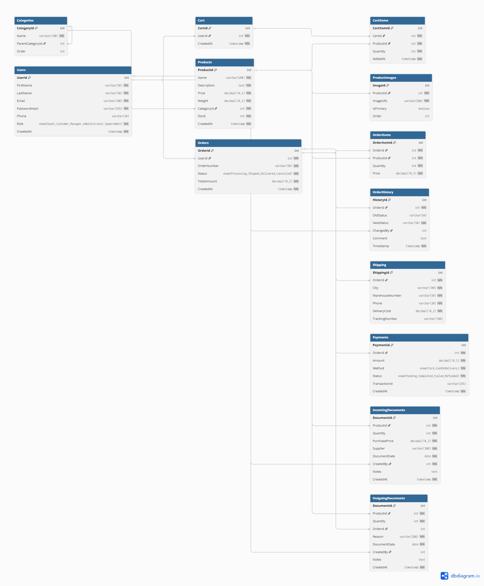

# Дизайн бази даних інтернет-магазину сувенірної продукції ХДУ

## 1. Вступ

### 1.1. Опис проекту
**Інтернет-магазин сувенірної продукції Херсонського державного університету** — повнофункціональний веб-додаток для продажу університетських товарів онлайн з інтеграціями платіжних систем (Stripe) та служби доставки (Nova Poshta).

### 1.2. Вибір моделі бази даних

**Обрана модель:** Реляційна база даних **MySQL 8.0**

#### Обґрунтування вибору SQL:

**Аргументи:**
1. **ACID-транзакції** для атомарності операцій замовлення (створення Order + зменшення Stock + Payment + Shipping)
2. **Точність складського обліку** через транзакційні блокування (`SELECT FOR UPDATE`)
3. **Зручність JOIN-запитів** для фінансових звітів (Orders + OrderItems + Products)
4. **Foreign Keys** для гарантування цілісності даних (автоматичне каскадне видалення)
5. **Нормалізація до 3NF** для уникнення дублювання даних
6. **Нативна підтримка в Entity Framework Core** для .NET

**Порівняльний аналіз:**

| Критерій | SQL (MySQL) | NoSQL (MongoDB) | Результат |
|----------|-------------|-----------------|-----------|
| Структура даних | Чітко визначені таблиці з зв'язками | Гнучкі JSON-документи | SQL |
| ACID-транзакції | Повна підтримка | Обмежена підтримка | SQL |
| Складські операції | Атомарні операції з Stock | Ризик race conditions | SQL |
| Зв'язки між сутностями | FK забезпечують цілісність | Немає FK, логіка в коді | SQL |
| Запити | JOIN для складних звітів | Nested queries або денормалізація | SQL |
| Нормалізація | Уникнення дублювання через 3NF | Денормалізація як норма | SQL |

**Ризики, які уникнули завдяки SQL:**
- Race conditions при одночасних замовленнях
- Некоректні залишки Stock при високому навантаженні
- Orphaned documents при видаленні замовлень
- Складність підтримки без Foreign Keys

### 1.3. Мета дизайну БД
Забезпечити:
- Зберігання користувачів, товарів, замовлень, платежів та доставки
- Точний облік складу через прибуткові/видаткові накладні
- Історію змін статусів замовлень для аудиту
- Цілісність даних через Foreign Keys
- Продуктивність через індекси на критичних полях

---

## 2. ER-діаграма

### 2.1. Візуалізація



### 2.2. Пояснення сутностей та зв'язків

#### Сутності (14 таблиць):

| Сутність       | Опис                  | Атрибути                                                                 | Ключі                  |
|----------------|-----------------------|--------------------------------------------------------------------------|------------------------|
| **Users**         | Користувачі          | UserId, FirstName, LastName, Email, PasswordHash, Phone, Role, CreatedAt | PK: UserId<br>FK: -   |
| **Roles**         | Ролі користувачів    | enum('Guest', 'Customer', 'Manager', 'Administrator', 'SuperAdmin')      | PK: -<br>FK: -        |
| **Products**      | Товари               | ProductId, Name, Description, Price, Weight, CategoryId, Stock, CreatedAt | PK: ProductId<br>FK: CategoryId |
| **Categories**    | Категорії товарів    | CategoryId, Name, ParentCategoryId, Order                                | PK: CategoryId<br>FK: ParentCategoryId |
| **ProductImages** | Зображення товарів   | ImageId, ProductId, ImageURL, IsPrimary, Order                           | PK: ImageId<br>FK: ProductId |
| **Cart**          | Кошики               | CartId, UserId, CreatedAt                                                | PK: CartId<br>FK: UserId |
| **CartItems**     | Товари в кошику      | CartItemId, CartId, ProductId, Quantity, AddedAt                         | PK: CartItemId<br>FK: CartId, ProductId |
| **Orders**        | Замовлення           | OrderId, UserId, OrderNumber, Status, TotalAmount, CreatedAt            | PK: OrderId<br>FK: UserId |
| **OrderItems**    | Товари в замовленні  | OrderItemId, OrderId, ProductId, Quantity, Price                         | PK: OrderItemId<br>FK: OrderId, ProductId |
| **OrderHistory**  | Історія змін статусів замовлення | HistoryId, OrderId, OldStatus, NewStatus, ChangedBy, Comment, Timestamp | PK: HistoryId<br>FK: OrderId, ChangedBy |
| **Shipping**      | Інформація про доставку | ShippingId, OrderId, City, WarehouseNumber, Phone, DeliveryCost, TrackingNumber | PK: ShippingId<br>FK: OrderId |
| **Payments**      | Платежі              | PaymentId, OrderId, Amount, Method, Status, TransactionId, CreatedAt     | PK: PaymentId<br>FK: OrderId |
| **IncomingDocuments** | Прибуткові накладні | DocumentId, ProductId, Quantity, PurchasePrice, Supplier, DocumentDate, CreatedBy, Notes, CreatedAt | PK: DocumentId<br>FK: ProductId, CreatedBy |
| **OutgoingDocuments** | Видаткові накладні  | DocumentId, ProductId, Quantity, OrderId, Reason, DocumentDate, CreatedBy, Notes, CreatedAt | PK: DocumentId<br>FK: ProductId, OrderId, CreatedBy |

#### Ключові зв'язки:

**1. Користувачі:**
- `Users` **1:1** `Cart` — один користувач має один кошик
- `Users` **1:N** `Orders` — користувач може мати багато замовлень
- `Users` **1:N** `IncomingDocuments` — менеджер створює прибуткові накладні
- `Users` **1:N** `OutgoingDocuments` — менеджер створює видаткові накладні
- `Users` **1:N** `OrderHistory` — адміністратор змінює статуси замовлень

**2. Каталог товарів:**
- `Categories` **1:N** `Products` — категорія містить багато товарів
- `Categories` **1:N** `Categories` (рекурсивний) — підтримка ієрархії (батьківська категорія → підкатегорії)
- `Products` **1:N** `ProductImages` — товар може мати декілька зображень

**3. Кошик:**
- `Cart` **1:N** `CartItems` (композиція) — кошик містить товари, при видаленні кошика видаляються items
- `Products` **1:N** `CartItems` — товар може бути в багатьох кошиках

**4. Замовлення:**
- `Orders` **1:N** `OrderItems` (композиція) — замовлення містить товари
- `Orders` **1:1** `Shipping` — кожне замовлення має один запис доставки
- `Orders` **1:1** `Payment` — кожне замовлення має один запис оплати
- `Orders` **1:N** `OrderHistory` — історія змін статусів замовлення
- `Orders` **1:N** `OutgoingDocuments` — при оформленні автоматично створюються видаткові накладні
- `Products` **1:N** `OrderItems` — товар може бути в багатьох замовленнях

**5. Складський облік:**
- `Products` **1:N** `IncomingDocuments` — надходження товару на склад
- `Products` **1:N** `OutgoingDocuments` — списання товару зі складу
- **Розрахунок Stock:**
  ```
  Stock = SUM(IncomingDocuments.Quantity) - SUM(OutgoingDocuments.Quantity)
  ```

---

## 3. Нормалізація бази даних

### 3.1. Перша нормальна форма (1NF)

**Вимоги 1NF:**
- Усі поля містять атомарні (неподільні) значення
- Немає повторюваних груп (масивів, списків)
- Кожен рядок унікальний (є первинний ключ)

**Перевірка на прикладі:**

**Таблиця `Products` у 1NF:**
```sql
ProductId | Name          | Price  | CategoryId | Stock
----------|---------------|--------|------------|------
1         | Футболка ХДУ  | 350.00 | 2          | 15
2         | Блокнот       | 120.00 | 3          | 42
```
- Усі поля атомарні (Price — одне число, а не список цін)
- Немає масивів (якби зберігали `Images: ["url1", "url2"]` — порушення 1NF)
- Є PK: `ProductId`

**Результат:** Усі 14 таблиць відповідають 1NF

---

### 3.2. Друга нормальна форма (2NF)

**Вимоги 2NF:**
- Відповідає 1NF
- Усі неключові атрибути повністю залежать від первинного ключа
- Немає часткових залежностей (актуально для складених ключів)

**Перевірка на прикладі:**

**Таблиця `CartItems` у 2NF:**
```sql
CartItemId (PK) | CartId (FK) | ProductId (FK) | Quantity | AddedAt
----------------|-------------|----------------|----------|----------
1               | 5           | 12             | 2        | 2024-12-10
```
- **Складений унікальний ключ:** `(CartId, ProductId)` — один товар раз у кошику
- **Перевірка залежностей:**
  - `Quantity` залежить від **обох** `(CartId, ProductId)` — скільки цього товару в цьому кошику
  - Немає часткової залежності (наприклад, `ProductName` залежав би тільки від `ProductId` — це порушення)
- **Чому без порушень:** Усі атрибути (`Quantity`, `AddedAt`) залежать від повного ключа `(CartId, ProductId)`

**Результат:** Усі таблиці у 2NF (немає часткових залежностей)

---

### 3.3. Третя нормальна форма (3NF)

**Вимоги 3NF:**
- Відповідає 2NF
- Немає транзитивних залежностей (неключові атрибути залежать тільки від PK, а не від інших неключових)

**Перевірка на прикладі:**

**Таблиця `Orders` у 3NF:**
```sql
OrderId (PK) | UserId (FK) | OrderNumber | Status      | TotalAmount | CreatedAt
-------------|-------------|-------------|-------------|-------------|----------
1            | 42          | ORD-001     | Processing  | 850.00      | 2024-12-10
```
- **Немає транзитивних залежностей:**
  - `TotalAmount` залежить від `OrderId` (розраховується з `OrderItems`)
  - **НЕ зберігаємо** `UserName` в Orders (бо він залежить від `UserId`, а не напряму від `OrderId`)
  - **НЕ зберігаємо** адресу доставки в Orders (окрема таблиця `Shipping`)

**Результат:** Усі 14 таблиць у 3NF

---

### 3.4. Висновок з нормалізації

| Нормальна форма | Статус | Пояснення |
|-----------------|--------|-----------|
| **1NF** | Виконано | Усі поля атомарні, немає масивів, є PK у кожній таблиці |
| **2NF** | Виконано | Немає часткових залежностей (приклад: `CartItems.Quantity` залежить від повного ключа) |
| **3NF** | Виконано | Немає транзитивних залежностей (окремі таблиці `Shipping`, `Payments` замість вкладення в `Orders`) |

**Переваги нормалізованої структури:**
- Немає дублювання даних (DRY принцип)
- Уникнення аномалій оновлення (зміна `Products.Price` не впливає на старі замовлення)
- Легкість підтримки (зміна структури в одному місці)
- Цілісність даних через Foreign Keys

**Контрольована денормалізація:**
- `Products.Stock` — для продуктивності (оновлюється тригерами)
- `OrderItems.Price` — історична ціна (snapshot на момент замовлення)
- `Orders.TotalAmount` — для швидкості відображення списку замовлень

---

## 4. SQL-скрипти створення бази даних

### 4.1. Створення бази даних

```sql
CREATE DATABASE IF NOT EXISTS khdu_souvenir_shop
  CHARACTER SET utf8mb4
  COLLATE utf8mb4_unicode_ci;

USE khdu_souvenir_shop;
```

### 4.2. Створення таблиць

```sql
CREATE TABLE Users (
    UserId INT AUTO_INCREMENT PRIMARY KEY,
    FirstName VARCHAR(50) NOT NULL,
    LastName VARCHAR(50) NOT NULL,
    Email VARCHAR(100) NOT NULL UNIQUE,
    PasswordHash VARCHAR(255) NOT NULL,
    Phone VARCHAR(20),
    Role ENUM('Guest', 'Customer', 'Manager', 'Administrator', 'SuperAdmin') NOT NULL DEFAULT 'Customer',
    CreatedAt TIMESTAMP NOT NULL DEFAULT CURRENT_TIMESTAMP,
    INDEX idx_role (Role)
);

CREATE TABLE Categories (
    CategoryId INT AUTO_INCREMENT PRIMARY KEY,
    Name VARCHAR(100) NOT NULL,
    ParentCategoryId INT,
    `Order` INT DEFAULT 0,
    INDEX idx_name (Name),
    INDEX idx_parent (ParentCategoryId),
    FOREIGN KEY (ParentCategoryId) REFERENCES Categories(CategoryId) ON DELETE SET NULL
);

CREATE TABLE Products (
    ProductId INT AUTO_INCREMENT PRIMARY KEY,
    Name VARCHAR(200) NOT NULL,
    Description TEXT NOT NULL,
    Price DECIMAL(10,2) NOT NULL,
    Weight DECIMAL(10,3) NOT NULL,
    CategoryId INT NOT NULL,
    Stock INT NOT NULL DEFAULT 0,
    CreatedAt TIMESTAMP NOT NULL DEFAULT CURRENT_TIMESTAMP,
    INDEX idx_name (Name),
    INDEX idx_category (CategoryId),
    INDEX idx_stock (Stock),
    INDEX idx_price (Price),
    FOREIGN KEY (CategoryId) REFERENCES Categories(CategoryId) ON DELETE RESTRICT
);

CREATE TABLE ProductImages (
    ImageId INT AUTO_INCREMENT PRIMARY KEY,
    ProductId INT NOT NULL,
    ImageURL VARCHAR(500) NOT NULL,
    IsPrimary BOOLEAN DEFAULT FALSE,
    `Order` INT DEFAULT 0,
    INDEX idx_product (ProductId),
    INDEX idx_primary (IsPrimary),
    FOREIGN KEY (ProductId) REFERENCES Products(ProductId) ON DELETE CASCADE
);

CREATE TABLE Cart (
    CartId INT AUTO_INCREMENT PRIMARY KEY,
    UserId INT NOT NULL UNIQUE,
    CreatedAt TIMESTAMP NOT NULL DEFAULT CURRENT_TIMESTAMP,
    FOREIGN KEY (UserId) REFERENCES Users(UserId) ON DELETE CASCADE
);

CREATE TABLE CartItems (
    CartItemId INT AUTO_INCREMENT PRIMARY KEY,
    CartId INT NOT NULL,
    ProductId INT NOT NULL,
    Quantity INT NOT NULL DEFAULT 1,
    AddedAt TIMESTAMP NOT NULL DEFAULT CURRENT_TIMESTAMP,
    UNIQUE INDEX uniq_cart_product (CartId, ProductId),
    FOREIGN KEY (CartId) REFERENCES Cart(CartId) ON DELETE CASCADE,
    FOREIGN KEY (ProductId) REFERENCES Products(ProductId) ON DELETE CASCADE
);

CREATE TABLE Orders (
    OrderId INT AUTO_INCREMENT PRIMARY KEY,
    UserId INT NOT NULL,
    OrderNumber VARCHAR(50) NOT NULL UNIQUE,
    Status ENUM('Processing', 'Shipped', 'Delivered', 'Cancelled') NOT NULL DEFAULT 'Processing',
    TotalAmount DECIMAL(10,2) NOT NULL,
    CreatedAt TIMESTAMP NOT NULL DEFAULT CURRENT_TIMESTAMP,
    INDEX idx_user (UserId),
    INDEX idx_status (Status),
    INDEX idx_created (CreatedAt),
    FOREIGN KEY (UserId) REFERENCES Users(UserId) ON DELETE RESTRICT
);

CREATE TABLE OrderItems (
    OrderItemId INT AUTO_INCREMENT PRIMARY KEY,
    OrderId INT NOT NULL,
    ProductId INT NOT NULL,
    Quantity INT NOT NULL,
    Price DECIMAL(10,2) NOT NULL,
    INDEX idx_order (OrderId),
    INDEX idx_product (ProductId),
    FOREIGN KEY (OrderId) REFERENCES Orders(OrderId) ON DELETE CASCADE,
    FOREIGN KEY (ProductId) REFERENCES Products(ProductId) ON DELETE RESTRICT
);

CREATE TABLE OrderHistory (
    HistoryId INT AUTO_INCREMENT PRIMARY KEY,
    OrderId INT NOT NULL,
    OldStatus VARCHAR(50),
    NewStatus VARCHAR(50) NOT NULL,
    ChangedBy INT,
    Comment TEXT,
    Timestamp TIMESTAMP NOT NULL DEFAULT CURRENT_TIMESTAMP,
    INDEX idx_order (OrderId),
    INDEX idx_timestamp (Timestamp),
    FOREIGN KEY (OrderId) REFERENCES Orders(OrderId) ON DELETE CASCADE,
    FOREIGN KEY (ChangedBy) REFERENCES Users(UserId) ON DELETE SET NULL
);

CREATE TABLE Shipping (
    ShippingId INT AUTO_INCREMENT PRIMARY KEY,
    OrderId INT NOT NULL UNIQUE,
    City VARCHAR(100) NOT NULL,
    WarehouseNumber VARCHAR(50) NOT NULL,
    Phone VARCHAR(20) NOT NULL,
    DeliveryCost DECIMAL(10,2) NOT NULL,
    TrackingNumber VARCHAR(100),
    FOREIGN KEY (OrderId) REFERENCES Orders(OrderId) ON DELETE CASCADE
);

CREATE TABLE Payments (
    PaymentId INT AUTO_INCREMENT PRIMARY KEY,
    OrderId INT NOT NULL UNIQUE,
    Amount DECIMAL(10,2) NOT NULL,
    Method ENUM('Card', 'CashOnDelivery') NOT NULL,
    Status ENUM('Pending', 'Completed', 'Failed', 'Refunded') NOT NULL DEFAULT 'Pending',
    TransactionId VARCHAR(255),
    CreatedAt TIMESTAMP NOT NULL DEFAULT CURRENT_TIMESTAMP,
    INDEX idx_status (Status),
    INDEX idx_transaction (TransactionId),
    FOREIGN KEY (OrderId) REFERENCES Orders(OrderId) ON DELETE CASCADE
);

CREATE TABLE IncomingDocuments (
    DocumentId INT AUTO_INCREMENT PRIMARY KEY,
    ProductId INT NOT NULL,
    Quantity INT NOT NULL,
    PurchasePrice DECIMAL(10,2) NOT NULL,
    Supplier VARCHAR(200) NOT NULL,
    DocumentDate DATE NOT NULL,
    CreatedBy INT NOT NULL,
    Notes TEXT,
    CreatedAt TIMESTAMP NOT NULL DEFAULT CURRENT_TIMESTAMP,
    INDEX idx_product (ProductId),
    INDEX idx_date (DocumentDate),
    INDEX idx_createdby (CreatedBy),
    FOREIGN KEY (ProductId) REFERENCES Products(ProductId) ON DELETE RESTRICT,
    FOREIGN KEY (CreatedBy) REFERENCES Users(UserId) ON DELETE RESTRICT
);

CREATE TABLE OutgoingDocuments (
    DocumentId INT AUTO_INCREMENT PRIMARY KEY,
    ProductId INT NOT NULL,
    Quantity INT NOT NULL,
    OrderId INT,
    Reason VARCHAR(200) NOT NULL,
    DocumentDate DATE NOT NULL,
    CreatedBy INT,
    Notes TEXT,
    CreatedAt TIMESTAMP NOT NULL DEFAULT CURRENT_TIMESTAMP,
    INDEX idx_product (ProductId),
    INDEX idx_order (OrderId),
    INDEX idx_date (DocumentDate),
    INDEX idx_reason (Reason),
    FOREIGN KEY (ProductId) REFERENCES Products(ProductId) ON DELETE RESTRICT,
    FOREIGN KEY (OrderId) REFERENCES Orders(OrderId) ON DELETE SET NULL,
    FOREIGN KEY (CreatedBy) REFERENCES Users(UserId) ON DELETE SET NULL
);
```
---

## 5. Висновки

Схема бази даних повністю відповідає UML-моделі проекту. Кожен клас з UML перетворено на окрему таблицю. Атрибути класів стали стовпцями таблиць з відповідними типами даних. Асоціації між класами реалізовано через зовнішні ключі (FK). Зв'язки один-до-багатьох і один-до-одного точно відображені. Забезпечено референційну цілісність завдяки FOREIGN KEY та обмеженням ON DELETE. Індекси на часто використовуваних полях підвищують ефективність запитів. Нормалізація до 3NF усуває дублювання та аномалії. Схема підтримує ключову бізнес-логіку інтернет-магазину: управління товарами, кошиком, замовленнями, оплатою та доставкою. Загалом, дизайн БД гарантує надійність, масштабованість і легкість підтримки системи.