# Специфікація вимог до програмного забезпечення інтернет-магазину сувернірної продукції Херсонського державного університету
---

**Тип документа:** Специфікація вимог до програмного забезпечення (SRS)  
**Версія:** 1.0  
**Статус:** У розробці  
**Автор:** Самородський Данило 12-341  
**Дата:** 09.05.2026  
**Проєкт:** KSU Souvenir Shop  

---
## Зміст
**1.** [Вступ](#1-вступ)  
    1.1. [Мета документа](#11-мета-документа)  
    1.2. [Область застосування](#12-область-застосування)  
**2.** [Загальний опис системи](#2-загальний-опис-системи)  
    2.1. [Мета та завдання проєкту](#21-мета-та-завдання-проєкту)  
    2.2. [Бізнес-модель](#22-бізнес-модель)  
    2.3. [Цільова аудиторія](#23-цільова-аудиторія)  
    2.4. [Ролі користувачів системи](#24-ролі-користувачів-системи)  
    2.5. [Контекст системи](#25-контекст-системи)  
**3.** [Функціональні вимоги](#3-функціональні-вимоги)  
    3.1. [Функціональні вимоги для Гостя](#31-функціональні-вимоги-для-гостя)  
    3.2. [Функціональні вимоги для Користувача](#32-функціональні-вимоги-для-користувача)  
    3.3. [Функціональні вимоги для Менеджера](#33-функціональні-вимоги-для-менеджера)  
    3.4. [Функціональні вимоги для Адміністратора](#34-функціональні-вимоги-для-адміністратора)  
    3.5. [Функціональні вимоги для СуперАдміна](#35-функціональні-вимоги-для-суперадміна)  
**4.** [Нефункціональні вимоги](#4-нефункціональні-вимоги)  
    4.1. [Продуктивність](#41-продуктивність)  
    4.2. [Надійність](#42-надійність)  
    4.3. [Безпека](#43-безпека)  
    4.4. [Зручність використання](#44-зручність-використання)  
    4.5. [Масштабованість](#45-масштабованість)  
    4.6. [Сумісність](#46-сумісність)  
    4.7. [Супроводжуваність](#47-супроводжуваність)  
**5.** [Архітектура системи](#5-архітектура-системи)  
    5.1. [Архітектурний стиль](#51-архітектурний-стиль)  
    5.2. [Контейнери системи](#52-контейнери-системи)  
    5.3. [Компоненти API Gateway](#53-компоненти-api-gateway)  
    5.4. [Архітектурні патерни](#54-архітектурні-патерни)  
    5.5. [Обґрунтування архітектурних рішень](#55-обґрунтування-архітектурних-рішень)  
    5.6. [Технологічний стек](#56-технологічний-стек)  
    5.7. [Модулі системи](#57-модулі-системи)  
**6.** [Модель предметної області](#6-модель-предметної-області)  
    6.1. [Діаграма класів](#61-діаграма-класів)  
    6.2. [Структура бази даних](#62-структура-бази-даних)  
    6.3. [Основні сутності](#63-основні-сутності)  
    6.4. [Enumeration (перелічення)](#64-enumeration-перелічення)  
**7.** [Діаграми варіантів використання](#7-діаграми-варіантів-використання)  
    7.1. [Use Case Diagram для Гостя](#71-use-case-diagram-для-гостя)  
    7.2. [Use Case Diagram для Користувача](#72-use-case-diagram-для-користувача)  
    7.3. [Use Case Diagram для Менеджера](#73-use-case-diagram-для-менеджера)  
    7.4. [Use Case Diagram для Адміністратора](#74-use-case-diagram-для-адміністратора)  
    7.5. [Use Case Diagram для СуперАдміна](#75-use-case-diagram-для-суперадміна)  
**8.** [Діаграми діяльності](#8-діаграми-діяльності)  
    8.1. [Activity Diagram: Реєстрація користувача в системі](#81-activity-diagram-реєстрація-користувача-в-системі)  
    8.2. [Activity Diagram: Додавання нового товару](#82-activity-diagram-додавання-нового-товару)  
    8.3. [Activity Diagram: Оформлення замовлення](#83-activity-diagram-оформлення-замовлення)  
    8.4. [Activity Diagram: Оформлення прибуткової накладної](#84-activity-diagram-оформлення-прибуткової-накладної)  
    8.5. [Activity Diagram: Створення видаткової накладної](#85-activity-diagram-створення-видаткової-накладної)  
    8.6. [Activity Diagram: Зміна статусу замовлення](#86-activity-diagram-зміна-статусу-замовлення)  
    8.7. [Activity Diagram: Налаштування інтеграції Stripe](#87-activity-diagram-налаштування-інтеграції-stripe)  
    8.8. [Activity Diagram: Перегляд аналітики](#88-activity-diagram-перегляд-аналітики)  
**9.** [Діаграми послідовності](#9-діаграми-послідовності)  
    9.1. [Sequence Diagram: Реєстрація користувача в системі](#91-sequence-diagram-реєстрація-користувача-в-системі)  
    9.2. [Sequence Diagram: Додавання нового товару](#92-sequence-diagram-додавання-нового-товару)  
    9.3. [Sequence Diagram: Оформлення замовлення](#93-sequence-diagram-оформлення-замовлення)  
    9.4. [Sequence Diagram: Оформлення прибуткової накладної](#94-sequence-diagram-оформлення-прибуткової-накладної)  
    9.5. [Sequence Diagram: Створення видаткової накладної](#95-sequence-diagram-створення-видаткової-накладної)  
    9.6. [Sequence Diagram: Зміна статусу замовлення](#96-sequence-diagram-зміна-статусу-замовлення)  
    9.7. [Sequence Diagram: Налаштування інтеграції Stripe](#97-sequence-diagram-налаштування-інтеграції-stripe)  
    9.8. [Sequence Diagram: Перегляд аналітики](#98-sequence-diagram-перегляд-аналітики)  
**10.** [Діаграми станів](#10-діаграми-станів)  
    10.1. [State Machine Diagram: Order (Замовлення)](#101-state-machine-diagram-order-замовлення)  
    10.2. [State Machine Diagram: Payment (Платіж)](#102-state-machine-diagram-payment-платіж)  
    10.3. [State Machine Diagram: IncomingDocument (Прибуткова накладна)](#103-state-machine-diagram-incomingdocument-прибуткова-накладна)  
    10.4. [State Machine Diagram: OutgoingDocument (Видаткова накладна)](#104-state-machine-diagram-outgoingdocument-видаткова-накладна)  
**11.** [Структура даних](#11-структура-даних)  
    11.1. [Domain Models (Entities)](#111-domain-models-entities)  
    11.2. [Data Transfer Objects (DTOs)](#112-data-transfer-objects-dtos)  
    11.3. [Правила валідації](#113-правила-валідації)  
**12.** [Інтерфейси системи](#12-область-застосування)  
    12.1. [Таблиця інтерфейсів модулів](#121-таблиця-інтерфейсів-модулів)  
    12.2. [Формат відповідей API](#122-формат-відповідей-api)  
    12.3. [Приклади основних endpoints](#123-приклади-основних-endpoints)  
**13.** [Матриця трасування вимог](#13-матриця-трасування-вимог)  
**14.** [Розгортання системи](#14-розгортання-системи)  
    14.1. [Deployment Diagram](#141-deployment-diagram)  
    14.2. [Інфраструктура Render.com](#142-інфраструктура-на-rendercom)  
    14.3. [Enviroment Variables](#143-environment-variables)  
    14.4. [CI/CD Pipeline](#144-cicd-pipeline)  
    14.5. [Безпека та моніторинг](#145-безпека-та-моніторинг)  
**15.** [Висновки](#15-висновки)  
    15.1. [Досягення цілей проєкту](#151-досягнення-цілей-проєкту)  
    15.2. [Переваги обраних рішень](#152-переваги-обраних-рішень)  
    15.3. [Потенціал для розвитку](#153-потенціал-для-розвитку)  
    15.4. [Відповідність вимогам](#154-відповідність-вимогам)  
    15.5. [Готовність до реалізації](#155-готовність-до-реалізації)  
**16.** [Додатки](#16-додатки)  
    16.1. [Глосарій термінів](#161-глосарій-термінів)  
    16.2. [Список посилань](#162-скорочення)  
    16.3. [Історія змін документа](#163-список-посилань)
## 1. Вступ
### 1.1. Мета документа
Даний документ System Requirements Specification (SRS) містить повний опис вимог до інформаційної системи інтернет-магазину сувенірної продукції Херсонського державного університету. Документ призначений для:
  - Команди розробників як основа для проєктування та реалізації системи
  - Замовника для підтвердження повноти та коректності вимог
  - Тестувальників для створення тестових сценаріїв
  - Технічних письменників для підготовки документації
### 1.2. Область застосування
Система інтернет-магазину сувенірної продукції ХДУ є веб-додатком, що забезпечує повний цикл електронної комерції для продажу брендованих товарів університету. Система включає:
  - Публічний веб-інтерфейс для перегляду та замовлення товарів
  - Особисті кабінети користувачів
  - Адміністративну панель для управління магазином
  - Інтеграції з платіжними системами та службами доставки
  - Систему складського обліку
## 2. Загальний опис системи
### 2.1. Мета та завдання проєкту
Мета проєкту: Створення веб-додатку інтернет-магазину сувенірної продукції Херсонського державного університету, який забезпечить зручний, безпечний та автоматизований процес продажу університетських товарів онлайн.  
Основні завдання:
1. Реалізація інтуїтивно зрозумілого інтерфейсу для користувачів
2. Забезпечення можливості створення користувацьких акаунтів
3. Реалізація системи кошика та оформлення замовлення з інтеграцією платіжних сервісів
4. Автоматизація обробки замовлень та відстеження статусів
5. Інтеграція з Nova Poshta API для доставки
6. Розробка адміністративної панелі для керування товарами та замовленнями
7. Забезпечення інформаційної безпеки
8. Формування звітів про продажі та статистику
9. Створення адаптивного дизайну
10. Реалізація складського обліку через накладні
11. Реалізація повнофункціональної системи акцій та знижок з підтримкою: різних типів знижок, цільових аудиторій, промокодів для активації знижок, верифікації студентів, стакування знижок за пріоритетом, аналітики ефективності акцій.
12. Побудова масштабованої архітектури
### 2.2. Бізнес-модель
Інтернет-магазин побудований за моделлю нішевого інтернет-магазину (Niche E-shop). Ця бізнес-модель орієнтована на вузьку цільову аудиторію - студентів, викладачів, випускників і гостей університету, які зацікавлені у придбанні брендованої сувенірної продукції.  
Особливості бізнес-моделі:
  - Вузька ніша з чітко визначеною аудиторією
  - Обмежений асортимент товарів з символікою університету
  - Створення корпоративного іміджу та підтримання студентської ідентичності
  - Повний функціонал класичного інтернет-магазину
  - Можливість корпоративних замовлень
### 2.3. Цільова аудиторія
1. Студенти ХДУ - основні покупці університетських сувенірів
2. Викладачі та працівники - для придбання продукції та корпоративних товарів
3. Випускники університету - для підтримки зв'язку з alma mater
4. Гості університету - потенційні покупці сувенірної продукції
5. Партнери та представники інших закладів - корпоративні замовлення
6. Адміністрація університету - керування асортиментом та фінансами
### 2.4. Ролі користувачів системи
Система підтримує п'ять ролей користувачів з різними рівнями доступу:

| Роль | Опис | Основні функції |
|------|------|-----------------|
| Гість | Неавторизований відвідувач | Перегляд каталогу, пошук, реєстрація |
| Користувач | Зареєстрований клієнт | Додавання до кошика, оформлення замовлень, особистий кабінет |
| Менеджер | Співробітник магазину | Керування товарами, складом, акціями |
| Адміністратор | Керівник магазину | Управління замовленнями, користувачами, звіти |
| СуперАдмін | Технічний адміністратор | Управління системою, ролями, інтеграціями |
### 2.5. Контекст системи
Система взаємодіє з наступними зовнішніми сервісами:
  - Stripe API - платіжний шлюз для обробки онлайн-платежів
  - Nova Poshta API - служба доставки для розрахунку вартості та відстеження посилок
  - Email Service - SMTP сервіс для відправки сповіщень
  - MinIO Storage - об'єктне сховище для зберігання зображень товарів
  - University API - API університету для автоматичної верифікації статусу студентів та отримання академічних даних (GPA, стипендіальний статус)
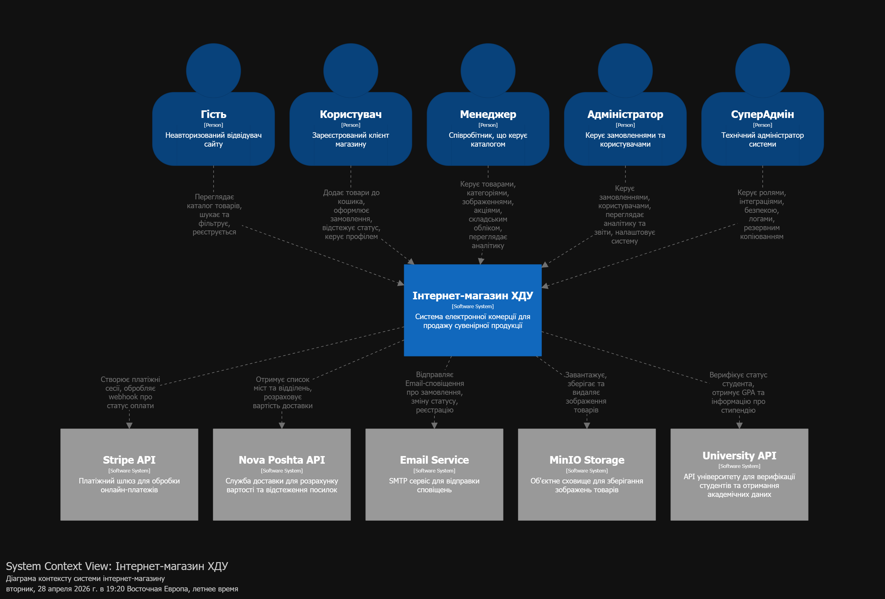
## 3. Функціональні вимоги
### 3.1. Функціональні вимоги для Гостя
**FR-G-01**: Перегляд каталогу товарів  
  **Опис**: Гість може переглядати каталог товарів, сортувати за ціною, популярністю, новинками.  
  **Ризик**: Низький (Ризик неефективного пошуку при великій кількості товарів.)  
  **Пріоритет**: Високий  
**FR-G-02**: Пошук та фільтрація товарів  
  **Опис**: Гість може шукати товари за назвою та фільтрувати за категоріями, ціною, розміром.  
  **Ризик**: Низький (Ризик некоректної роботи фільтрів або повільного пошуку.)  
  **Пріоритет**: Високий  
**FR-G-03**: Перегляд детальної інформації про товар  
  **Опис**: Гість може переглядати детальну інформацію про товар (фото, опис, ціна, наявність, відгуки).  
  **Ризик**: Низький (Ризик відображення застарілої інформації про наявність або ціну.)  
  **Пріоритет**: Високий  
**FR-G-04**: Реєстрація та авторизація  
  **Опис**: Гість може зареєструватися в системі, створивши обліковий запис, або увійти в існуючий.  
  **Ризик**: Середній (Ризик витоку або компрометації облікових даних при неналежній реалізації безпеки.)  
  **Пріоритет**: Високий  
### 3.2. Функціональні вимоги для Користувача
**FR-C-01**: Додавання товарів до кошика  
  **Опис**: Користувач може додавати товари до кошика для подальшого оформлення замовлення.  
  **Ризик**: Середній (Ризик втрати даних кошика при оновленні сторінки або некоректного врахування товарів.)  
  **Пріоритет**: Високий  
**FR-C-02**: Оформлення замовлення  
  **Опис**: Користувач може оформляти замовлення з вибором населеного пункту, відділення доставки Nova Poshta та способу оплати. Система підтримує два способи оплати: онлайн-оплата через платіжний шлюз Stripe та оплата при отриманні на відділенні Nova Poshta. Вартість доставки розраховується автоматично через Nova Poshta API на основі ваги товарів та обраного відділення. При оформленні замовлення система автоматично:  
    - Перевіряє всі доступні знижки для користувача (студентські, персональні, акційні)  
    - Застосовує найвигідніші знижки за пріоритетом  
    - Дозволяє ввести промокод для додаткової знижки  
    - Застосовує стакування знижок (автоматичні + промокод)  
    - Розраховує фінальні ціни з урахуванням всіх знижок  
    - Зберігає повну інформацію про ціни та знижки в OrderItems (originalPrice, appliedPromotionId, discountAmount, finalPrice)  
  При успішному оформленні замовлення автоматично створюється видаткова накладна через WarehouseModule для резервування товарів на складі з копіюванням інформації про знижки з OrderItems. Після успішного оформлення користувач отримує Email-підтвердження з детальною деталізацією: вартість товарів без знижок, список застосованих знижок, вартість доставки, підсумкова сума.  
  **Ризик**: Високий (Ризик втрати даних замовлення, некоректного розрахунку вартості доставки та знижок, помилок при інтеграції з платіжними сервісами, Nova Poshta API або University API, недоступність зовнішніх сервісів, некоректне стакування знижок.)  
  **Пріоритет**: Високий  
**FR-C-03**: Керування особистим кабінетом  
  **Опис**: Користувач може редагувати свої контактні дані, змінювати пароль, керувати адресами доставки.  
  **Ризик**: Низький (Ризик некоректного оновлення даних або порушення конфіденційності.)  
  **Пріоритет**: Середній  
**FR-C-04**: Перегляд історії замовлень  
  **Опис**: Користувач може переглядати повну історію своїх замовлень з деталізацією.  
  **Ризик**: Низький (Ризик відображення неповної або некоректної інформації.)  
  **Пріоритет**: Середній  
**FR-C-05**: Відстеження статусів замовлення  
  **Опис**: Користувач може відстежувати поточний статус свого замовлення (Обробляється, Відправлено, Доставлено) в особистому кабінеті, через Email-сопвіщення.  
  **Ризик**: Середній (Ризик несвоєчасного оновлення статусу, що призведе до плутанини.)  
  **Пріоритет**: Середній  
**FR-C-06**: Зберігання даних для доставки  
  **Опис**: Користувач може зберігати кілька адрес доставки для швидкого оформлення замовлень. Кожна збережена адреса включає: населений пункт, відділення Nova Poshta, контактний телефон. Це дозволяє швидко обирати збережену адресу при повторному оформленні замовлення.  
  **Ризик**: Низький (Ризик некоректного збереження або відображення адрес.)  
  **Пріоритет**: Низький  
**FR-C-07**: Отримання персональних пропозицій та автоматичних знижок  
  **Опис**: Користувач може отримувати персональні рекомендації товарів на основі історії переглядів і покупок. Система автоматично застосовує доступні знижки на основі статусу користувача:  
    - Студентські знижки (автоматично після верифікації через University API)  
    - Персональні знижки (призначені менеджером/адміністратором)  
    - Акційні знижки (активні промо-акції на товари/категорії)  
  Знижки застосовуються автоматично при перегляді товарів та оформленні замовлення. Користувач отримує Email-сповіщення про нові доступні знижки.  
  **Ризик**: Середній (Ризик некоректних рекомендацій через помилки в алгоритмі, некоректного застосування знижок.)  
  **Пріоритет**: Середній  
**FR-C-08**: Перегляд доступних знижок  
  **Опис**: Користувач може переглядати список всіх доступних йому знижок в особистому кабінеті. Відображається інформація про кожну знижку: назва, опис, розмір знижки, область застосування (товари/категорії/весь асортимент), термін дії, умови використання (мінімальна сума замовлення, мінімальна кількість товарів). Знижки групуються за типами: студентські, персональні, загальні акції.  
  **Ризик**: Низький (Ризик відображення неактуальної інформації про знижки через помилки кешування.)  
  **Пріоритет**: Середній  
**FR-C-09**: Верифікація студентського статусу  
  **Опис**: При реєстрації з університетським email (@ksu.edu.ua або @student.ksu.edu.ua) система автоматично відправляє запит до University API для верифікації статусу студента. При успішній верифікації система отримує дані: studentStatus (REGULAR/SCHOLARSHIP/HIGH\_ACHIEVER), GPA, scholarshipStatus. На основі цих даних автоматично призначаються студентські знижки:  
    - REGULAR: базова студентська знижка  
    - SCHOLARSHIP (стипендіат): підвищена знижка  
    - HIGH\_ACHIEVER (GPA ≥ 4.5): максимальна знижка  
  Студентський статус має термін дії (4 місяці до кінця семестру), після чого знижки деактивуються. Користувач отримує Email-підтвердження з інформацією про присвоєні знижки. Якщо University API недоступний, система створює задачу для повторної перевірки через 1 годину. Якщо студент не знайдений в базі університету, адміністратор може верифікувати статус вручну на основі документів.  
  **Ризик**: Середній (Ризик недоступності University API, некоректної верифікації, помилок при призначенні знижок.)  
  **Пріоритет**: Високий  
**FR-C-10**: Введення промокоду при оформленні  
  **Опис**: Користувач може ввести промокод при оформленні замовлення для отримання додаткової знижки. Система валідує промокод:  
    - Перевіряє існування в БД  
    - Перевіряє чи активний (isActive = true)  
    - Перевіряє термін дії (startDate ≤ now ≤ endDate)  
    - Перевіряє ліміт використань (currentUsage < usageLimit)  
    - Перевіряє умови застосування (мінімальна сума замовлення, мінімальна кількість товарів)  
  При успішній валідації промокод застосовується поверх автоматичних знижок (стакування). Система перераховує фінальні ціни та відображає оновлену деталізацію замовлення. При невалідному промокоді система показує відповідне повідомлення: "Промокод не знайдено", "Термін дії закінчився", "Промокод вичерпано", "Не відповідає умовам". Після успішного оформлення замовлення система збільшує лічильник використання промокоду (currentUsage++).  
  **Ризик**: Середній (Ризик некоректної валідації промокоду, помилок при стакуванні знижок, можливість зловживання промокодами.)  
  **Пріоритет**: Середній  
**FR-C-11**: Перегляд історії використаних знижок  
  **Опис**: Користувач може переглядати історію використання знижок в особистому кабінеті. Для кожної використаної знижки відображається: назва акції, дата використання, номер замовлення, сума знижки в грн. Історія доступна з фільтрами за датою та типом знижки.  
  **Ризик**: Низький (Ризик відображення неповної інформації через помилки в запитах до БД.)  
  **Пріоритет**: Низький
### 3.3. Функціональні вимоги для Менеджера
**FR-M-01**: Керування каталогом товарів  
  **Опис**: Менеджер може додавати, редагувати, видаляти товари в каталозі, керувати їх атрибутами (назва, опис, ціна, вага). Кількість товару на складі не вказується при створенні товару, а керується через оформлення прибуткових накладних. Поточні залишки розраховуються автоматично на основі всіх прибуткових та видаткових документів.  
  **Ризик**: Середній (Ризик некоректного введення даних, що призведе до помилок у замовленнях.)  
  **Пріоритет**: Високий  
**FR-M-02**: Керування категоріями товарів  
  **Опис**: Менеджер може створювати, редагувати, видаляти категорії товарів та налаштовувати їх ієрархію.  
  **Ризик**: Низький (Ризик порушення структури каталогу при некоректному редагуванні.)  
  **Пріоритет**: Високий  
**FR-M-03**: Завантаження зображень товарів  
  **Опис**: Менеджер може завантажувати, редагувати та видаляти зображення товарів через адмін-панель.  
  **Ризик**: Низький (Ризик завантаження невідповідних форматів або перевищення розмірів файлів.)  
  **Пріоритет**: Високий  
**FR-M-04**: Керування акціями та знижками  
  **Опис**: Менеджер має повний функціонал керування системою акцій та знижок:  
    - Менеджер може створити нову акцію з наступними параметрами:  
        + Назва та опис акції  
        + Тип знижки: PERCENTAGE (відсоткова), FIXED\_AMOUNT (фіксована сума в грн), SPECIAL\_PRICE (спеціальна ціна)  
        + Значення знижки (число)  
        + Цільова аудиторія: ALL (всі користувачі), STUDENTS (студенти), STAFF (працівники), ALUMNI (випускники), CUSTOM (персонально)  
        + Область застосування: PRODUCT (конкретний товар), CATEGORY (категорія товарів), CART (весь кошик), SHIPPING (доставка)  
        + Дати дії (опціонально): startDate, endDate  
        + Промокод (опціонально): унікальний код для активації  
        + Умови застосування (опціонально): мінімальна сума замовлення, мінімальна кількість товарів  
        + Пріоритет (0-100): для визначення порядку застосування при стакуванні  
        + Ліміт використань (опціонально): максимальна кількість застосувань  
    - Менеджер може редагувати всі параметри існуючої акції.  
    - Менеджер може деактивувати акцію (isActive = false) або повністю видалити.  
    - Менеджер може призначити знижку конкретному користувачу (наприклад, VIP клієнтам).  
    - Менеджер може переглядати статистику використання знижок:  
        + Кількість використань кожної акції  
        + Загальна сума знижок  
        + Найпопулярніші акції  
        + ROI по акціях (окупність)  
        + Експорт звіту по акціях у форматах PDF/CSV/Excel  
    - Менеджер може фільтрувати акції за статусом (активні/неактивні), типом, цільовою аудиторією, датами.  
    - Менеджер може переглядати розширену аналітику ефективності акцій:  
        + Всі метрики що вже є (кількість використань, загальна сума знижок, ROI)  
        + Порівняння конверсії з акцією vs без акції  
        + Середній чек при використанні акції vs без  
        + Repeat Purchase Rate користувачів що скористались акцією  
        + Вплив акції на залишки товарів (чи не призводить до дефіциту)  
        + Прогнозована окупність акції на основі історичних даних  
  Система підтримує стакування знижок за пріоритетом:
  1. Персональні знижки (найвищий пріоритет)
  2. Студентські знижки (за studentStatus)
  3. Товарні/Категорійні знижки
  4. Знижки на кошик
  5. Промокоди
  **Ризик**: Високий (Ризик некоректного застосування знижок, помилок при стакуванні, можливість зловживання системою знижок, фінансові втрати через надмірні знижки.)  
  **Пріоритет**: Високий  
**FR-M-05**: Перегляд запасів на складі  
  **Опис**: Менеджер може переглядати поточні залишки товарів на складі, які розраховуються автоматично на основі прибуткових та видаткових накладних. Система показує детальну інформацію: загальна кількість надходжень, загальна кількість списань, поточний залишок. Менеджер отримує сповіщення про низький запас товару.  
  **Ризик**: Низький (Ризик відображення неактуальної інформації про наявність.)  
  **Пріоритет**: Середній  
**FR-M-06**: Оформлення прибуткової накладної  
  **Опис**: Менеджер може оформити надходження товару на склад через створення прибуткової накладної із зазначенням товару, кількості, закупівельної ціни та вибором фірми-постачальника зі списку. Якщо потрібної фірми немає в списку, менеджер може додати нову фірму безпосередньо з форми оформлення накладної. При збереженні накладної система автоматично збільшує поточний залишок товару на складі. Всі операції логуються для аудиту.  
  **Ризик**: Середній (Ризик помилок при введенні даних накладної або виборі неправильної фірми, що може призвести до некоректних залишків на складі або помилок в обліку постачальників.)  
  **Пріоритет**: Високий  
**FR-M-07**: Оформлення видаткової накладної  
  **Опис**: Менеджер або Адміністратор може вручну створити видаткову накладну для списання товарів зі складу з причин, не пов'язаних із замовленнями (пошкоджений товар, втрата, повернення постачальнику, інвентаризація). При поверненні товару постачальнику (причина = RETURN) обов'язково вказується фірма-постачальник, якій повертається товар. Для інших причин списання фірма не вказується. При збереженні накладної система автоматично зменшує поточний залишок товару на складі. Всі операції логуються для аудиту. Видаткові накладні також створюються автоматично системою при оформленні замовлення користувачем (див. FR-C-02). При автоматичному створенні (Reason = ORDER):  
    - companyId = NULL (не вказується фірма)  
    - Система копіює інформацію про знижки з OrderItems:  
        + originalPrice - базова ціна товару  
        + appliedPromotionId - ID застосованої знижки  
        + discountAmount - сума знижки в грн  
        + finalPrice - фінальна ціна після знижки  
  Ця інформація критично важлива для:  
    - Фінансової звітності (розрахунок реального доходу)  
    - Аналізу ефективності акцій (ROI по знижках)  
    - Історії складських операцій (повна прозорість руху товарів)  
  Для ручного створення накладних (Reason = RETURN/DAMAGED/LOST/INVENTORY) поля знижок не заповнюються (NULL).  
  **Ризик**: Середній (Ризик помилкового списання товарів або неправильного вибору фірми при поверненні, що призведе до некоректних залишків на складі та помилок в обліку повернень постачальникам. Ризик втрати інформації про знижки при автоматичному створенні.)  
  **Пріоритет**: Високий  
**FR-M-08**: Керування фірмами-постачальниками  
  **Опис**: Менеджер може додавати, редагувати, деактивувати фірми-постачальників для складського обліку. Фірми використовуються при оформленні прибуткових накладних замість введення назви постачальника вручну. Кожна фірма містить: назву, контактну особу, телефон, email, адресу та примітки. Менеджер може фільтрувати фірми за статусом (активні/деактивовані) та здійснювати пошук за назвою. Деактивація фірми є м'яким видаленням - фірма залишається в системі для історії, але не доступна для нових накладних.  
  **Ризик**: Низький (Ризик некоректного введення даних фірми або створення дублікатів.)  
  **Пріоритет**: Середній  
**FR-M-09**: Перегляд аналітики продажів  
  **Опис**: Менеджер може переглядати детальну аналітику продажів з можливістю вибору періоду, фільтрації та порівняння. Система відображає:  
    - Загальна кількість замовлень за період  
    - Загальний дохід (сума всіх Order.totalAmount + shippingCost)  
    - Середній чек (totalAmount / кількість замовлень)  
    - Динаміка продажів (графік по днях/тижнях/місяцях)  
    - Розподіл за способами оплати (Card/CashOnDelivery)  
    - Розподіл за статусами замовлень  
    - Можливість фільтрації за товаром, категорією, датою  
    - Експорт звіту у форматах PDF/CSV/Excel  
  **Ризик**: Низький (Ризик відображення неточної статистики через помилки в агрегації даних)  
  **Пріоритет**: Високий  
**FR-M-10**: Перегляд популярності товарів  
  **Опис**: Менеджер може переглядати рейтинг товарів за різними метриками:  
    - Топ-N товарів за кількістю продажів (з OrderItems)  
    - Топ-N товарів за доходом (sum(OrderItem.finalPrice \* quantity))  
    - Топ-N товарів за прибутком (дохід - витрати на закупівлю з IncomingDocuments)  
    - Товари з найбільшою кількістю переглядів (якщо логується)  
    - Товари які часто додають у кошик, але не купують  
    - Можливість фільтрації за категорією, періодом  
    - Візуалізація у вигляді таблиці та графіків  
  **Ризик**: Низький (Ризик некоректних розрахунків при складній логіці)  
  **Пріоритет**: Високий  
**FR-M-11**: Перегляд аналітики категорій  
  **Опис**: Менеджер може переглядати порівняльну аналітику категорій товарів:  
    - Дохід по кожній категорії (sum по товарах категорії)  
    - Кількість проданих одиниць по категоріях  
    - Середній чек по категоріях  
    - Динаміка продажів категорій в часі  
    - Частка кожної категорії в загальному доході (pie chart)  
    - Порівняння категорій (бар-чарт)  
    - Експорт звіту  
  **Ризик**: Низький (Ризик помилок при агрегації даних з вкладених категорій)  
  **Пріоритет**: Середній  
**FR-M-12**: Експорт аналітичних звітів  
  **Опис**: Менеджер може експортувати будь-який аналітичний звіт у форматах:  
    - PDF (форматований звіт з графіками)  
    - CSV (табличні дані для обробки)  
    - Excel (XLSX з можливістю подальшої обробки)  
    - Експорт включає всі дані та візуалізації з обраного звіту.  
  **Ризик**: Низький (Ризик помилок при генерації файлів великого розміру)  
  **Пріоритет**: Середній
### 3.4. Функціональні вимоги для Адміністратора
**FR-A-01**: Керування замовленнями  
  **Опис**: Адміністратор може переглядати всі замовлення, змінювати їх статуси, скасовувати замовлення.  
  **Ризик**: Високий (Ризик помилкового змінення статусу, що призведе до порушення бізнес-процесу.)  
  **Пріоритет**: Високий  
**FR-A-02**: Керування користувачами  
  **Опис**: Адміністратор може переглядати список користувачів, блокувати облікові записи, скидати паролі.  
  **Ризик**: Середній (Ризик несанкціонованого блокування або порушення конфіденційності даних.)  
  **Пріоритет**: Високий  
**FR-A-03**: Перегляд звітів  
  **Опис**: Адміністратор має доступ до комплексної системи аналітики та звітності, яка включає:  
    - Фінансову аналітику (детально описано в FR-A-08)  
    - Аналітику продажів (доступна через інтерфейс менеджера)  
    - Метрики конверсії (FR-A-09)  
    - Аналіз поведінки користувачів (FR-A-10)  
    - Всі звіти доступні для експорту у форматах PDF/CSV/Excel  
  **Ризик**: Низький (Ризик відображення неточної статистики через помилки в агрегації даних.)  
  **Пріоритет**: Середній  
**FR-A-04**: Керування налаштуваннями системи  
  **Опис**: Адміністратор може налаштовувати базові параметри системи: базову валюту (UAH), мови інтерфейсу, параметри доставки.  
  **Ризик**: Середній (Ризик некоректного налаштування, що вплине на роботу всього магазину.)  
  **Пріоритет**: Середній  
**FR-A-05**: Доступ до всіх модулів адмін-панелі  
  **Опис**: Адміністратор має повний доступ до всіх функцій та модулів адміністративної панелі.  
  **Ризик**: Високий (Ризик несанкціонованих дій при компрометації облікових даних адміністратора.)  
  **Пріоритет**: Високий  
**FR-A-06**: Перегляд складських документів  
  **Опис**: Адміністратор може переглядати повну історію прибуткових та видаткових накладних для контролю руху товарів. Доступні фільтри за датою, товаром, типом документа. Можливість експорту звітів по складу.  
  **Ризик**: Низький (Ризик відображення неповної інформації через помилки в запитах до БД.)  
  **Пріоритет**: Середній  
**FR-A-07**: Перегляд ефективності акцій та керування студентськими верифікаціями  
  **Опис**: Адміністратор має розширені можливості для аналізу акцій та керування студентськими верифікаціями.  
  Адміністратор може переглядати детальну статистику по всіх акціях:  
    - Список активних акцій з кількістю використань  
    - Загальна сума знижок по кожній акції  
    - Кількість унікальних користувачів, що скористались акцією  
    - Середній чек з знижкою vs без знижки  
    - ROI по акціях (окупність через збільшення продажів)  
    - Найпопулярніші акції за періодом  
    - Конверсія відвідувачів у покупців через акції  
    - Експорт звіту по акціях у форматах PDF/CSV/Excel  
  Адміністратор може:  
    - Переглядати список студентів з активними знижками (studentStatus, GPA, термін дії)  
    - Переглядати queue невдалих верифікацій (користувачі, для яких University API не спрацював)  
    - Схвалювати студентську верифікацію вручну на основі документів (студентський квиток, заліковка)  
    - Відхиляти верифікацію  
    - Повторно запускати верифікацію через University API  
    - Продовжувати термін дії studentStatus (якщо потрібно)  
    - Переглядати історію всіх верифікацій з датами та результатами  
  **Ризик**: Низький (Ризик відображення неточної статистики через помилки в агрегації даних, можливість зловживання ручною верифікацією.)  
  **Пріоритет**: Середній  
**FR-A-08**: Перегляд повної фінансової аналітики  
  **Опис**: Адміністратор має доступ до розширеної фінансової аналітики:  
    - Загальний дохід (сума всіх Order.totalAmount за період)  
    - Дохід від доставки (сума всіх Order.shippingCost)  
    - Витрати на закупівлю товарів (сума IncomingDocuments.purchasePrice \* quantity)  
    - Чистий прибуток (дохід - витрати - знижки)  
    - ROI по товарах (прибуток / витрати на закупівлю)  
    - ROI по категоріях  
    - Вплив знижок на прибутковість (дохід зі знижками vs потенційний дохід без)  
    - Фінансові графіки та тренди  
    - Прогнозування доходів на основі історії  
    - Експорт фінансового звіту (PDF/Excel)  
  **Ризик**: Середній (Ризик розкриття чутливих фінансових даних при компрометації доступу)  
  **Пріоритет**: Високий  
**FR-A-09**: Перегляд метрик конверсії  
  **Опис**: Адміністратор може переглядати ключові метрики ефективності магазину:  
    - Конверсія відвідувачів у зареєстрованих користувачів  
    - Конверсія зареєстрованих у покупців  
    - Відсоток скасованих замовлень (CANCELLED / всього) 
    - Середній чек (загальний дохід / кількість замовлень)  
    - Repeat Purchase Rate (% користувачів з більш ніж 1 замовленням)  
    - Average Order Items (середня кількість товарів в замовленні)  
    - Час від реєстрації до першої покупки  
    - Cart Abandonment Rate (% кошиків які не перетворились на замовлення)  
    - Візуалізація воронки продажів  
  **Ризик**: Низький (Ризик неточних розрахунків через помилки в логіці)  
  **Пріоритет**: Високий  
**FR-A-10**: Аналіз поведінки користувачів  
  **Опис**: Адміністратор може переглядати аналітику поведінки користувачів:  
    - Найпопулярніші товари за переглядами (якщо логується)  
    - Товари які часто додають у кошик, але не купують  
    - Середній час від додавання в кошик до покупки  
    - Користувачі з найбільшою кількістю замовлень (топ-клієнти)  
    - Розподіл користувачів за ролями та активністю  
    - Когортний аналіз (retention rate по місяцях реєстрації)  
    - Heat map популярності категорій по днях тижня  
    - Експорт звіту  
  **Ризик**: Середній (Ризик порушення приватності користувачів при надто детальному трекінгу)  
  **Пріоритет**: Середній
### 3.5. Функціональні вимоги для СуперАдміна
**FR-SA-01**: Керування ролями та дозволами  
  **Опис**: СуперАдмін може створювати, редагувати системні ролі та налаштовувати права доступу для них.  
  **Ризик**: Високий (Ризик несанкціонованого надання прав, що призведе до порушення безпеки системи.)  
  **Пріоритет**: Високий  
**FR-SA-02**: Доступ до системних налаштувань  
  **Опис**: СуперАдмін може налаштовувати технічні параметри системи (інтеграції, безпека, резервне копіювання).  
  **Ризик**: Високий (Ризик неправильного налаштування, що може вивести систему з ладу.)  
  **Пріоритет**: Високий  
**FR-SA-03**: Перегляд системних логів  
  **Опис**: СуперАдмін може переглядати логи системи для моніторингу помилок та аналізу діяльності.  
  **Ризик**: Низький (Ризик перевантаження системи при інтенсивному логуванні.)  
  **Пріоритет**: Середній  
**FR-SA-04**: Керування інтеграціями  
  **Опис**: СуперАдмін може налаштовувати та керувати всіма зовнішніми інтеграціями системи.  
  Stripe (Платежі):  
    - Встановити Publishable Key та Secret Key  
    - Налаштувати Webhook Secret та Webhook URL  
    - Обрати режим (Sandbox/Production)  
    - Тестувати інтеграцію (пробний платіж)  
    - Переглядати статус інтеграції (Активна/Помилка)  
  Nova Poshta (Доставка):  
    - Встановити API Key  
    - Налаштувати параметри доставки (максимальна вага, тарифи)  
    - Тестувати інтеграцію (запит списку відділень)  
    - Переглядати статус інтеграції  
  University API (Верифікація студентів):  
    - Встановити API Key університету  
    - Налаштувати Base URL для API  
    - Налаштувати параметри верифікації:  
        + Автоматична верифікація при реєстрації (ON/OFF)  
        + Інтервал повторної перевірки при помилці (за замовчуванням 1 година)  
        + Термін дії studentStatus (за замовчуванням 4 місяці)  
        + Мінімальний GPA для HIGH\_ACHIEVER (за замовчуванням 4.5)  
    - Тестувати інтеграцію (запит даних тестового студента)  
    - Переглядати статус інтеграції (Активна/Помилка/Недоступна)  
    - Переглядати логи запитів до University API  
  СуперАдмін може переглядати зведену інформацію про статус всіх інтеграцій на одній сторінці з індикаторами (зелений/червоний).  
  **Ризик**: Високий (Ризик порушення роботи платежів, доставки або студентських знижок при некоректному налаштуванні. Ризик витоку API ключів.)  
  **Пріоритет**: Високий  
**FR-SA-05**: Резервне копіювання та відновлення  
  **Опис**: СуперАдмін може ініціювати резервне копіювання бази даних та відновлювати систему з бекапу.  
  **Ризик**: Високий (Ризик втрати даних при некоректному процесі резервного копіювання.)  
  **Пріоритет**: Високий
## 4. Нефункціональні вимоги
### 4.1. Продуктивність
**NFR-P-01**: Обробка одночасних користувачів  
  **Опис**: Система повинна підтримувати одночасну роботу не менше 500 активних користувачів без значного зниження продуктивності.  
  **Ризик**: Високий (Складність оптимізації системи для підтримки високого навантаження, особливо під час сезонних акцій або розпродажів.)  
  **Пріоритет**: Високий  
**NFR-P-02**: Час відгуку системи  
  **Опис**: Час завантаження сторінок для кінцевого користувача не повинен перевищувати 3 секунди, а час обробки API-запитів - 2 секунди.  
  **Ризик**: Високий (Повільна робота системи призведе до втрати клієнтів та зниження конверсії.)  
  **Пріоритет**: Високий  
**NFR-P-03**: Обробка транзакцій  
  **Опис**: Система повинна обробляти не менше 50 транзакцій оформилення замовлень за хвилину.  
  **Ризик**: Середній (Ризик втрати замовлень під час пікового навантаження через обмеження бази даних або бекенду.)  
  **Пріоритет**: Високий
### 4.2. Надійність
**NFR-R-01**: Доступність системи  
  **Опис**: Система повинна бути доступною 99.5% часу протягом року, за винятком запланованих технічних робіт.  
  **Ризик**: Високий (Низька доступність призведе до прямих фінансових втрат та пошкодження репутації.)  
  **Пріоритет**: Високий  
**NFR-R-02**: Резервне копіювання даних  
  **Опис**: Автоматичне резервне копіювання бази даних та критичних файлів має виконуватися щодня.  
  **Ризик**: Високий (Ризик повної втрати даних про замовлення, товари та користувачів у разі збою.)  
  **Пріоритет**: Високий  
**NFR-R-03**: Стійкість до помилок інтеграцій  
  **Опис**: У разі тимчасової недоступності зовнішніх сервісів (Nova Poshta, Stripe) система повинна коректно обробляти помилки та забезпечувати відновлення функціоналу після відновлення зв'язку.  
  **Ризик**: Середній (Ризик часткової непрацездатності системи та незадоволеності користувачів.)  
  **Пріоритет**: Середній
### 4.3. Безпека
**NFR-S-01**: Захищене з'єднання  
  **Опис**: Весь трафік між клієнтом та сервером повинен шифруватися за допомогою HTTPS (TLS 1.2+).  
  **Ризик**: Високий (Ризик перехоплення конфіденційних даних клієнтів, включаючи платіжну інформацію.)  
  **Пріоритет**: Високий  
**NFR-S-02**: Аутентифікація та авторизація  
  **Опис**: Система повинна використовувати безпечні механізми аутентифікації (JWT) та авторизації на основі ролей (RBAC).  
  **Ризик**: Високий (Ризик несанкціонованого доступу до адміністративних функцій або даних інших користувачів.)  
  **Пріоритет**: Високий  
**NFR-S-03**: Захист платіжних даних  
  **Опис**: Система не повинна зберігати платіжні дані (номери карток, CVC). Всі платежі мають оброблятися через інтегрований платіжний шлюз (Stripe) з використанням токенізації.  
  **Ризик**: Високий (Ризик витоку платіжних даних та фінансових шахрайств.)  
  **Пріоритет**: Високий  
**NFR-S-04**: Захист від веб-загроз  
  **Опис**: Система повинна включати захист від поширених веб-загроз, таких як XSS, CSRF, SQL-ін'єкції.  
  **Ризик**: Високий (Ризик компрометації системи через вразливості веб-додатків.)  
  **Пріоритет**: Високий
### 4.4. Зручність використання
**NFR-U-01**: Інтуїтивність інтерфейсу  
  **Опис**: Інтерфейс користувача повинен бути зрозумілим та інтуїтивним, щоб клієнт міг знайти та замовити товар не більше ніж за 5 кліків.  
  **Ризик**: Низький (Суб'єктивність оцінки "зручності", можлива потреба в ітеративному тестуванні з користувачами.)  
  **Пріоритет**: Високий  
**NFR-U-02**: Адаптивність дизайну  
  **Опис**: Інтерфейс повинен коректно відображатися та функціонувати на пристроях з різними роздільними здатностями (ПК, планшети, смартфони).  
  **Ризик**: Середній (Складність забезпечення ідентичної функціональності на всіх типах пристроїв.)  
  **Пріоритет**: Високий  
**NFR-U-03**: Локалізація  
  **Опис**: Інтерфейс системи повинен підтримувати мінімум дві мови: українську та англійську.  
  **Ризик**: Низький (Складність забезпечення якісної локалізації та синхронізації контенту.)  
  **Пріоритет**: Середній
### 4.5. Масштабованість
**NFR-SC-01**: Горизонтальне масштабування  
  **Опис**: Архітектура системи повинна дозволяти горизонтальне масштабування для збільшення продуктивності шляхом додавання нових серверних нод.  
  **Ризик**: Високий (Складність проектування архітектуры, яка дозволить ефективно масштабуватися під зростаючі потреби.)  
  **Пріоритет**: Високий
### 4.6. Сумісність
**NFR-CO-01**: Сумісність з браузерами  
  **Опис**: Клієнтська частина (Frontend) повинна коректно працювати в останніх версіях популярних браузерів: Chrome, Firefox, Safari, Edge.  
  **Ризик**: Низький (Ризик виникнення специфічних помилок верстки або логіки в окремих браузерах.)  
  **Пріоритет**: Високий  
**NFR-CO-02**: Інтеграція з зовнішніми сервісами  
  **Опис**: Система має інтегруватися з зовнішніми сервісами через публічні API: платіжна система Stripe, служба доставки Nova Poshta.  
  **Ризик**: Високий (Складність інтеграції, забезпечення стабільності зв'язку та обробки помилок.)  
  **Пріоритет**: Високий  
**NFR-CO-03**: Мультивалютна підтримка платежів  
  **Опис**: Система має підтримувати оплату в різних валютах для міжнародних клієнтів через інтеграцію з Stripe Adaptive Pricing. При цьому всі товари та доставка розраховуються в базовій валюті UAH, а конвертація відбувається автоматично на етапі оплати. Stripe підтримує понад 135 валют, що дозволяє клієнтам з різних країн здійснювати оплату у зручній для них валюті.  
  **Ризик**: Середній (Ризик некоректної конвертації валют, коливання курсів, технічні обмеження Stripe.)  
  **Пріоритет**: Середній
### 4.7. Супроводжуваність
**NFR-M-01**: Модульність та документація  
  **Опис**: Код має бути модульним, добре структурованим та супроводжуватися технічною документацією для полегшення подальшої підтримки та розвитку.  
  **Ризик**: Низький (Ризик збільшення витрат на супровід та розробку нових функцій без належної якості коду.)  
  **Пріоритет**: Середній
## 5. Архітектура системи
### 5.1. Архітектурний стиль
Інтернет-магазин побудований за трирівневою клієнт-серверною архітектурою з використанням REST API для комунікації між рівнями.  
Рівні системи:
1. Presentation Layer (Frontend)
    - Web Application (React SPA)
    - Admin Panel (React Admin)
2. Business Logic Layer (Backend)
    - API Gateway (.NET Core)
    - Services (бізнес-логіка)
    - Integrations (зовнішні сервіси)
3. Data Layer
    - MySQL Database
    - In-Memory Cache
    - MinIO Object Storage
### 5.2. Контейнери системи
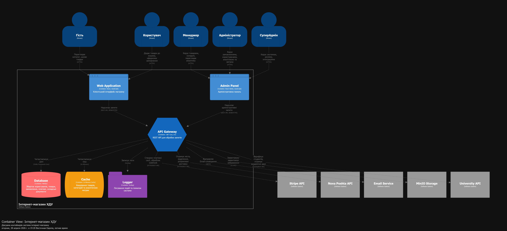
Опис контейнерів:
  - Web Application - клієнтський інтерфейс магазину (React)
  - Admin Panel - адміністративна панель (React Admin)
  - API Gateway - REST API для обробки запитів (.NET Core)
  - Database
  - MySQL для зберігання даних
  - Cache - In-Memory Cache для кешування
  - Logger - Serilog для логування
### 5.3. Компоненти API Gateway

Основні компоненти:
Middleware:
  - Authentication Middleware - перевірка JWT токенів
  - CORS Middleware - налаштування CORS політик
  - Rate Limiter - обмеження кількості запитів
Controllers:
  - AuthController
  - ProductController
  - CategoryController
  - CartController
  - OrderController
  - PaymentController
  - ShippingController
  - UserController
  - AdminController
  - WarehouseController
  - PromotionController
  - AnalyticsController
Services:
  - AuthService
  - ProductService
  - CategoryService
  - CartService
  - OrderService
  - PaymentService
  - ShippingService
  - UserService
  - ReportService
  - NotificationService
  - WarehouseService
  - PromotionService
  - AnalyticsService
Integrations:
  - Stripe Integration
  - Nova Poshta Integration
  - Email Integration
  - MinIO Integration
  - University Integration
Repositories:
  - Product Repository
  - Order Repository
  - User Repository
  - Payment Repository
  - Incoming Repository
  - Outgoing Repository
  - Promotion Repository
  - UserPromotion Repository
  - DbContext (Entity Framework Core)
### 5.4. Архітектурні патерни
1. Layered Architecture - шарова архітектура з розділенням на Controllers, Services, Repositories
2. Repository Pattern - абстракція доступу до бази даних
3. Dependency Injection - інверсія залежностей між компонентами
4. MVC Pattern - розділення відповідальностей у Frontend
### 5.5. Обґрунтування архітектурних рішень
Вибір REST API замість GraphQL  
  Рішення: REST API  
  Обґрунтування:  
    - Простота реалізації для навчального проєкту  
    - Стандартизовані HTTP методи  
    - Легка інтеграція з React та .NET Core  
    - Краща підтримка кешування  
    - Зрозуміла структура endpoints  
Вибір MySQL замість PostgreSQL  
  Рішення: MySQL 8.0  
  Обґрунтування:  
    - Простіше налаштування та адміністрування для навчального проєкту  
    - Менші вимоги до ресурсів серверу (важливо для безкоштовного хостингу)  
    - Вища швидкість читання даних для операцій SELECT (перегляд каталогу, пошук)  
    - Відмінна підтримка в Entity Framework Core через Pomelo.EntityFrameworkCore.MySql  
    - Достатня функціональність: JSON поля, ACID транзакції, full-text search  
Вибір In-Memory Cache замість Redis  
  Рішення: In-Memory Cache (ASP.NET Core)  
  Обґрунтування:  
    - Вбудований у .NET Core, без додаткових залежностей  
    - Достатній для невеликого магазину  
    - Економія ресурсів на Render.com  
    - Простіше налаштування та підтримка  
Вибір монолітної архітектури замість мікросервісів  
  Рішення: Монолітна архітектура з модульною структурою  
  Обґрунтування:  
    - Простіше розробка та налагодження  
    - Менші накладні витрати на інфраструктуру  
    - Легше розгортання  
    - Достатньо для магазину з 500-1000 користувачів  
    - Модульна структура дозволяє легко виділити мікросервіси у майбутньому  
Вибір MinIO замість AWS S3  
  Рішення: MinIO (self-hosted)  
  Обґрунтування:  
    - Безкоштовне зберігання зображень  
    - S3-сумісний API (легко мігрувати на AWS S3 у майбутньому)  
    - Повний контроль над даними  
    - Простіше налаштування для навчального проєкту  
### 5.6. Технологічний стек
Frontend:
  - React 18.x - основний UI фреймворк
  - React Router 6.x - маршрутизація
  - Axios 1.x - HTTP клієнт
  - React Admin 4.x - адміністративна панель
  - Tailwind CSS 3.x - CSS фреймворк
  - Vite 5.x - build tool
Backend:
  - ASP.NET Core 8.0 - Web API Framework
  - Entity Framework Core 8.0 - ORM
  - AutoMapper 12.x - маппінг між DTO та Entity
  - FluentValidation 11.x - валідація даних
  - Serilog 3.x - структуроване логування
  - Swagger/OpenAPI 6.x - API документація
  - iTextSharp 5.x - генерація PDF звітів
  - EPPlus 7.x - генерація Excel (XLSX) звітів
  - CsvHelper 30.x - генерація CSV файлів
Database & Storage:
  - MySQL 8.0 - основна реляційна БД
  - In-Memory Cache - кешування
  - MinIO - об'єктне сховище для зображень
Security:
  - JWT - токени автентифікації
  - ASP.NET Identity 8.0 - управління користувачами
  - BCrypt - хешування паролів
  - HTTPS/TLS 1.3 - шифрування трафіку
External Integrations:
  - Stripe v1 - обробка платежів (Sandbox mode)
  - Nova Poshta API v2.0 - доставка
  - University API - верифікація студентів та отримання академічних даних
  - SMTP - відправка email-сповіщень
DevOps:
  - Docker 24.x - контейнеризація
  - Docker Compose 2.x - локальна розробка
  - GitHub Actions - CI/CD pipeline
  - Render.com - cloud hosting (PaaS)
  - Nginx 1.25 - веб-сервер для Frontend
Testing:
  - xUnit 2.x - Unit тести для Backend
  - Moq 4.x - Mocking для тестів
  - Jest 29.x - Unit тести для Frontend
  - React Testing Library 14.x - тестування React компонентів
  - Cypress 13.x - E2E тести
### 5.7. Модулі системи
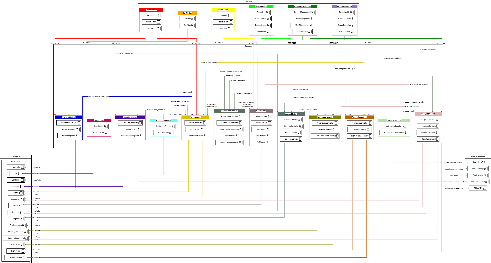
Система складається з наступних модулів:
1. CatalogModule - керування товарами та категоріями
2. CartModule - робота з кошиком покупок
3. OrderModule - обробка замовлень
4. PaymentModule - інтеграція з платіжними системами
5. ShippingModule - інтеграція з Nova Poshta
6. UserModule - автентифікація та авторизація
7. AdminPanelModule - адміністративні функції
8. NotificationModule - відправка сповіщень
9. WarehouseModule - складський облік
10. PromotionModule - керування акціями та знижками, розрахунок цін зі знижками, стакування знижок, аналітика ефективності
11. UniversityModule - інтеграція з University API для верифікації студентів, керування студентськими знижками
12. AnalyticsModule - збір, обробка та візуалізація аналітичних даних для прийняття управлінських рішень
## 6. Модель предметної області
### 6.1. Діаграма класів
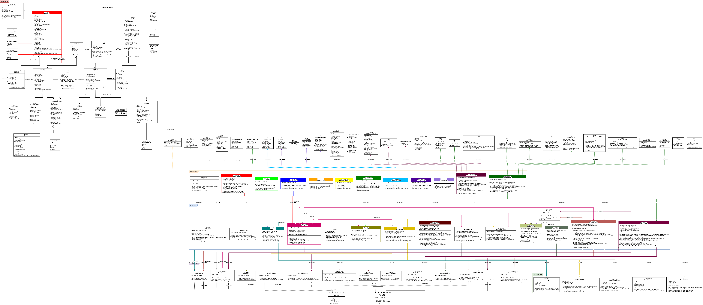
### 6.2. Структура бази даних
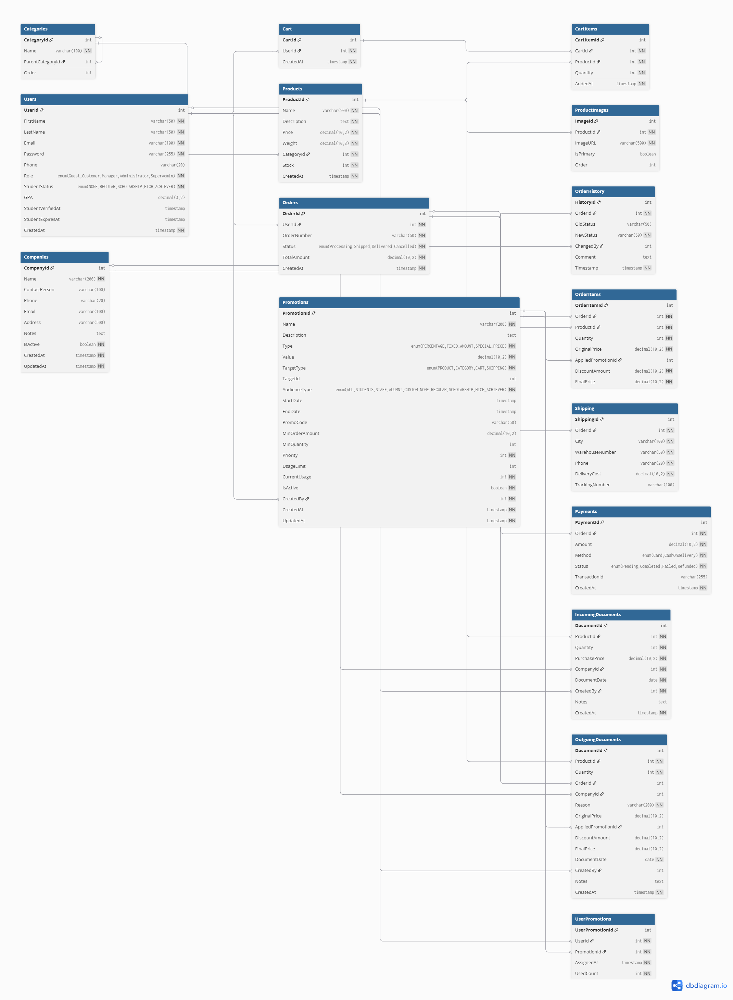
Основні таблиці:
  - Користувачі та ролі:
      + Users - інформація про користувачів
  - Каталог товарів:
      + Products - товари магазину
      + Categories - категорії товарів (з підтримкою ієрархії)
      + ProductImages - зображення товарів
  - Кошик:
      + Cart - кошики користувачів (1:1 з Users)
      + CartItems - товари в кошику
  - Замовлення:
      + Orders - замовлення клієнтів
      + OrderItems - товари в замовленні
      + OrderHistory - історія змін статусів
  - Доставка та платежі:
      + Shipping - інформація про доставку
      + Payments - платежі
  - Складський облік:
      + IncomingDocuments - прибуткові накладні (з посиланням на Companies)
      + OutgoingDocuments - видаткові накладні (з посиланням на Companies для повернень)
  - Акції та знижки:
      + Promotions - акції та знижки системи
      + UserPromotions - персональні знижки користувачів (many-to-many)
  - Фірми-постачальники:
      + Companies - фірми-постачальники для складського обліку
### 6.3. Основні сутності
**User (Користувач)**  
Поля:
  - id: int (PK)
  - firstName: string
  - lastName: string
  - email: string (unique)
  - passwordHash: string
  - phone: string
  - role: Role (enum)
  - status: UserStatus (enum)
  - studentStatus: StudentStatus (enum: NONE, REGULAR, SCHOLARSHIP, HIGH\_ACHIEVER)
  - gpa: decimal(3,2) (nullable)
  - studentVerifiedAt: DateTime (nullable)
  - studentExpiresAt: DateTime (nullable)
  - createdAt: DateTime
  - updatedAt: DateTime
Методи:
  - register()
  - login()
  - updateProfile()
  - changePassword()
  - block()
  - unblock()
  - verifyStudent()
  - isStudentStatusActive()
**Product (Товар)**  
Поля:
  - id: int (PK)
  - name: string
  - description: text
  - price: decimal
  - weight: decimal
  - categoryId: int (FK)
  - createdAt: DateTime
  - updatedAt: DateTime
  Обчислювані поля:
  - stock (розраховується через WarehouseModule)
Методи:
  - create()
  - update()
  - delete()
  - getStock()
  - checkAvailability()
**Order (Замовлення)**  
Поля:
  - id: int (PK)
  - orderNumber: string (unique)
  - userId: int (FK)
  - status: OrderStatus (enum)
  - totalAmount: decimal
  - shippingCost: decimal
  - paymentMethod: PaymentMethod (enum)
  - createdAt: DateTime
  - updatedAt: DateTime
Методи:
  - create()
  - updateStatus()
  - cancel()
  - getTotal()
**Promotion (Акція/Знижка)**  
Поля:
  - id: int (PK)
  - name: string(200)
  - description: text
  - type: PromotionType (enum: PERCENTAGE/FIXED\_AMOUNT/SPECIAL\_PRICE)
  - value: decimal(10,2)
  - targetType: PromotionTarget (enum: PRODUCT/CATEGORY/CART/SHIPPING)
  - targetId: int (FK, nullable)
  - audienceType: PromotionAudience (enum: ALL/STUDENTS/STAFF/ALUMNI/CUSTOM)
  - startDate: DateTime (nullable)
  - endDate: DateTime (nullable)
  - promoCode: string(50) (unique, nullable)
  - minOrderAmount: decimal(10,2) (nullable)
  - minQuantity: int (nullable)
  - priority: int (default: 0)
  - usageLimit: int (nullable)
  - currentUsage: int (default: 0)
  - isActive: bool (default: true)
  - createdBy: int (FK)
  - createdAt: DateTime
  - updatedAt: DateTime
Обчислювані поля:
  - isValid(), canBeUsed()
Методи:
  - create()
  - update()
  - activate()
  - deactivate()
  - delete()
  - validatePromoCode()
  - checkConditions()
  - incrementUsage()
  - calculateDiscount()
**Company (Фірма-постачальник)**  
Поля:
  - id: int
  - name: string(200)
  - contactPerson: string(100)
  - phone: string(20)
  - email: string(100)
  - address: string(500)
  - notes: text
  - isActive: bool
  - createdAt: DateTime
  - updatedAt: DateTime
Методи:
  - create()
  - update()
  - deactivate()
  - getIncomingDocuments()
  - getOutgoingDocuments()
### 6.4. Enumeration (перелічення)
Role:
  - GUEST - неавторизований відвідувач
  - CUSTOMER - зареєстрований клієнт
  - MANAGER - менеджер каталогу та складу
  - ADMIN - адміністратор замовлень
  - SUPERADMIN - технічний адміністратор
OrderStatus:
  - PENDING\_PAYMENT - очікує оплати
  - PROCESSING - обробляється
  - SHIPPED - відправлено
  - DELIVERED - доставлено
  - CANCELLED - скасовано
PaymentMethod:
  - CARD\_ONLINE - онлайн-оплата карткою через Stripe
  - CASH\_ON\_DELIVERY - оплата при отриманні
PaymentStatus:
  - PENDING - очікує оплати
  - PAID - оплачено
  - FAILED - помилка оплати
  - REFUNDED - повернено кошти
OutgoingReason:
  - ORDER - списання через замовлення (автоматично)
  - DAMAGED - пошкоджений товар
  - LOST - втрата товару
  - RETURN - повернення постачальнику
  - INVENTORY - інвентаризація
PromotionType:
  - PERCENTAGE - відсоткова знижка
  - FIXED\_AMOUNT - фіксована сума в грн
  - SPECIAL\_PRICE - спеціальна ціна
PromotionTarget:
  - PRODUCT - знижка на конкретний товар
  - CATEGORY - знижка на категорію товарів
  - CART - знижка на весь кошик
  - SHIPPING - знижка на доставку
PromotionAudience:
  - ALL - для всіх користувачів
  - STUDENTS - для студентів
  - STAFF - для працівників університету
  - ALUMNI - для випускників
  - CUSTOM - персональні знижки
StudentStatus:
  - NONE - не студент / не верифікований
  - REGULAR - звичайний студент (базова студентська знижка)
  - SCHOLARSHIP - стипендіат (підвищена знижка)
  - HIGH\_ACHIEVER - відмінник (GPA ≥ 4.5, максимальна знижка)
## 7. Діаграми варіантів використання
### 7.1. Use Case Diagram для Гостя
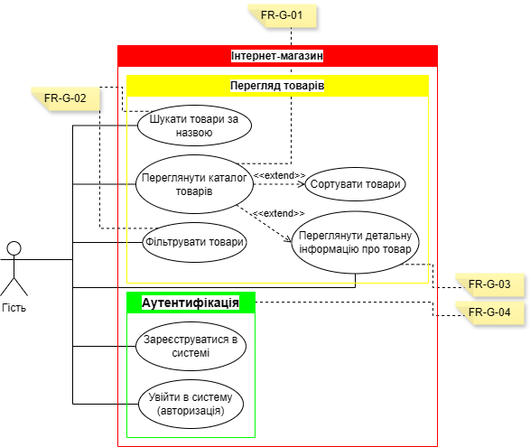
Основні прецеденти:
  - Шукати товари за назвою
  - Переглянути каталог товарів
  - Фільтрувати товари
  - Сортувати товари
  - Переглянути детальну інформацію про товар
  - Зареєструватися в системі
  - Увійти в систему (авторизація)
### 7.2. Use Case Diagram для Користувача
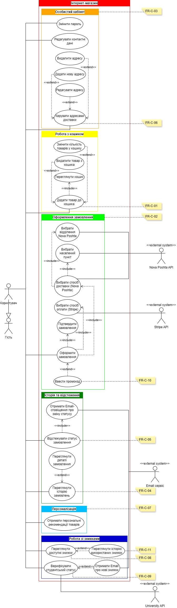
Основні прецеденти:
  - Особистий кабінет:
      + Змінити пароль
      + Редагувати контактні дані
      + Керувати адресами доставки
  - Робота з кошиком:
      + Додати товар до кошика
      + Переглянути кошик
      + Змінити кількість товарів у кошику
      + Видалити товар з кошика
  - Оформлення замовлення:
      + Оформити замовлення
      + Вибрати спосіб доставки (Nova Poshta)
      + Вибрати населений пункт
      + Вибрати відділення Nova Poshta
      + Вибрати спосіб оплати (Картка онлайн / При отриманні)
      + Підтвердити замовлення
  - Історія та відстеження:
      + Переглянути історію замовлень
      + Переглянути деталі замовлення
      + Відстежувати статус замовлення
      + Отримати Email-сповіщення про зміну статусу
  - Персоналізація:
      + Отримати персональні рекомендації товарів
  - Робота зі знижками:
      + Переглянути доступні знижки
      + Верифікувати студентський статус
### 7.3. Use Case Diagram для Менеджера
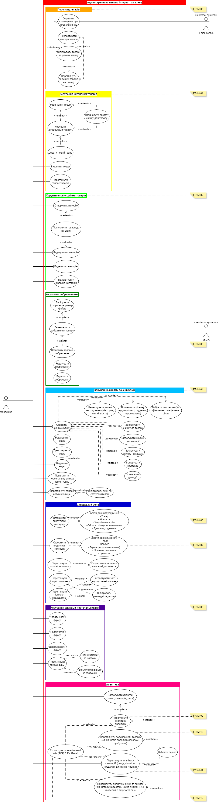
Основні прецеденти:
  - Керування каталогом товарів:
      + Додати новий товар
      + Редагувати товар
      + Видалити товар
      + Переглянути список товарів
      + Керувати атрибутами товару
  - Керування категоріями:
      + Створити категорію
      + Редагувати категорію
      + Видалити категорію
      + Налаштувати ієрархію категорій
      + Призначити товари до категорії
  - Керування зображеннями:
      + Завантажити зображення товару
      + Валідувати формат та розмір файлу
      + Встановити головне зображення
      + Редагувати зображення
      + Видалити зображення
  - Керування акціями та знижками:
      + Створити акцію/знижку
      + Редагувати акцію
      + Видалити акцію
      + Призначити персональну знижку користувачу
      + Переглянути статистику використання знижок
      + Переглянути список активних акцій
  - Перегляд запасів:
      + Переглянути залишки товарів на складі
      + Отримати сповіщення про низький запас
      + Фільтрувати товари за рівнем запасу
      + Експортувати звіт про запаси
  - Складський облік:
      + Оформити прибуткову накладну
      + Оформити видаткову накладну
      + Переглянути історію надходжень
      + Переглянути історію списань
      + Фільтрувати накладні за датою
      + Експортувати звіт надходжень/списань
      + Переглянути поточні залишки
  - Керування фірмами-постачальниками:
      + Додати нову фірму
      + Редагувати фірму
      + Деактивувати фірму
      + Переглянути список фірм
  - Аналітика:
      + Застосувати фільтри
      + Переглянути аналітику продажів
      + Переглянути популярність товарів
      + Переглянути аналітику категорій
      + Переглянути аналітику акцій та знижок
      + Експортувати аналітичний звіт
### 7.4. Use Case Diagram для Адміністратора
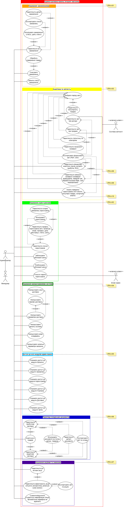
Основні прецеденти:
  - Керування замовленнями:
      + Переглянути всі замовлення
      + Переглянути деталі замовлення
      + Змінити статус замовлення
      + Скасувати замовлення
      + Фільтрувати замовлення
      + Експортувати список замовлень
      + Обробити повернення товару
  - Керування користувачами:
      + Переглянути список користувачів
      + Переглянути профіль користувача
      + Переглянути історію замовлень користувача
      + Фільтрувати користувачів
      + Заблокувати обліковий запис
      + Розблокувати обліковий запис
      + Скинути пароль користувача
  - Аналітика та звітність:
      + Вибрати період звіту
      + Переглянути звіт про продажі
      + Переглянути звіт про доходи
      + Переглянути популярність товарів
      + Переглянути статистику по категоріям
      + Переглянути фінансову аналітику
      + Переглянути метрики конверсії
      + Аналіз поведінки користувачів
      + Експортувати фінансовий звіт
  - Керування налаштуваннями системи:
      + Налаштувати валюту системи
      + Налаштувати мову інтерфейсу
      + Налаштувати параметри доставки
      + Налаштувати загальні параметри магазину
  - Перегляд складських документів:
      + Переглянути прибуткові накладні
      + Переглянути видаткові накладні
      + Фільтрувати документи
      + Переглянути деталі документа
      + Експортувати звіт по складу
      + Аналіз руху товарів
  - Керування акціями та знижками:
      + Переглянути всі активні акції
      + Переглянути ефективність акцій
      + Схвалити/відхилити студентську верифікацію
### 7.5. Use Case Diagram для СуперАдміна
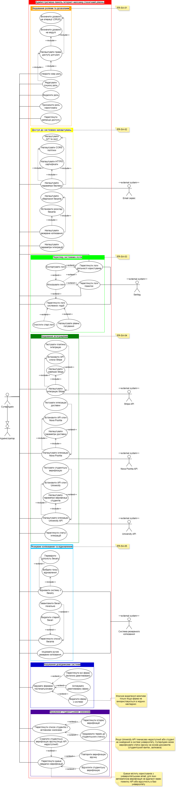
Основні прецеденти:
  - Керування ролями та дозволами:
      + Створити нову роль
      + Редагувати існуючу роль
      + Видалити роль
      + Призначити роль користувачу
      + Переглянути матрицю доступу
      + Налаштувати права доступу для ролі
      + Визначити дозволи на модулі
      + Визначити дозволи на операції (CRUD)
  - Доступ до системних налаштувань:
      + Налаштувати параметри безпеки
      + Налаштувати JWT та сесії
      + Налаштувати CORS політики
      + Налаштувати HTTPS сертифікати
      + Налаштувати резервне копіювання
      + Налаштувати зберігання бекапів
      + Встановити розклад бекапів
      + Налаштувати параметри інтеграцій
  - Перегляд системних логів:
      + Переглянути логи помилок
      + Переглянути логи системних подій
      + Переглянути логи діяльності користувачів
      + Фільтрувати логи
      + Експортувати логи
      + Очистити старі логи
      + Налаштувати рівень логування
  - Керування інтеграціями:
      + Налаштувати інтеграцію Stripe
      + Встановити API ключі Stripe
      + Налаштувати webhook Stripe
      + Тестувати платіжну інтеграцію
      + Налаштувати інтеграцію Nova Poshta
      + Встановити API ключ Nova Poshta
      + Налаштувати параметри доставки
      + Тестувати інтеграцію доставки
      + Налаштувати інтеграцію University API
      + Встановити API ключ University
      + Налаштувати параметри верифікації студентів
      + Тестувати студентську верифікацію
      + Переглянути статус інтеграцій
  - Резервне копіювання та відновлення:
      + Переглянути список бекапів
      + Ініціювати ручне резервне копіювання
      + Відновити систему з бекапу
      + Вибрати точку відновлення
      + Завантажити бекап локально
      + Видалити старий бекап
      + Перевірити цілісність бекапу
  - Керування довідниками системи:
      + Керувати фірмами-постачальниками
  - Керування студентськими знижками:
      + Переглянути список студентів з активними знижками
      + Схвалити студентську верифікацію вручну
      + Переглянути queue невдалих верифікацій
## 8. Діаграми діяльності
### 8.1. Activity Diagram: Реєстрація користувача в системі
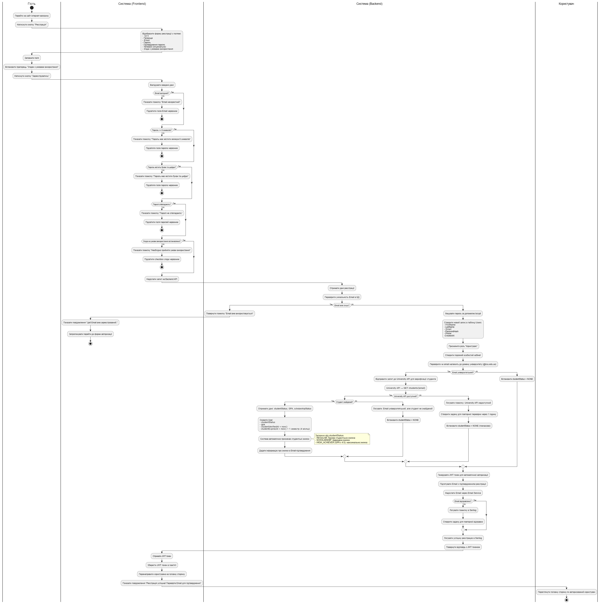
Учасники:
  - Гість
  - Система (Frontend)
  - Система (Backend)
Основні кроки:
1. Гість натискає кнопку "Реєстрація" в інтерфейсі
2. Система відображає форму реєстрації з полями:
    - Ім'я (обов'язкове)
    - Прізвище (обов'язкове)
    - Email (обов'язкове)
    - Пароль (обов'язкове, мін. 8 символів)
    - Підтвердження паролю (обов'язкове)
    - Телефон (опціонально)
    - Згода з умовами використання (обов'язкове, checkbox)
3. Гість заповнює всі обов'язкові поля
4. Гість встановлює прапорець "Згода з умовами використання"
5. Гість натискає кнопку "Зареєструватися"
6. Система валідує введені дані на клієнті (формат, довжина, співпадіння паролів)
7. Система надсилає запит на Backend API
8. Backend перевіряє унікальність Email в базі даних
9. Backend хешує пароль за допомогою bcrypt
10. Backend створює новий запис користувача в таблиці Users з полями: FirstName, LastName, Email, PasswordHash, Phone, CreatedAt
11. Backend призначає роль "Користувач"
12. Backend створює порожній особистий кабінет
13. Backend перевіряє, чи email належить до домену університету (@ksu.edu.ua)
14. Якщо email університетський:
    - Backend надсилає запит до University API для верифікації студента (GET /students/{email})
    - Якщо студент знайдений, Backend отримує дані: studentStatus, GPA, scholarshipStatus
    - Backend оновлює запис User: studentStatus, gpa, studentVerifiedAt = now(), studentExpiresAt = now() + 4 місяці
    - Система автоматично призначає студентські знижки залежно від studentStatus (REGULAR - базова, SCHOLARSHIP - підвищена, HIGH\_ACHIEVER (GPA ≥ 4.5) - максимальна)
    - Інформація про знижки додається в Email-підтвердження
15. Якщо email не університетський або студент не знайдений - встановити studentStatus = NONE
16. Backend генерує JWT токен для автоматичної авторизації
17. Backend підготовує Email з підтвердженням реєстрації (включно з інформацією про знижки, якщо є)
18. Backend надсилає Email через Email сервіс
19. Backend логує успішну реєстрацію в Serilog
20. Backend повертає успішну відповідь з JWT токеном
21. Frontend отримує JWT токен
22. Frontend зберігає JWT токен в пам'яті
23. Система перенаправляє користувача на головну сторінку
24. Система відображає повідомлення "Реєстрація успішна! Перевірте Email для підтвердження"
Точки прийняття рішень:
  - Валідація email, паролю, згоди на умови
  - Перевірка унікальності email
  - Перевірка чи є email університетським
  - Доступність University API
  - Перевірка існування студента
  - Успішність відправки email
### 8.2. Activity Diagram: Додавання нового товару
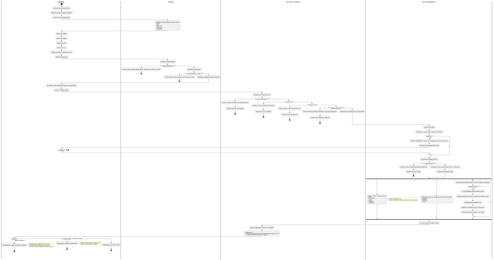
Учасники:
  - Менеджер
  - Система (Frontend)
  - Система (Backend)
Основні кроки:
1. Менеджер входить в адміністративну панель
2. Менеджер переходить до розділу "Керування товарами"
3. Менеджер натискає кнопку "Додати товар"
4. Система відображає форму додавання товару з полями: Назва, Опис, Ціна (грн), Вага (кг), Категорія, Зображення
5. Менеджер вводить назву товару
6. Менеджер вводить опис товару
7. Менеджер вводить ціну (грн)
8. Менеджер вводить вагу (кг)
9. Менеджер вибирає категорію з випадаючого списку
10. Менеджер завантажує зображення товару (до 5 файлів)
11. Система валідує формат зображень (JPEG, PNG, WebP)
12. Система валідує розмір файлів (макс. 5 MB кожен)
13. Система відображає попередній перегляд зображень
14. Менеджер встановлює головне зображення (перше за замовчуванням)
15. Менеджер натискає "Зберегти товар"
16. Система (Frontend) валідує всі обов'язкові поля
17. Система перевіряє: Всі поля заповнені, Ціна > 0, Вага > 0, Зображення завантажено
18. Система надсилає запит на Backend API з даними форми
19. Backend отримує дані товару
20. Backend перевіряє, чи назва товару вже існує в категорії
21. Якщо назва існує - Backend показує попередження "Товар з такою назвою вже існує в цій категорії" та пропонує продовжити або змінити
22. Backend завантажує зображення в MinIO
23. Backend генерує унікальні імена файлів (UUID + extensions)
24. Backend отримує URL зображень з MinIO
25. Backend створює запис в таблиці Products: Name, Description, Price, Weight, CategoryId, CreatedAt (Stock НЕ створюється, кількість буде 0 до першої прибуткової накладної)
26. Backend зберігає посилання на зображення в таблиці ProductImages: ProductId, ImageURL, IsPrimary, Order
27. Менеджер може встановити базову знижку для товару (опціонально):
    - Система відображає форму створення знижки
    - Менеджер вибирає тип знижки (%, фіксована, спеціальна ціна)
    - Менеджер вводить значення знижки
    - Менеджер встановлює дати дії (опціонально)
    - Система створює Promotion для цього товару
28. Backend логує створення товару в Serilog
29. Система показує повідомлення "Товар успішно додано"
30. Система пропонує:
    - Оформити прибуткову накладну для надходження товару на склад
    - Створити акцію/знижку для цього товару
31. Менеджер обирає:
    - Якщо "Оформити надходження" - перенаправлення на форму прибуткової накладної (товар вже обраний автоматично)
    - Якщо "Створити акцію" - перенаправлення на форму створення акції (товар вже обраний автоматично в полі "Застосувати до товару")
    - Якщо "Перейти до списку" - перенаправлення на список товарів
Точки прийняття рішень:
  - Валідація формату зображень (JPEG/PNG/WebP)
  - Валідація розміру файлів (≤5MB)
  - Перевірка заповнення всіх полів
  - Перевірка ціни та ваги (>0)
  - Перевірка наявності зображення
  - Продовження після попередження про дублікат назви
  - Доступність MinIO
  - Вибір встановлення знижки
  - Оформлення прибуткової накладної та стоврення акції для товару
### 8.3. Activity Diagram: Оформлення замовлення

Учасники:
  - Користувач
  - Система (Frontend)
  - Система (Backend - OrderService)
  - Система (Backend - WarehouseService)
  - Система (Backend - PromotionService)
  - Stripe
  - Nova Poshta API
Основні кроки:
1. Користувач переходить на сторінку кошика
2. Система відображає список товарів у кошику з загальною сумою
3. Система перевіряє доступні знижки для користувача: студентські знижки (якщо studentStatus активний), персональні знижки (UserPromotions), акційні знижки (активні Promotions)
4. Система попередньо розраховує суму з урахуванням автоматичних знижок
5. Система відображає деталізацію: Сума товарів, Автоматичні знижки, Проміжна сума
6. Користувач натискає кнопку "Оформити замовлення"
7. Система перевіряє наявність всіх товарів на складі через БД
8. Система перевіряє мінімальну суму замовлення (100 грн)
9. Система відображає форму оформлення замовлення
10. Користувач перевіряє/редагує контактні дані (ім'я, телефон, email - автозаповнення з профілю)
11. Користувач вибирає спосіб доставки "Nova Poshta"
12. Система надсилає запит до Nova Poshta API (список населених пунктів)
13. Система відображає список населених пунктів з пошуком
14. Користувач вибирає населений пункт
15. Система надсилає запит до Nova Poshta API (список відділень у населеному пункті)
16. Система відображає список відділень Nova Poshta
17. Користувач вибирає відділення Nova Poshta
18. Система надсилає запит Nova Poshta API (розрахунок вартості доставки)
19. Система отримує вартість доставки з API
20. Система розраховує загальну суму (товари + доставка)
21. Система відображає загальну суму з деталізацією: Вартість товарів (без знижок), Застосовані знижки, Проміжна сума товарів, Вартість доставки, Підсумок до оплати
22. Система відображає поле для введення промокоду (опціонально)
23. Система відображає вибір способу оплати: Карткою онлайн, Оплата при отриманні
24. Якщо користувач бажає ввести промокод:
    1) Користувач вводить промокод
    2) Backend (PromotionService) отримує промокод
    3) Backend перевіряє існування промокоду в БД
    4) Backend перевіряє валідність: isActive = true, startDate <= now <= endDate, currentUsage < usageLimit
    5) Backend перевіряє, чи промокод вже застосований до цього замовлення
    6) Backend застосовує промокод та розраховує додаткову знижку
    7) Backend перераховує загальну суму з урахуванням промокоду
    8) Система відображає оновлену деталізацію з промокодом
    9) Система показує "Промокод успішно застосовано!"
25. Користувач обирає спосіб оплати
  Для оплати карткою онлайн:
26. Користувач натискає "Підтвердити замовлення"
27. Backend (OrderService) отримує дані замовлення з Frontend
28. Backend (PromotionService) розраховує фінальні ціни для кожного товару: originalPrice (базова ціна), appliedPromotionId (ID найвигіднішої знижки або промокоду), discountAmount (сума знижки), finalPrice (ціна після знижки)
29. Backend створює запис замовлення в БД (status: "Очікує оплати")
30. Backend створює OrderItems з повною інформацією про знижки (productId, quantity, originalPrice, appliedPromotionId, discountAmount, finalPrice)
31. Backend створює видаткові накладні через WarehouseService (автоматично зменшує Stock)
32. Backend генерує сесію оплати в Stripe через API
33. Система перенаправляє користувача на сторінку Stripe
34. Користувач вводить дані банківської картки
35. Stripe обробляє платіж
36. Stripe повертає статус успішної оплати через webhook
37. Backend отримує webhook від Stripe
38. Backend перевіряє підпис webhook (webhook signature)
39. Backend оновлює статус замовлення на "Обробляється"
40. Backend оновлює статус платежу на "Оплачено"
41. Backend додає запис у таблицю Payments
42. Backend додає запис у таблицю OrderHistory
43. Backend надсилає Email-підтвердження користувачу з деталізацією: Номер замовлення, Список товарів, Вартість товарів (без знижок), Застосовані знижки (деталізація по кожній), Вартість доставки, Підсумок оплачено
44. Backend очищає кошик користувача
45. Система перенаправляє на сторінку "Замовлення успішно створено"
46. Система відображає номер та деталі замовлення
  Для оплати при отриманні:
26. Користувач натискає "Підтвердити замовлення"
27. Backend (OrderService) отримує дані замовлення з Frontend
28. Backend (PromotionService) розраховує фінальні ціни для кожного товару
29. Backend створює запис замовлення в БД (status: "Очікує оплати при отриманні")
30. Backend створює OrderItems з повною інформацією про знижки
31. Backend створює видаткові накладні через WarehouseService (автоматично зменшує Stock)
32. Backend створює запис в таблиці Payments (status: "Очікує оплати при отриманні", method: "Cash on Delivery")
33. Backend додає запис у таблицю OrderHistory
34. Якщо використано промокод - Backend оновлює Promotions.currentUsage++
35. Backend додає запис в UserPromotions (якщо персональна знижка)
36. Backend логує створення замовлення в Serilog
37. Backend надсилає Email-підтвердження користувачу з деталями: Номер замовлення, Список товарів з цінами, Вартість товарів (без знижок), Застосовані знижки (деталізація по кожній), Вартість доставки, Сума до сплати при отриманні, Адреса відділення Nova Poshta, Інструкції з оплати
38. Backend очищає кошик користувача
39. Система перенаправляє на сторінку "Замовлення успішно створено"
40. Система відображає номер та деталі замовлення
41. Система показує повідомлення "Оплатіть замовлення при отриманні на відділенні Nova Poshta"
Точки прийняття рішень:
  - Наявність товарів на складі
  - Мінімальна сума замовлення (≥100 грн)
  - Доступність Nova Poshta API
  - Спосіб оплати (картка / при отриманні)
  - Доступність Stripe API
  - Введення промокоду за бажанням
  - Перевірка валідності промокоду
  - Результат платежу (успішно / відхилено)
  - Валідність підпису webhook
  - Успішність відправки email
### 8.4. Activity Diagram: Оформлення прибуткової накладної
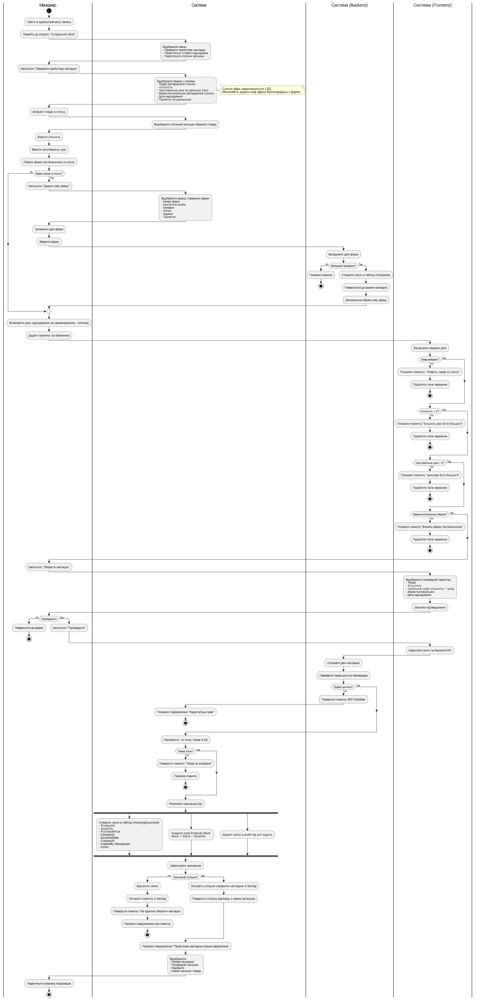
Учасники:
  - Менеджер
  - Система (Frontend)
  - Система (Backend)
Основні кроки:
1. Менеджер входить в адміністративну панель
2. Менеджер переходить до розділу "Складський облік"
3. Система відображає меню: Оформити прибуткову накладну, Переглянути історію надходжень, Переглянути поточні залишки
4. Менеджер натискає "Оформити прибуткову накладну"
5. Система відображає форму з полями: Товар (випадаючий список), Кількість, Закупівельна ціна за одиницю (грн), Фірма-постачальник (випадаючий список), Дата надходження, Примітки (опціонально)
6. Менеджер вибирає товар зі списку
7. Система відображає поточний залишок обраного товару
8. Менеджер вводить кількість
9. Менеджер вводить закупівельну ціну
10. Менеджер обирає фірму-постачальника зі списку
11. Якщо фірми немає в списку:
    1) Менеджер натискає "Додати нову фірму"
    2) Система відображає форму створення фірми: Назва фірми, Контактна особа, Телефон, Email, Адреса, Примітки
    3) Менеджер заповнює дані фірми
    4) Менеджер зберігає фірму
    5) Backend валідує дані фірми
    6) Backend створює запис в таблиці Companies
    7) Система повертається до форми накладної
    8) Система автоматично обирає нову фірму
12. Менеджер встановлює дату надходження (за замовчуванням - поточна)
13. Менеджер додає примітки (за бажанням)
14. Система (Frontend) валідує введені дані: Товар вибрано, Кількість > 0, Закупівельна ціна > 0, Фірма-постачальник обрана
15. Менеджер натискає "Зберегти накладну"
16. Система відображає попередній перегляд: Товар, Кількість, Загальна сума (кількість \* ціна), Фірма-постачальник, Дата надходження
17. Система запитує підтвердження
18. Менеджер натискає "Підтвердити"
19. Система надсилає запит на Backend API
20. Backend отримує дані накладної
21. Backend перевіряє права доступу Менеджера
22. Backend перевіряє, чи існує товар в БД
23. Backend розпочинає транзакцію БД
24. Backend створює запис в таблиці IncomingDocuments: ProductId, Quantity, PurchasePrice, CompanyId, DocumentDate, CreatedAt, CreatedBy (Менеджер), Notes
25. Backend оновлює поле Products.Stock: Stock = Stock + Quantity
26. Backend додає запис в audit log для аудиту
27. Backend фіксує транзакцію
28. Backend логує успішне створення накладної в Serilog
29. Backend повертає успішну відповідь з новим залишком
30. Система показує повідомлення "Прибуткова накладна успішно оформлена"
31. Система відображає: Номер накладної, Попередній залишок, Надійшло, Новий залишок товару
32. Менеджер переглядає оновлену інформацію
Точки прийняття рішень:
  - Валідація вибору фірми
  - Валідація вибору товару
  - Валідація кількості (>0)
  - Валідація ціни (>0)
  - Валідація постачальника (не порожній)
  - Підтвердження менеджером
  - Перевірка рівня доступу
  - Існування товару в БД
  - Успішність транзакції БД
### 8.5. Activity Diagram: Створення видаткової накладної
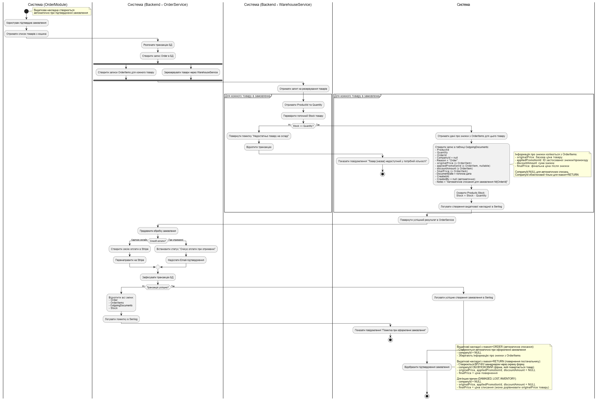
Учасники:
  - Система (OrderModule)
  - Система (Backend - OrderService)
  - Система (Backend - WarehouseService)
Основні кроки:
1. Користувач підтвердив замовлення
2. Система (OrderModule) отримує список товарів з кошика
3. Backend (OrderService) розпочинає транзакцію БД
4. Backend створює запис Order в БД
5. Backend створює записи OrderItems для кожного товару
6. Backend викликає WarehouseService для резервування товарів
7. WarehouseService отримує запит на резервування товарів
8. Для кожного товару в замовленні:
   1) WarehouseService отримує ProductId та Quantity
   2) WarehouseService перевіряє поточний Stock товару
   3) WarehouseService отримує дані про знижки з OrderItems для цього товару
   4) WarehouseService створює запис в таблиці OutgoingDocuments: ProductId, Quantity, OrderId, CompanyId = null, Reason = "Order", originalPrice (з OrderItem), appliedPromotionId (з OrderItem, nullable), discountAmount (з OrderItem), finalPrice (з OrderItem), DocumentDate = поточна дата, CreatedAt, CreatedBy = null (автоматично), Notes = "Автоматичне списання для замовлення №[OrderId]"
   5) WarehouseService оновлює Products.Stock: Stock = Stock - Quantity
   6) WarehouseService логує створення видаткової накладної в Serilog
9. WarehouseService повертає успішний результат в OrderService
10. OrderService продовжує обробку замовлення (створення сесії оплати Stripe або встановлення статусу "Очікує оплати при отриманні")
11. OrderService фіксує транзакцію БД
12. OrderService логує успішне створення замовлення в Serilog
13. Система відображає підтвердження замовлення користувачу
Точки прийняття рішень:
  - Наявність товарів (Stock ≥ quantity)
  - Спосіб оплати (картка / при отриманні)
  - Успішність транзакції БД
Примітка: Видаткова накладна створюється автоматично при підтвердженні замовлення для резервування товарів.
### 8.6. Activity Diagram: Зміна статусу замовлення
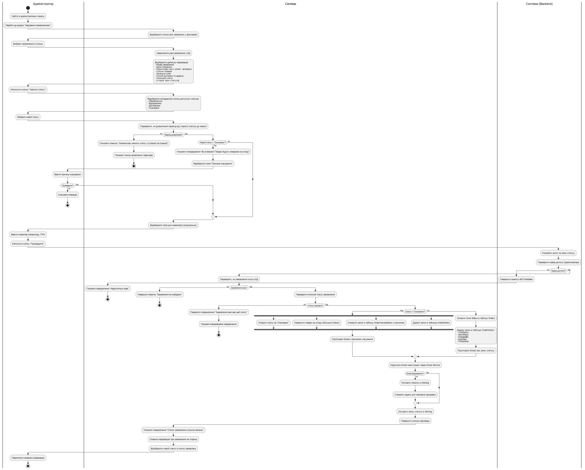
Учасники:
  - Адміністратор
  - Система (Frontend)
  - Система (Backend)
Основні кроки:
1. Адміністратор входить в адміністративну панель
2. Адміністратор переходить до розділу "Керування замовленнями"
3. Система відображає список всіх замовлень з фільтрами
4. Адміністратор вибирає замовлення зі списку
5. Система завантажує дані замовлення з БД
6. Система відображає детальну інформацію: Номер замовлення, Дата створення, Користувач (ім'я, email, телефон), Список товарів, Загальна сума, Спосіб доставки та адреса, Поточний статус, Історія змін статусів
7. Адміністратор натискає кнопку "Змінити статус"
8. Система відображає випадаючий список доступних статусів: Обробляється, Відправлено, Доставлено, Скасовано
9. Адміністратор вибирає новий статус
10. Система перевіряє, чи дозволений перехід від старого статусу до нового
11. Якщо новий статус = "Скасовано":
    1) Система показує попередження "Ви впевнені? Товари будуть повернені на склад"
    2) Система відображає поле "Причина скасування"
    3) Адміністратор вводить причину скасування
    4) Адміністратор підтверджує скасування
12. Система відображає поле для коментаря (опціонально)
13. Адміністратор вводить коментар (наприклад, ТТН)
14. Адміністратор натискає кнопку "Підтвердити"
15. Backend отримує запит на зміну статусу
16. Backend перевіряє права доступу Адміністратора
17. Backend перевіряє, чи замовлення існує в БД
18. Backend перевіряє поточний статус замовлення
19. Якщо статус = "Скасовано":
    1) Backend оновлює статус на "Скасовано"
    2) Backend повертає товари на склад (збільшує Stock для кожного товару)
    3) Backend створює запис в таблиці OrderCancellations з причиною
    4) Backend додає запис в таблицю OrderHistory
    5) Backend підготовує Email з причиною скасування
20. Якщо інший статус:
    1) Backend оновлює поле Status в таблиці Orders
    2) Backend додає запис в таблицю OrderHistory: OldStatus, NewStatus, ChangedBy, Comment, Timestamp
    3) Backend підготовує Email про зміну статусу
21. Backend надсилає Email користувачу через Email Service
22. Backend логує зміну статусу в Serilog
33. Backend повертає успішну відповідь
24. Система показує повідомлення "Статус замовлення успішно змінено"
25. Система оновлює інформацію про замовлення на сторінці
26. Система відображає новий статус в списку замовлень
27. Адміністратор переглядає оновлену інформацію
Точки прийняття рішень:
  - Дозволений перехід статусу
  - Підтвердження при скасуванні
  - Права доступу адміністратора
  - Існування замовлення
  - Зміна статусу (чи статус вже встановлений)
  - Тип нового статусу ("Скасовано" / інший)
  - Успішність транзакції БД
  - Успішність відправки email
### 8.7. Activity Diagram: Налаштування інтеграції Stripe
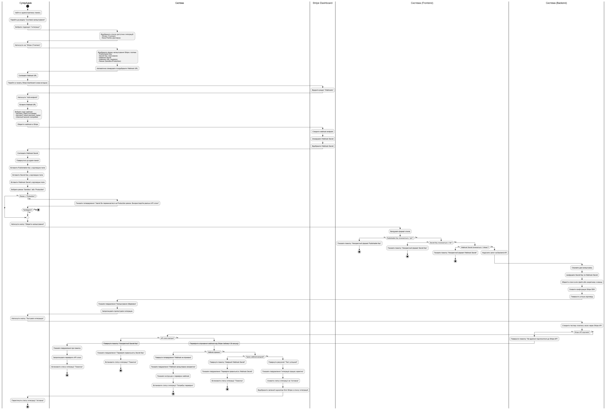
Учасники:
  - СуперАдмін
  - Система (Frontend)
  - Система (Backend)
  - Stripe Dashboard
  - Stripe API
Основні кроки:
1. СуперАдмін входить в адміністративну панель
2. СуперАдмін переходить до розділу "Системні налаштування"
3. СуперАдмін вибирає підрозділ "Інтеграції"
4. Система відображає список доступних інтеграцій: Stripe (Платежі), Nova Poshta (Доставка)
5. СуперАдмін натискає на "Stripe (Платежі)"
6. Система відображає форму налаштування Stripe з полями: Publishable Key, Secret Key (приховане), Webhook Secret, Webhook URL (readonly), Режим (Sandbox/Production)
7. Система автоматично генерує та відображає Webhook URL
8. СуперАдмін копіює Webhook URL
9. СуперАдмін переходить в панель Stripe Dashboard (нова вкладка)
10. СуперАдмін в Stripe Dashboard переходить до розділу "Webhooks"
11. СуперАдмін натискає "Add endpoint"
12. СуперАдмін вставляє Webhook URL
13. СуперАдмін вибирає події webhook: payment\_intent.succeeded, payment\_intent.payment\_failed, checkout.session.completed
14. СуперАдмін зберігає webhook в Stripe
15. Stripe створює webhook endpoint
16. Stripe генерує Webhook Secret
17. Stripe відображає Webhook Secret
18. СуперАдмін копіює Webhook Secret
19. СуперАдмін повертається до адмін-панелі
20. СуперАдмін вставляє Publishable Key у відповідне поле
21. СуперАдмін вставляє Secret Key у відповідне поле
22. СуперАдмін вставляє Webhook Secret у відповідне поле
23. СуперАдмін вибирає режим "Sandbox" або "Production"
24. Якщо режим = "Production":
    1) Система показує попередження "Увага! Ви перемикаєтеся на Production режим. Використовуйте реальні API ключі"
    2) СуперАдмін підтверджує або скасовує
25. СуперАдмін натискає кнопку "Зберегти налаштування"
26. Система (Frontend) валідує формат ключів: Publishable Key починається з "pk", Secret Key починається з "sk", Webhook Secret починається з "whsec"
27. Система надсилає запит на Backend API
28. Backend отримує дані налаштувань
29. Backend шифрує Secret Key та Webhook Secret
30. Backend зберігає ключі в env файлі або секретному сховищі
31. Backend оновлює конфігурацію Stripe SDK
32. Backend повертає успішну відповідь
33. Система показує повідомлення "Налаштування збережено"
34. Система пропонує протестувати інтеграцію
35. СуперАдмін натискає кнопку "Тестувати інтеграцію"
36. Backend створює тестову платіжну сесію через Stripe API
37. Backend перевіряє, чи Stripe API відповів
38. Backend перевіряє, чи API ключі валідні
39. Backend перевіряє отримання webhook від Stripe (таймаут 30 секунд)
40. Backend перевіряє, чи підпис webhook валідний
41. Backend повертає результат тесту: "Успішно"
42. Система показує повідомлення "Інтеграція працює коректно"
43. Система оновлює статус інтеграції на "Активна"
44. Система відображає зелений індикатор біля Stripe в списку інтеграцій
45. СуперАдмін переглядає статус інтеграції "Активна"
Точки прийняття рішень:
  - Режим (Production - показує попередження)
  - Валідація формату ключів (pk\_, sk\_, whsec\_)
  - Права доступу (тільки СуперАдмін)
  - Доступність Stripe API
  - Валідність API ключів
  - Отримання webhook (таймаут 30 сек)
  - Валідність підпису webhook
### 8.8. Activity Diagram Перегляд аналітики
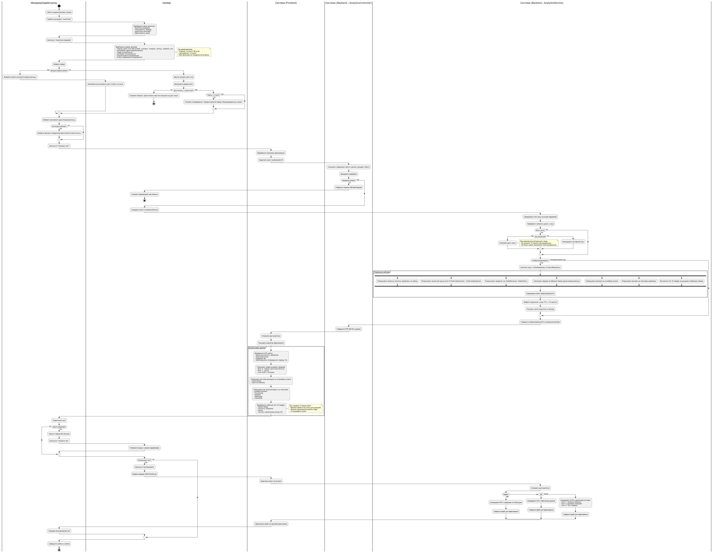
Учасники:
  - Менеджер/Адміністратор
  - Система
  - Система (Frontend)
  - Система (Backend - AnalyticsController)
  - Система (Backend - AnalyticsService)
Основні кроки:
1. Менеджер/Адміністратор входить в адміністративну панель
2. Менеджер/Адміністратор переходить до розділу "Аналітика"
3. Система відображає меню аналітики: Аналітика продажів, Популярність товарів, Аналітика категорій, Ефективність акцій
4. Менеджер/Адміністратор натискає "Аналітика продажів"
5. Система відображає форму фільтрів: Період (дати з/по або preset: сьогодні, тиждень, місяць, квартал, рік), Групування (день/тиждень/місяць), Товар (опціонально), Категорія (опціонально), Спосіб оплати (опціонально), Статус замовлення (опціонально)
6. За замовчуванням встановлено: Період - останні 30 днів, Групування - по днях, Без фільтрів за товаром/категорією
7. Менеджер/Адміністратор вибирає період (preset або вручну)
8. Якщо preset - система автоматично встановлює дати початку та кінця
9. Якщо вручну - менеджер вказує дати з/по, система валідує: Дата початку <= Дата кінця, Період <= 2 роки (якщо більше - показати попередження)
10. Менеджер/Адміністратор вибирає групування (день/тиждень/місяць)
11. За бажанням - менеджер/адміністратор застосовує фільтри (товар/категорія/спосіб оплати/статус)
12. Менеджер/Адміністратор натискає "Показати звіт"
13. Система (Frontend) відображає індикатор завантаження
14. Система надсилає запит на Backend API (AnalyticsController)
15. Backend отримує параметри запиту (period, groupBy, filters)
16. Backend валідує параметри
17. Backend передає запит в AnalyticsService
18. AnalyticsService формує ключ кешу на основі параметрів
19. AnalyticsService перевіряє наявність даних у кеші
20. Якщо дані в кеші та кеш актуальний (не минуло 15 хвилин, не було нових замовлень) - AnalyticsService отримує дані з кешу
21. Якщо потрібно розраховувати:
    1) AnalyticsService запитує дані з OrderRepository, ProductRepository
    2) AnalyticsService розраховує метрики: Загальна кількість замовлень за період, Загальний дохід (sum of Order.totalAmount + Order.shippingCost), Середній чек (totalRevenue / totalOrders), Групування продажів за обраний період (день/тиждень/місяць), Розподіл за способами оплати, Розподіл за статусами замовлень, Топ-10 товарів за доходом
    3) AnalyticsService формує об'єкт SalesAnalyticsDTO
    4) AnalyticsService зберігає результат у кеш (TTL = 15 хвилин)
    5) AnalyticsService логує запит аналітики в Serilog
22. AnalyticsService повертає SalesAnalyticsDTO в AnalyticsController
23. Backend повертає HTTP 200 OK з даними
24. Система (Frontend) отримує дані аналітики
25. Система приховує індикатор завантаження
26. Система відображає KPI картки: Загальна кількість замовлень, Загальний дохід, Середній чек, Зміна відносно попереднього періоду (%)
27. Система будує графік динаміки продажів (Line chart): Вісь X - період, Вісь Y - дохід
28. Система будує pie chart розподілу за способами оплати (Card Online, Cash on Delivery)
29. Система будує bar chart розподілу за статусами (Pending Payment, Processing, Shipped, Delivered, Cancelled)
30. Система відображає таблицю топ-10 товарів: Назва товару, Кількість продажів, Дохід, Частка у загальному доході (%)
31. Менеджер/Адміністратор переглядає звіт
32. За бажанням - менеджер/адміністратор змінює параметри та натискає "Оновити звіт" (повернення до кроку 14)
33. За бажанням - менеджер/адміністратор натискає "Експортувати"
34. Менеджер/Адміністратор вибирає формат (PDF/CSV/Excel)
35. Система надсилає запит на експорт
36. Backend (AnalyticsService) отримує дані аналітики
37. Якщо PDF - Backend генерує PDF з графіками та таблицями
38. Якщо CSV - Backend генерує CSV з табличними даними
39. Якщо Excel - Backend генерує XLSX з декількома листами (Лист 1: Загальні метрики, Лист 2: Динаміка продажів, Лист 3: Топ товарів)
40. Backend повертає файл для завантаження
41. Система завантажує файл на пристрій користувача
42. Менеджер/Адміністратор отримує експортований звіт
Точки прийняття рішень:
  - Вибір періоду
  - Перевірка правильності дат початку та кінця
  - Вибір застосування фільтрів
  - Валідність введених параметрів запиту
  - Перевірка наявності даних в кеші
  - Перевірка актуальності кешу
  - Вибір разрахунку
  - Вибір зміни параметрів
  - Вибір експорту звіту
  - Вибір формату звіту
## 9. Діаграми послідовності
### 9.1. Sequence Diagram: Реєстрація користувача в системі
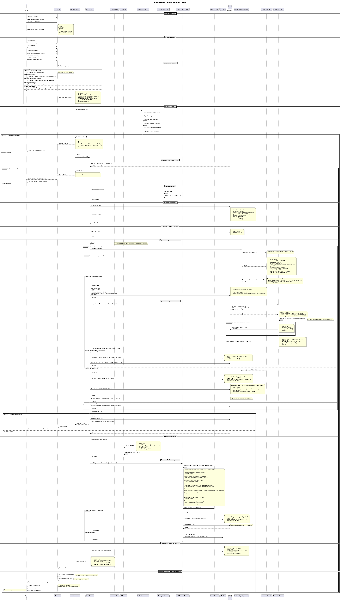
Учасники:
  - Гість
  - Frontend
  - AuthController
  - AuthService
  - UserService
  - JWTService
  - ValidationService
  - EncryptionService
  - NotificationService
  - Email Service
  - UniversityIntegration
  - University API
  - PromotionService
  - Serilog
  - Database
Основний сценарій:
1. Початок реєстрації:
    1) Гість переходить на сайт та натискає "Реєстрація"
    2) Frontend відображає форму з полями: Ім'я, Прізвище, Email, Пароль, Підтвердження паролю, Телефон (опціонально), Згода з умовами
2. Заповнення форми:
    3) Гість заповнює всі поля форми
    4) Frontend валідує дані на клієнті (формат email, довжина паролю ≥8, наявність букв та цифр, співпадіння паролів, згода з умовами)
3. Відправка на Backend:
    5) Frontend надсилає POST /api/auth/register з RegisterDTO
    6) AuthController отримує запит та передає в ValidationService
4. Валідація на Backend:
    7) ValidationService перевіряє обов'язкові поля, формат email, довжину та складність паролю, формат телефону
    8) Якщо валідація не пройдена → повертає 400 Bad Request з помилками → Frontend відображає помилки
5. Перевірка унікальності email:
    9) AuthService запитує Database: SELECT \* FROM Users WHERE email = ?
    10) Якщо email вже існує → повертає 409 Conflict → Frontend пропонує перейти до авторизації
    11) Якщо email унікальний → продовжує реєстрацію
6. Хешування паролю:
    12) AuthService передає пароль в EncryptionService
    13) EncryptionService генерує salt та хешує пароль через bcrypt (12 rounds)
    14) Повертає passwordHash
7. Створення користувача (Транзакція):
    15) Database: BEGIN TRANSACTION
    16) INSERT INTO Users (firstName, lastName, email, passwordHash, phone, role: "CUSTOMER", status: "ACTIVE", createdAt: NOW())
    17) Database повертає userId
    18) INSERT INTO Cart (userId, createdAt: NOW())
    19) Database повертає cartId
8. Верифікація студентського статусу:
    20) AuthService перевіряє чи email університетський (@ksu.edu.ua або @student.ksu.edu.ua)
    21) Якщо ТАК:
        A. UniversityIntegration надсилає GET /api/students/{email} до University API  
        B. Якщо University API доступний та студент знайдений:  
            a. University API повертає дані: studentId, firstName, lastName, email, gpa, scholarshipStatus, studentStatus, enrollmentYear, faculty, specialty  
            b. UniversityIntegration мапить studentStatus:  
                - GPA ≥ 4.5 && scholarshipStatus = ACTIVE → HIGH\_ACHIEVER  
                - scholarshipStatus = ACTIVE → SCHOLARSHIP  
                - інакше → REGULAR  
            c. UPDATE Users SET studentStatus, gpa, studentVerifiedAt: NOW(), studentExpiresAt: NOW() + 4 MONTH WHERE id = userId  
            d. PromotionService призначає студентські знижки:  
                a) SELECT \* FROM Promotions WHERE audienceType = 'STUDENTS' AND isActive = true  
                b) Вибирає відповідні знижки за studentStatus (для HIGH\_ACHIEVER: 15%)  
                c) INSERT INTO UserPromotions (userId, promotionId, assignedAt: NOW(), usedCount: 0)  
                d) Логує через Serilog: "Student promotions assigned"  
            e. Якщо University API недоступний:  
                a) Логує помилку через Serilog  
                b) INSERT INTO StudentVerificationQueue (userId, email, retryCount: 0, nextRetryAt: NOW() + 1 HOUR)
                c) UPDATE Users SET studentStatus = 'NONE' (тимчасово, до успішної верифікації)
        C. Якщо НІ (не університетський email):
            a. UPDATE Users SET studentStatus = 'NONE'
9. Завершення транзакції:
    22) Database: COMMIT TRANSACTION
    23) Якщо помилка → ROLLBACK TRANSACTION → 500 Internal Error → Frontend: "Помилка реєстрації"
10. Генерація JWT токену:
    24) JWTService створює payload: {userId, email, role: "CUSTOMER", iat: timestamp, exp: timestamp + 3600}
    25) Підписує токен через JWT\_SECRET
    26) Повертає JWT token
11. Відправка Email-підтвердження:
    27) NotificationService формує Email:
        A. Якщо studentStatus активний: "Ви верифіковані як студент ХДУ! Статус: [HIGH\_ACHIEVER/SCHOLARSHIP/REGULAR], GPA: [X.X]. Доступні знижки: [Y%] на весь асортимент. Термін дії: [дата]"
        B. Якщо studentStatus = NONE: Базове вітання без інформації про студентські знижки
    28) Email Service надсилає через SMTP
    29) Якщо помилка → логує через Serilog → INSERT INTO EmailQueue для повторної спроби
12. Логування успішної реєстрації:
    30) Serilog: "User registered" з деталями (userId, email, role, registeredAt)
13. Повернення результату:
    31) AuthController повертає 201 Created: {userId, token, role, expiresAt, message: "Реєстрація успішна"}
    32) Frontend зберігає JWT token в sessionStorage
    33) Оновлює стан: isAuthenticated = true
    34) Перенаправляє на головну сторінку
    35) Показує повідомлення: "Реєстрація успішна! Перевірте Email для підтвердження"
Альтернативні сценарії:  
    - Email вже зареєстрований: Система повідомляє про конфлікт та пропонує авторизуватися  
    - University API недоступний: Реєстрація завершується успішно зі studentStatus = 'NONE', верифікація буде повторена автоматично через 1 годину  
    - Email не відправлено: Користувач зареєстрований, але email додається в чергу для повторної спроби  
    - Транзакція не вдалася: Всі зміни відкатуються, користувач отримує повідомлення про помилку
### 9.2. Sequence Diagram: Додавання нового товару
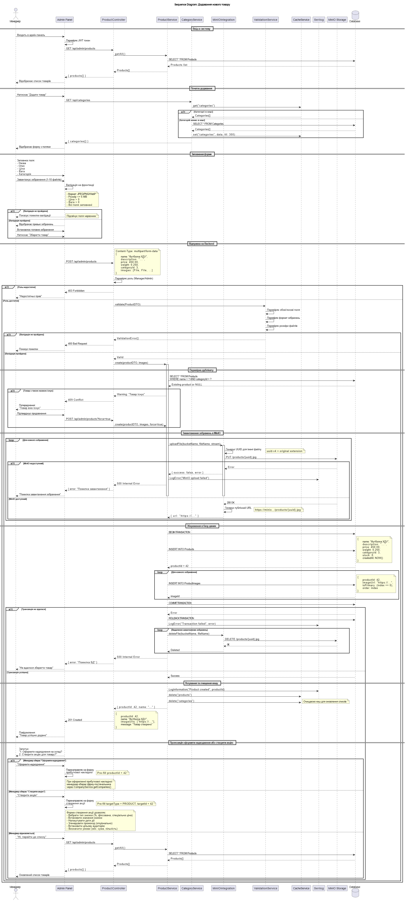
Учасники:
  - Менеджер
  - Admin Panel
  - ProductController
  - ProductService
  - CategoryService
  - MinIOIntegration
  - ValidationService
  - CacheService
  - Serilog
  - MinIO Storage
  - Database
Основний сценарій:
1. Вхід в систему:
    1) Менеджер входить в адмін-панель
    2) AdminPanel перевіряє JWT токен (роль: MANAGER або ADMIN)
    3) GET /api/admin/products → ProductService.getAll()
    4) Database: SELECT \* FROM Products
    5) Frontend відображає список товарів
2. Початок додавання:
    6) Менеджер натискає "Додати товар"
    7) AdminPanel → CategoryService: GET /api/categories
    8) CategoryService → CacheService: get("categories")
    9) Якщо категорії в кеші: → повертає з кешу
    10) Якщо категорій немає в кеші:
    11) Database: SELECT \* FROM Categories
    12) CacheService: set("categories", data, ttl: 300)
    13) AdminPanel відображає форму з полями (назва, опис, ціна, вага, категорія) та можливістю завантаження зображень (1-10 файлів)
3. Заповнення форми:
    12) Менеджер заповнює поля та завантажує зображення
    13) AdminPanel валідує на фронтенді:
        - Формат: JPEG/PNG/WebP
        - Розмір <= 5 MB
        - Ціна > 0
        - Вага > 0
        - Всі поля заповнені
    14) Якщо валідація не пройдена: → показує помилки, підсвічує поля червоним
    15) Якщо валідація пройдена:
        A. Відображає превью зображень  
        B. Менеджер встановлює головне зображення  
        C. Менеджер натискає "Зберегти товар"
4. Відправка на Backend:
    16) AdminPanel → ProductController: POST /api/admin/products (Content-Type: multipart/form-data) з {name, description, price, weight, categoryId, images: [File, File, ...]}
    17) ProductController перевіряє роль (Manager/Admin)
    18) Якщо роль недостатня: → 403 Forbidden → AdminPanel: "Недостатньо прав"
5. Валідація на Backend:
    19) ProductController → ValidationService: validate(ProductDTO)
    20) ValidationService перевіряє обов'язкові поля, формат зображень, розміри файлів
    21) Якщо валідація не пройдена: → ValidationError[] → 400 Bad Request → AdminPanel показує помилки
    22) Якщо валідація пройдена: → продовжити
6. Перевірка дублікату:
    23) ProductService → Database: SELECT \* FROM Products WHERE name = ? AND categoryId = ?
    24) Якщо товар з такою назвою існує:
        A. 409 Conflict → AdminPanel: Попередження "Товар вже існує"  
        B. Менеджер підтверджує продовження  
        C. AdminPanel → ProductController: POST /api/admin/products?force=true  
        D. ProductService.create(productDTO, images, force=true)
7. Завантаження зображень в MinIO:
    25) Для кожного зображення:
        A. ProductService → MinIO: uploadFile(bucketName, fileName, stream)  
        B. MinIO генерує UUID для імені файлу (uuid-v4 + original extension)  
        C. MinIO → MinIO Storage: PUT /products/{uuid}.jpg  
        D. Якщо MinIO недоступний:  
            a. MinIO Storage → MinIO: Error  
            b. MinIO → ProductService: {success: false, error}  
            c. Serilog: LogError("MinIO upload failed")  
            d. ProductService → ProductController: 500 Internal Error  
            e. AdminPanel: "Помилка завантаження зображення"  
            f. Процес припиняється  
        E. Якщо MinIO доступний:  
            a. MinIO Storage → MinIO: 200 OK  
            b. MinIO генерує публічний URL (https://minio.../products/{uuid}.jpg)  
            c. MinIO → ProductService: {url: "https://..."}
8. Збереження в базу даних (Транзакція):
    26) Database: BEGIN TRANSACTION
    27) INSERT INTO Products з {name, description, price, weight, categoryId, stock: 0, createdAt: NOW()}
    28) Database повертає productId = 42
    29) Для кожного зображення:
        A. INSERT INTO ProductImages з {productId: 42, imageUrl: "https://...", isPrimary: (index == 0), order: index}  
        B. Database повертає imageId
    30) Database: COMMIT TRANSACTION
    31) Якщо транзакція не вдалася:
        A. Database → ProductService: Error  
        B. Database: ROLLBACK TRANSACTION  
        C. Serilog: LogError("Transaction failed", error)  
        D. Видалення завантажених зображень з MinIO:  
            a. ProductService → MinIO: deleteFile(bucketName, fileName) для кожного завантаженого файлу  
            b. MinIO → MinIO Storage: DELETE /products/{uuid}.jpg  
        E. ProductService → ProductController: 500 Internal Error  
        F. AdminPanel: "Не вдалося зберегти товар"
    32) Якщо транзакція успішна:
        A. Database → ProductService: Success  
        B. Serilog: LogInformation("Product created", productId)  
        C. CacheService: delete("products"), delete("categories") -- очищення кешу для оновлення списків  
        D. ProductService → ProductController: {productId: 42, name: "..."}  
        E. ProductController → AdminPanel: 201 Created з {productId: 42, name: "Футболка ХДУ", imageUrls: ["https://..."], message: "Товар створено"}  
        F. AdminPanel → Менеджер: Повідомлення "Товар успішно додано"
9. Пропозиція оформити надходження або створити акцію:
    33) AdminPanel → Менеджер: Запитує "1. Оформити надходження на склад? 2. Створити акцію для товару?"
    34) Сценарій 1: Менеджер обирає "Оформити надходження":
        A. AdminPanel перенаправляє на форму прибуткової накладної з pre-fill productId = 42  
        B. При оформленні менеджер обирає фірму-постачальника через CompanyService.getCompanies()
    35) Сценарій 2: Менеджер обирає "Створити акцію":
        A. AdminPanel перенаправляє на форму створення акції з pre-fill targetType = PRODUCT, targetId = 42  
        B. Форма дозволяє: вибрати тип знижки (%, фіксована, спеціальна ціна), встановити значення знижки, налаштувати дати дії, згенерувати промокод (опціонально), встановити цільову аудиторію, визначити умови (мін. сума, кількість)
    36) Сценарій 3: Менеджер відмовляється:
        A. AdminPanel → ProductController: GET /api/admin/products  
        B. ProductService.getAll() → Database: SELECT \* FROM Products  
        C. AdminPanel відображає оновлений список товарів  
Альтернативні сценарії:
  - MinIO недоступний: Процес припиняється, менеджер отримує помилку, товар не створюється
  - Транзакція не вдалася: Всі завантажені зображення видаляються з MinIO, товар не створюється
  - Дублікат товару: Менеджер отримує попередження, може підтвердити створення або скасувати
### 9.3. Sequence Diagram: Оформлення замовлення
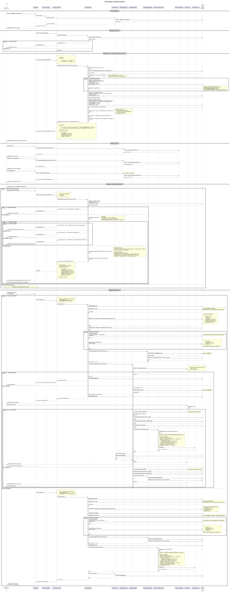
Учасники:
  - Користувач
  - Frontend
  - CartController
  - OrderController
  - OrderService
  - CartService
  - ShippingService
  - PaymentService
  - WarehouseService
  - NotificationService
  - PromotionService
  - Nova Poshta API
  - Stripe API
  - Email Service
  - Database
Основний сценарій:
1. Перегляд кошика:
    1) Користувач натискає "Оформити замовлення"
    2) Frontend → CartController: GET /api/cart
    3) CartService отримує дані з Database (Cart, CartItems)
    4) Повертає Frontend: {items[], total}
    5) Frontend відображає список товарів
2. Перевірка наявності:
    6) Frontend → OrderController: POST /api/orders/validate
    7) OrderService → Database: SELECT Stock FROM Products
    8) Якщо товари недоступні → 400 Bad Request → Frontend: "Товар недоступний"
    9) Якщо товари доступні → продовжити
3. Перевірка та застосування автоматичних знижок:
    10) Frontend → OrderController: GET /api/promotions/applicable з {userId, cartItems: [{productId, quantity}]}
    11) OrderService → Database: SELECT studentStatus, gpa FROM Users WHERE id = userId
    12) OrderService перевіряє чи studentStatus активний (studentExpiresAt > now())
    13) Якщо studentStatus активний:
        A. SELECT \* FROM Promotions WHERE audienceType = 'STUDENTS' AND isActive = true AND startDate <= now() AND endDate >= now()  
        B. Вибирає знижки залежно від studentStatus:  
            - REGULAR: базова студентська знижка (5%)  
            - SCHOLARSHIP: знижка для стипендіатів (10%)  
            - HIGH\_ACHIEVER (GPA >= 4.5): знижка для відмінників (15%)  
    14) SELECT персональні знижки з UserPromotions
    15) SELECT акційні знижки з Promotions (targetType = 'PRODUCT'/'CATEGORY'/'CART', audienceType = 'ALL')
    16) Об'єднує всі знижки та сортує за пріоритетом:
        - Персональні (найвищий)
        - Студентські (за studentStatus)
        - Товарні/Категорійні
        - Загальні акції
    17) Для кожного товару обирає найвигіднішу знижку (без стакування)
    18) Розраховує попередні ціни: {originalPrice, appliedPromotionId, discountAmount, finalPrice}
    19) Повертає Frontend: {promotions[], itemsWithDiscounts[]}
4. Вибір доставки:
    20) Користувач обирає місто
    21) Frontend → ShippingService: GET /api/shipping/cities?search=Київ
    22) ShippingService → Nova Poshta API: POST /v2.0/json/ (getCities)
    23) Nova Poshta API → ShippingService: {cities[]}
    24) Користувач обирає відділення
    25) Frontend → ShippingService: GET /api/shipping/warehouses?cityRef=xxx
    26) ShippingService → Nova Poshta API: POST /v2.0/json/ (getWarehouses)
    27) Frontend → ShippingService: POST /api/shipping/calculate з {cityRef, weight}
    28) ShippingService → Nova Poshta API: POST /v2.0/json/ (getDocumentPrice)
    29) Повертає Frontend: {cost: 85.00, estimatedDays: "1-2"}
5. Введення промокоду (опціонально):
    30) Якщо користувач вводить промокод:
        A. Frontend → OrderController: POST /api/promotions/validate-code з {promoCode: "KSU2026", userId, cartItems}  
        B. OrderService → Database: SELECT \* FROM Promotions WHERE promoCode = ? AND isActive = true  
        C. Якщо промокод не знайдено: → 400 Bad Request → Frontend: "Промокод не знайдено"  
        D. Якщо промокод знайдено:  
            a. Перевіряє валідність: startDate <= now() <= endDate, currentUsage < usageLimit, відповідає умовам (мін. сума, мін. кількість)  
            b. Якщо невалідний: → 400 Bad Request → Frontend показує причину ("Термін дії закінчився" / "Промокод вичерпано" / "Мінімальна сума 500 грн")  
            c. Якщо валідний:  
                a) Застосовує промокод ПОВЕРХ автоматичних знижок  
                b) Стакування знижок: спочатку автоматичні (студентські, персональні, акційні), потім промокод  
                c) Для кожного товару: originalPrice → (автоматичні знижки) → (промокод) → finalPrice  
                d) Перераховує фінальні ціни  
                e) Повертає Frontend: {valid: true, updatedPrices[], newTotal, promoCodeDiscount}  
                f) Frontend оновлює деталізацію: показує автоматичні знижки окремо + знижку від промокоду окремо + загальну суму знижок
    31) Якщо користувач не вводить промокод: → продовжити з автоматичними знижками
6. Оформлення замовлення:
    32) Користувач обирає спосіб оплати (CARD\_ONLINE або CASH\_ON\_DELIVERY) та підтверджує
7. Сценарій 1: Оплата карткою онлайн:
    33) Frontend → OrderController: POST /api/orders з {items, shippingAddress, paymentMethod: "CARD\_ONLINE"}
    34) OrderService → Database: BEGIN TRANSACTION
    35) INSERT INTO Orders (status: "PENDING\_PAYMENT", totalAmount: сума з урахуванням ВСІХ знижок)
    36) INSERT INTO OrderItems з повною інформацією про знижки: {productId, quantity, originalPrice, appliedPromotionId, discountAmount, finalPrice}
    37) Якщо використано промокод:
        A. UPDATE Promotions SET currentUsage = currentUsage + 1 WHERE id = ?  
        B. INSERT INTO UserPromotions або UPDATE usedCount = usedCount + 1
    38) WarehouseService.createOutgoingDocument(orderId, items):
        A. INSERT INTO OutgoingDocuments з інформацією про знижки: {productId, quantity, orderId, reason: "ORDER", originalPrice, appliedPromotionId, discountAmount, finalPrice, notes: "Автоматичне списання", documentDate: CURRENT\_DATE}  
        B. UPDATE Products SET stock = stock - quantity  
        C. INSERT INTO AuditLog
    39) PaymentService.createPaymentSession(orderId, amount):
        D. Stripe API: POST /v1/checkout/sessions  
        E. Якщо Stripe недоступний: → ROLLBACK TRANSACTION → 500 Internal Error → Frontend: "Платіжна система недоступна"  
        F. Якщо Stripe доступний:  
            a. Повертає {sessionId, url}  
            b. INSERT INTO Payments (status: "PENDING")
    40) Database: COMMIT TRANSACTION
    41) Повертає Frontend: {orderId, paymentUrl}
    42) Frontend перенаправляє користувача на Stripe
    43) Користувач вводить дані картки
    44) Якщо платіж успішний:
        A. Stripe API → PaymentService: POST /api/webhooks/stripe (payment\_intent.succeeded)  
        B. UPDATE Payments SET status = "PAID"  
        C. UPDATE Orders SET status = "PROCESSING"  
        D. INSERT INTO OrderHistory  
        E. NotificationService формує Email з детальною інформацією про знижки:  
            a. Вартість товарів (без знижок): XXXX грн  
            b. Застосовані знижки:  
                a) Студентська знижка 10%: -XX грн  
                b) Промокод KSU2026: -YY грн  
            c. Проміжна сума товарів: ZZZZ грн  
            d. Вартість доставки: 85 грн  
            e. Підсумок оплачено: TOTAL грн  
        F. Email Service надсилає email  
        G. CartService.clearCart(userId)  
        H. Stripe API перенаправляє на success\_url  
        I. Frontend: "Замовлення успішно створено!"
    45) Якщо платіж відхилено:
        A. Stripe API → PaymentService: POST /api/webhooks/stripe (payment\_intent.payment\_failed)  
        B. UPDATE Payments SET status = "FAILED"  
        C. UPDATE Orders SET status = "CANCELLED"  
        D. WarehouseService.returnStock(orderId): DELETE FROM OutgoingDocuments, UPDATE Products SET stock = stock + quantity  
        E. Stripe API перенаправляє на cancel\_url  
        F. Frontend: "Оплата відхилена"
8. Сценарій 2: Оплата при отриманні:
    33) Frontend → OrderController: POST /api/orders з {items, shippingAddress, paymentMethod: "CASH\_ON\_DELIVERY"}
    34) OrderService → Database: BEGIN TRANSACTION
    35) INSERT INTO Orders (status: "PROCESSING", totalAmount: сума з урахуванням ВСІХ знижок)
    36) INSERT INTO OrderItems з повною інформацією про знижки: {productId, quantity, originalPrice, appliedPromotionId, discountAmount, finalPrice}
    37) INSERT INTO Shipping
    38) INSERT INTO Payments (status: "PENDING", method: "CASH\_ON\_DELIVERY")
    39) Якщо використано промокод:
        A. UPDATE Promotions SET currentUsage = currentUsage + 1  
        B. INSERT INTO UserPromotions або UPDATE usedCount = usedCount + 1
    40) WarehouseService.createOutgoingDocument(orderId, items):
        A. INSERT INTO OutgoingDocuments з інформацією про знижки  
        B. UPDATE Products SET stock = stock - quantity
    41) Database: COMMIT TRANSACTION
    42) NotificationService відправляє Email з детальною інформацією про знижки + адреса відділення Nova Poshta + інструкції з оплати
    43) CartService.clearCart(userId)
    44) Повертає Frontend: {orderId, orderNumber}
    45) Frontend: "Замовлення створено! Оплатіть при отриманні"
Альтернативні сценарії:
  - Товар недоступний: Користувач отримує повідомлення, замовлення не створюється
  - Промокод невалідний: Показується конкретна причина (термін, ліміт, умови), користувач може продовжити без промокоду
  - Stripe недоступний: Транзакція відкатується, користувач отримує помилку з пропозицією спробувати пізніше або обрати оплату при отриманні
  - Платіж відхилено: Замовлення скасовується, товари повертаються на склад, користувач інформується
### 9.4. Sequence Diagram: Оформлення прибуткової накладної
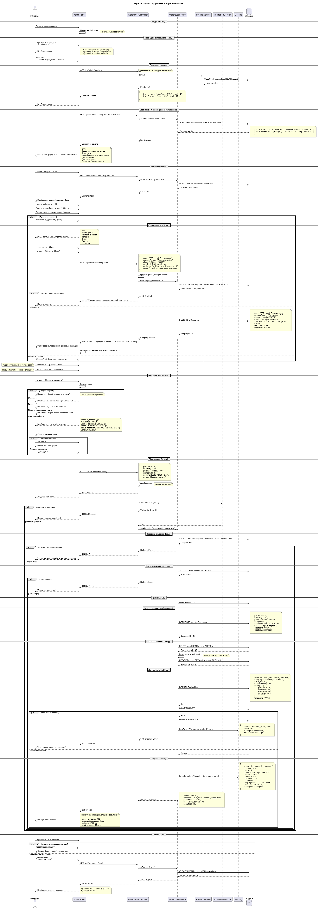
Учасники:
  - Менеджер
  - Admin Panel
  - WarehouseController
  - WarehouseService
  - ProductService
  - ValidationService
  - Serilog
  - Database
Основний сценарій:
1. Вхід в систему:
    1) Менеджер входить в адмін-панель
    2) AdminPanel перевіряє JWT токен (роль: MANAGER або ADMIN)
2. Перехід до складського обліку:
    3) Менеджер переходить до розділу "Складський облік"
    4) AdminPanel відображає меню: "Оформити прибуткову накладну", "Переглянути історію надходжень", "Переглянути поточні залишки"
    5) Менеджер натискає "Оформити прибуткову накладну"
3. Завантаження форми:
    6) AdminPanel → WarehouseController: GET /api/admin/products
    7) ProductService.getAll() → Database: SELECT id, name, stock FROM Products
    8) Повертає список товарів: [{id: 1, name: "Футболка ХДУ", stock: 45}, ...]
    9) AdminPanel → WarehouseController: GET /api/warehouse/companies?isActive=true
    10) WarehouseService.getCompanies(isActive=true) → Database: SELECT \* FROM Companies WHERE isActive = true
    11) Повертає список фірм: [{id: 1, name: "ТОВ Текстиль+", contactPerson: "Іванов І.І."}, ...]
    12) AdminPanel відображає форму з полями:
        - Товар (випадаючий список)
        - Кількість
        - Закупівельна ціна за одиницю
        - Постачальник (випадаючий список фірм)
        - Дата надходження
        - Примітки (опціонально)
4. Заповнення форми:
    13) Менеджер обирає товар зі списку
    14) AdminPanel → WarehouseController: GET /api/warehouse/stock/{productId}
    15) WarehouseService.getCurrentStock(productId) → Database: SELECT stock FROM Products WHERE id = ?
    16) Повертає поточний залишок: Stock: 45
    17) AdminPanel відображає поточний залишок: "45 шт"
    18) Менеджер вводить кількість: 100
    19) Менеджер вводить закупівельну ціну: 250.00 грн
    20) Менеджер обирає фірму-постачальника зі списку або додає нову
5. Створення нової фірми (опціонально):
    21) Якщо фірми немає в списку:
        A. Менеджер натискає "Додати нову фірму"  
        B. AdminPanel відображає форму створення фірми: Назва фірми, Контактна особа, Телефон, Email, Адреса, Примітки  
        C. Менеджер заповнює дані фірми та натискає "Зберегти фірму"  
        D. AdminPanel → WarehouseController: POST /api/warehouse/companies з {name, contactPerson, phone, email, address, notes}  
        E. WarehouseController перевіряє роль (Manager/Admin)  
        F. WarehouseService.createCompany(companyDTO) → Database: SELECT \* FROM Companies WHERE name = ? OR email = ?  
        G. Якщо назва або email вже існують:  
            a. 409 Conflict → AdminPanel: "Фірма з такою назвою або email вже існує"  
        H. Якщо фірма нова:  
            a. Database: INSERT INTO Companies з {name, contactPerson, phone, email, address, notes, isActive: true, createdAt: NOW()}  
            b. Database повертає companyId = 3  
            c. WarehouseService → WarehouseController: Company created  
            d. WarehouseController → AdminPanel: 201 Created {companyId: 3, name: "ТОВ Новий Постачальник"}  
            e. AdminPanel повертається до форми накладної, автоматично обирає нову фірму (companyId=3)
    22) Якщо фірма є в списку:
        A. Менеджер обирає "ТОВ Текстиль+" (companyId=1)
6. Завершення заповнення:
    23) Менеджер встановлює дату надходження (за замовчуванням - поточна дата)
    24) Менеджер додає примітки (опціонально): "Перша партія весняної колекції"
7. Валідація на Frontend:
    25) Менеджер натискає "Зберегти накладну"
    26) AdminPanel валідує поля:
        A. Товар не вибрано? → "Оберіть товар зі списку"  
        B. Кількість <= 0? → "Кількість має бути більше 0"  
        C. Ціна <= 0? → "Ціна має бути більше 0"  
        D. Фірма-постачальник не обрана? → "Оберіть фірму-постачальника"
    27) Якщо валідація не пройдена: → Показати помилки, підсвітити поля
    28) Якщо валідація пройдена:
        A. AdminPanel відображає попередній перегляд:  
            - Товар: Футболка ХДУ  
            - Кількість: 100 шт  
            - Ціна за одиницю: 250.00 грн  
            - Загальна сума: 25,000.00 грн  
            - Фірма-постачальник: ТОВ Текстиль+ (ID: 1)  
            - Дата: 29.12.2024  
        B. AdminPanel запитує підтвердження  
        C. Якщо менеджер скасовує: → Повертається до форми  
        D. Якщо менеджер підтверджує: → Продовжити
8. Відправка на Backend:
    29) AdminPanel → WarehouseController: POST /api/warehouse/incoming з {productId: 1, quantity: 100, purchasePrice: 250.00, companyId: 1, documentDate: "2024-12-29", notes: "Перша партія..."}
    30) WarehouseController перевіряє роль (MANAGER або ADMIN)
    31) Якщо недостатньо прав: → 403 Forbidden → "Недостатньо прав"
9. Валідація на Backend:
    32) WarehouseController → ValidationService: validate(IncomingDTO)
    33) Якщо валідація не пройдена: → ValidationError[] → 400 Bad Request → AdminPanel показує помилки валідації
    34) Якщо валідація пройдена: → Продовжити
10. Створення прибуткової накладної:
    35) WarehouseService.createIncomingDocument(dto, managerId)
    36) Перевірка існування фірми:
        A. Database: SELECT \* FROM Companies WHERE id = ? AND isActive = true  
        B. Якщо фірма не існує або неактивна: → NotFoundError → 404 Not Found → "Фірму не знайдено або вона деактивована"
    37) Перевірка існування товару:
        A. Database: SELECT \* FROM Products WHERE id = ?  
        B. Якщо товар не існує: → NotFoundError → 404 Not Found → "Товар не знайдено"
    38) Транзакція БД:
        A. Database: BEGIN TRANSACTION  
        B. INSERT INTO IncomingDocuments з {productId: 1, quantity: 100, purchasePrice: 250.00, companyId: 1, documentDate: "2024-12-29", notes: "...", createdAt: NOW(), createdBy: managerId}  
        C. Database повертає documentId = 42  
        D. Database: SELECT stock FROM Products WHERE id = 1 → currentStock: 45  
        E. Розраховує новий stock: newStock = 45 + 100 = 145  
        F. Database: UPDATE Products SET stock = 145 WHERE id = 1  
        G. Database повертає Rows affected: 1  
        H. INSERT INTO AuditLog з {action: "INCOMING\_DOCUMENT\_CREATED", entityType: "IncomingDocument", entityId: 42, userId: managerId, changes: {productId: 1, oldStock: 45, newStock: 145, quantity: 100}, timestamp: NOW()}  
        I. Database: COMMIT TRANSACTION  
        J. Якщо транзакція не вдалася:  
            a. Database → WarehouseService: Error  
            b. Database: ROLLBACK TRANSACTION  
            c. Serilog: LogError("Transaction failed", error)  
            d. WarehouseService → WarehouseController: 500 Internal Error  
            e. AdminPanel: "Не вдалося зберегти накладну"  
        K. Якщо транзакція успішна:  
            a. Database → WarehouseService: Success  
            b. Serilog: LogInformation("Incoming document created") з деталями {documentId: 42, productId: 1, productName: "Футболка ХДУ", quantity: 100, oldStock: 45, newStock: 145, companyId: 1, companyName: "ТОВ Текстиль+", totalCost: 25000.00, managerId}  
            c. WarehouseService → WarehouseController: {documentId: 42, message: "Прибуткову накладну оформлено", previousStock: 45, receivedQuantity: 100, newStock: 145}  
            d. WarehouseController → AdminPanel: 201 Created  
            e. AdminPanel → Менеджер: Повідомлення "Прибуткова накладна успішно оформлена" з деталями (Номер накладної: #42, Попередній залишок: 45 шт, Надійшло: +100 шт, Новий залишок: 145 шт)
11. Подальші дії:
    39) Сценарій 1: Менеджер хоче додати ще накладну:
        A. Менеджер натискає "Додати ще накладну"  
        B. AdminPanel очищає форму та відображає знову
    40) Сценарій 2: Менеджер завершує роботу:
        A. Менеджер переходить до "Поточні залишки"  
        B. AdminPanel → WarehouseController: GET /api/warehouse/stock  
        C. WarehouseService.getCurrentStock() → Database: SELECT \* FROM Products WITH updated stock  
        D. AdminPanel відображає оновлені залишки: Футболка ХДУ: 145 шт (було 45), Худі ХДУ: 12 шт, ...  
Альтернативні сценарії:
  - Фірма не знайдена або деактивована: Менеджер отримує помилку, накладна не створюється
  - Товар не знайдено: Менеджер отримує помилку, накладна не створюється
  - Транзакція не вдалася: Всі зміни відкатуються, менеджер отримує помилку
  - Створення нової фірми з дублікатом: Менеджер отримує попередження про існуючу фірму
### 9.5. Sequence Diagram: Створення видаткової накладної
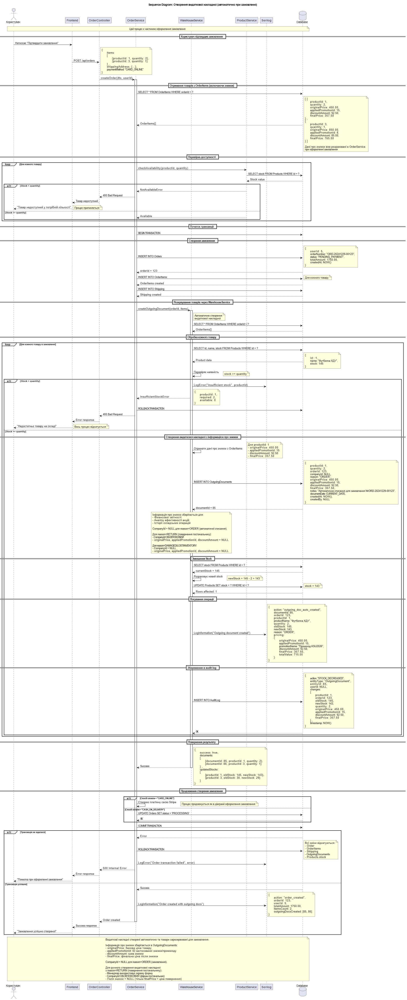
Учасники:
  - Користувач
  - Frontend
  - OrderController
  - OrderService
  - WarehouseService
  - ProductService
  - Serilog
  - Database
Основний сценарій:
1. Користувач підтвердив замовлення:
    1) Користувач натискає "Підтвердити замовлення"
    2) Frontend → OrderController: POST /api/orders з {items: [{productId: 1, quantity: 2}, {productId: 3, quantity: 1}], shippingAddress: {...}, paymentMethod: "CARD\_ONLINE"}
    3) OrderController → OrderService: createOrder(dto, userId)
2. Отримання товарів з OrderItems (включаючи знижки):
    4) OrderService → Database: SELECT \* FROM OrderItems WHERE orderId = ?
    5) Database повертає OrderItems[] з повною інформацією про знижки:
        A. [{productId: 1, quantity: 2, originalPrice: 450.00, appliedPromotionId: 15, discountAmount: 92.50, finalPrice: 357.50}, {productId: 3, quantity: 1, originalPrice: 850.00, appliedPromotionId: 8, discountAmount: 85.00, finalPrice: 765.00}]  
        Примітка: Дані про знижки вже розраховані в OrderService при оформленні замовлення
3. Перевірка доступності:
    6) Для кожного товару:
        A. OrderService → ProductService: checkAvailability(productId, quantity)  
        B. ProductService → Database: SELECT stock FROM Products WHERE id = ?  
        C. Database повертає Stock value  
        D. Якщо Stock < quantity:  
            a. ProductService → OrderService: NotAvailableError  
            b. OrderService → OrderController: 400 Bad Request  
            c. OrderController → Frontend: "Товар недоступний"  
            d. Frontend → Користувач: "Товар недоступний у потрібній кількості"  
            e. Процес припиняється  
        E. Якщо Stock >= quantity:  
            a. ProductService → OrderService: Available
4. Початок транзакції:
    7) Database: BEGIN TRANSACTION
5. Створення замовлення:
    8) Database: INSERT INTO Orders з {userId: 5, orderNumber: "ORD-20241229-00123", status: "PENDING\_PAYMENT", totalAmount: 1750.00, createdAt: NOW()}
    9) Database повертає orderId = 123
    10) Database: INSERT INTO OrderItems для кожного товару
    11) Database: INSERT INTO Shipping
6. Резервування товарів через WarehouseService:
    12) OrderService → WarehouseService: createOutgoingDocument(orderId, items)
    13) WarehouseService → Database: SELECT \* FROM OrderItems WHERE orderId = ?
    14) Database повертає OrderItems[]
7. Обробка кожного товару:
    15) Для кожного товару в замовленні:
        A. WarehouseService → Database: SELECT id, name, stock FROM Products WHERE id = ?  
        B. Database повертає Product data: {id: 1, name: "Футболка ХДУ", stock: 145}  
        C. WarehouseService перевіряє наявність: stock >= quantity  
        D. Якщо Stock < quantity:  
            a. Serilog: LogError("Insufficient stock", productId)  
            b. WarehouseService → OrderService: InsufficientStockError з {productId: 1, required: 2, available: 0}  
            c. OrderService → Database: ROLLBACK TRANSACTION  
            d. OrderService → OrderController: 400 Bad Request  
            e. OrderController → Frontend: Error response  
            f. Frontend → Користувач: "Недостатньо товару на складі"  
            g. Весь процес відкатується  
        E. Якщо Stock >= quantity:  
            a. Створення видаткової накладної з інформацією про знижки:  
                a) WarehouseService отримує дані про знижки з OrderItems: {originalPrice: 450.00, appliedPromotionId: 15, discountAmount: 92.50, finalPrice: 357.50}  
                b) Database: INSERT INTO OutgoingDocuments з {productId: 1, quantity: 2, orderId: 123, companyId: NULL, reason: "ORDER", originalPrice: 450.00, appliedPromotionId: 15, discountAmount: 92.50, finalPrice: 357.50, notes: "Автоматичне списання для замовлення №ORD-20241229-00123", documentDate: CURRENT\_DATE, createdAt: NOW(), createdBy: NULL}  
                c) Database повертає documentId = 85  
                Примітка: Інформація про знижки зберігається для фінансової звітності, аналізу ефективності акцій, історії складських операцій. CompanyId = NULL для reason=ORDER (автоматичні списання). Для reason=RETURN (повернення постачальнику): CompanyId ОБОВ'ЯЗКОВИЙ, originalPrice/appliedPromotionId/discountAmount = NULL. Для reason=DAMAGED/LOST/INVENTORY: CompanyId = NULL, originalPrice/appliedPromotionId/discountAmount = NULL  
            b. Зменшення Stock:  
                a) Database: SELECT stock FROM Products WHERE id = ? → currentStock = 145  
                b) WarehouseService розраховує новий stock: newStock = 145 - 2 = 143  
                c) Database: UPDATE Products SET stock = 143 WHERE id = ?  
                d) Database повертає Rows affected: 1  
            c. Логування операції:  
                a) Serilog: LogInformation("Outgoing document created") з деталями {action: "outgoing\_doc\_auto\_created", documentId: 85, orderId: 123, productId: 1, productName: "Футболка ХДУ", quantity: 2, oldStock: 145, newStock: 143, reason: "ORDER", pricing: {originalPrice: 450.00, appliedPromotionId: 15, promotionName: "Промокод KSU2026", discountAmount: 92.50, finalPrice: 357.50, totalValue: 715.00}}  
            d. Збереження в audit log:  
                a) Database: INSERT INTO AuditLog з {action: "STOCK\_DECREASED", entityType: "OutgoingDocument", entityId: 85, userId: NULL, changes: {productId: 1, orderId: 123, oldStock: 145, newStock: 143, quantity: 2, originalPrice: 450.00, appliedPromotionId: 15, discountAmount: 92.50, finalPrice: 357.50}, timestamp: NOW()}  
8. Повернення результату:
    16) WarehouseService → OrderService: {success: true, documents: [{documentId: 85, productId: 1, quantity: 2}, {documentId: 86, productId: 3, quantity: 1}], updatedStocks: [{productId: 1, oldStock: 145, newStock: 143}, {productId: 3, oldStock: 30, newStock: 29}]}
9. Продовження створення замовлення:
    17) Якщо спосіб оплати = "CARD\_ONLINE":
        A. OrderService створює платіжну сесію Stripe (процес продовжується як в діаграмі оформлення замовлення)
    18) Якщо спосіб оплати = "CASH\_ON\_DELIVERY":
        A. Database: UPDATE Orders SET status = 'PROCESSING'
10. Завершення транзакції:
    19) Database: COMMIT TRANSACTION
    20) Якщо транзакція не вдалася:
        A. Database → OrderService: Error  
        B. Database: ROLLBACK TRANSACTION  
        C. Примітка: Всі зміни відкатуються: Order, OrderItems, Shipping, OutgoingDocuments, Products.stock  
        D. Serilog: LogError("Order transaction failed", error)  
        E. OrderService → OrderController: 500 Internal Error  
        F. OrderController → Frontend: Error response  
        G. Frontend → Користувач: "Помилка при оформленні замовлення"
    21) Якщо транзакція успішна:
        A. Database → OrderService: Success  
        B. Serilog: LogInformation("Order created with outgoing docs") з деталями {action: "order\_created", orderId: 123, userId: 5, totalAmount: 1750.00, itemsCount: 2, outgoingDocsCreated: [85, 86]}  
        C. OrderService → OrderController: Order created  
        D. OrderController → Frontend: Success response  
        E. Frontend → Користувач: "Замовлення успішно створено!"  
Альтернативні сценарії:
  - Товар недоступний (на етапі перевірки): Процес припиняється, замовлення не створюється
  - Недостатньо товару на складі (під час створення накладної): Транзакція відкатується, всі зміни скасовуються
  - Транзакція не вдалася: Всі зміни (Order, OrderItems, Shipping, OutgoingDocuments, stock) відкатуються
Примітки:
  - Видаткові накладні створюються автоматично та товари резервуються для замовлення
  - Інформація про знижки зберігається в OutgoingDocuments:
      + originalPrice: базова ціна товару
      + appliedPromotionId: ID застосованої знижки/промокоду
      + discountAmount: сума знижки
      + finalPrice: фінальна ціна після знижки
  - CompanyId = NULL для reason=ORDER (замовлення)
  - Для ручного створення видаткової накладної з reason=RETURN (повернення постачальнику): Менеджер використовує окрему форму, CompanyId ОБОВ'ЯЗКОВИЙ (фірма-постачальник), Поля знижок = NULL (тільки finalPrice = ціна повернення)
### 9.6. Sequence Diagram: Зміна статусу замовлення
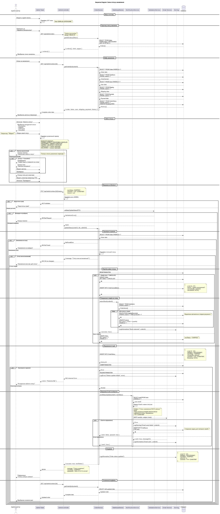
Учасники:
  - Адміністратор
  - Admin Panel
  - AdminController
  - OrderService
  - WarehouseService
  - NotificationService
  - ValidationService
  - Email Service
  - Serilog
  - Database
Основний сценарій:
1. Вхід в систему:
    1) Адміністратор входить в адмін-панель
    2) AdminPanel перевіряє JWT токен (роль: ADMIN або SUPERADMIN)
2. Перегляд списку замовлень:
    3) Адміністратор переходить до "Керування замовленнями"
    4) AdminPanel → AdminController: GET /api/admin/orders з ?status=processing&page=1&limit=20
    5) AdminController → OrderService: getAllOrders(filters)
    6) OrderService → Database: SELECT \* FROM Orders WHERE status = 'PROCESSING' LIMIT 20 OFFSET 0
    7) Database повертає Orders[]
    8) OrderService → AdminController: {orders[], total, pages}
    9) AdminController → AdminPanel: {orders[]}
    10) AdminPanel відображає список замовлень
3. Вибір замовлення:
    11) Адміністратор клікає на замовлення
    12) AdminPanel → AdminController: GET /api/admin/orders/{id}
    13) AdminController → OrderService: getOrderById(orderId)
    14) OrderService виконує множинні запити до Database:
        A. SELECT \* FROM Orders WHERE id = ? → Order data  
        B. SELECT \* FROM OrderItems WHERE orderId = ? → OrderItems[]  
        C. SELECT \* FROM Users WHERE id = ? → User data  
        D. SELECT \* FROM Shipping WHERE orderId = ? → Shipping data  
        E. SELECT \* FROM Payments WHERE orderId = ? → Payment data  
        F. SELECT \* FROM OrderHistory WHERE orderId = ? ORDER BY timestamp DESC → History[]
    15) OrderService → AdminController: {order, items, user, shipping, payment, history}
    16) AdminController → AdminPanel: Complete order data
    17) AdminPanel відображає детальну інформацію
4. Зміна статусу:
    18) Адміністратор натискає "Змінити статус"
    19) AdminPanel відображає випадаючий список: Processing, Shipped, Delivered, Cancelled
    20) Адміністратор обирає новий статус (наприклад: "Shipped")
5. Перевірка дозволеного переходу:
    21) AdminPanel перевіряє дозволений перехід на фронтенді
    22) Дозволені переходи:
        - PENDING\_PAYMENT → PROCESSING | CANCELLED
        - PROCESSING → SHIPPED | CANCELLED
        - SHIPPED → DELIVERED | CANCELLED
        - CANCELLED → (немає переходів)
        - DELIVERED → (немає переходів)
    23) Якщо перехід недозволений:
        A. AdminPanel → Адміністратор: Показує помилку "Неможливо змінити статус" з списком дозволених переходів
    24) Якщо перехід дозволений:
        A. Якщо статус = "Cancelled":  
            a. AdminPanel → Адміністратор: Попередження "Товари будуть повернені на склад"  
            b. AdminPanel → Адміністратор: Показує поле "Причина скасування"  
            c. Адміністратор вводить причину та підтверджує  
        B. AdminPanel → Адміністратор: Показує поле для коментаря  
        C. Адміністратор вводить коментар (наприклад ТТН)  
        D. Адміністратор натискає "Підтвердити"
6. Відправка на Backend:
    25) AdminPanel → AdminController: PUT /api/admin/orders/{id}/status з {newStatus: "SHIPPED", comment: "ТТН: 1234567890", reason: null}
    26) AdminController перевіряє роль (ADMIN)
    27) Якщо недостатньо прав: → 403 Forbidden → "Недостатньо прав"
7. Валідація на Backend:
    28) AdminController → ValidationService: validate(UpdateStatusDTO)
    29) Якщо валідація не пройдена: → ValidationError[] → 400 Bad Request → AdminPanel показує помилки
    30) Якщо валідація пройдена: → Продовжити
8. Обробка зміни статусу:
    31) AdminController → OrderService: updateStatus(orderId, dto, adminId)
    32) Перевірка існування:
        A. OrderService → Database: SELECT \* FROM Orders WHERE id = ?  
        B. Якщо замовлення не існує: → NotFoundError → 404 Not Found → "Замовлення не знайдено"
    33) Перевірка поточного статусу:
        C. Якщо статус вже встановлений: → {message: "Статус вже встановлений"} → 200 OK (no changes) → "Замовлення вже має цей статус"
    34) Якщо статус інший:
        C. Database: BEGIN TRANSACTION  
        D. Якщо новий статус = "CANCELLED":  
            a. Database: UPDATE Orders SET status = 'CANCELLED'  
            b. Database: INSERT INTO OrderCancellations з {orderId: 123, reason: "Товар пошкоджений", cancelledBy: adminId, cancelledAt: NOW()}  
            c. Повернення товарів на склад:  
                a) OrderService → WarehouseService: returnStock(orderId)  
                b) WarehouseService → Database: SELECT \* FROM OrderItems WHERE orderId = ?  
                c) Для кожного товару:  
                    I. Database: DELETE FROM OutgoingDocuments WHERE orderId = ? AND productId = ? (видалення автоматично створених документів)  
                    II. Database: UPDATE Products SET stock = stock + quantity WHERE id = ?  
                d) Serilog: LogInformation("Stock returned", orderId)  
                e) WarehouseService → OrderService: {success: true}  
        E. Якщо інші статуси:  
            a. Database: UPDATE Orders SET status = ? WHERE id = ? (newStatus = "SHIPPED")  
        D. Збереження історії:  
            a. Database: INSERT INTO OrderHistory з {orderId: 123, oldStatus: "PROCESSING", newStatus: "SHIPPED", changedBy: adminId, comment: "ТТН: 1234567890", timestamp: NOW()}  
            b. Database повертає historyId  
        E. Database: COMMIT TRANSACTION  
        F. Якщо транзакція не вдалася:  
            a. Database → OrderService: Error  
            b. Database: ROLLBACK TRANSACTION  
            c. Serilog: LogError("Status update failed", error)  
            d. OrderService → AdminController: 500 Internal Error  
            e. AdminController → AdminPanel: {error: "Помилка БД"}  
            f. AdminPanel → Адміністратор: "Не вдалося змінити статус"  
        G. Якщо транзакція успішна:  
            a. Database → OrderService: Success  
            b. Відправка Email-сповіщення:  
                a) OrderService → NotificationService: sendStatusUpdate(orderId, newStatus)  
                b) NotificationService → Database: SELECT email FROM Users WHERE id = ?  
                c) NotificationService формує Email з новим статусом: Subject: "Статус замовлення №123 змінено", Body: "Ваше замовлення №ORD-20241215-00123 перейшло в статус: Відправлено. ТТН: 1234567890"  
                d) NotificationService → Email Service: SMTP send(to, subject, body)  
                e) Якщо Email не відправлено:  
                    I. Email Service → NotificationService: Error  
                    II. NotificationService → Serilog: LogWarning("Email send failed", orderId)  
                    III. NotificationService → Database: INSERT INTO EmailQueue FOR retry (створення задачі для повторної спроби)  
                    IV. NotificationService → OrderService: {sent: false, queued: true}  
                f) Якщо Email відправлено:  
                    I. Email Service → NotificationService: {sent: true, messageId}  
                    II. NotificationService → Serilog: LogInformation("Email sent", orderId)  
                    III. NotificationService → OrderService: {sent: true}  
            c. Логування:  
                a) Serilog: LogInformation("Order status updated") з деталями {orderId: 123, oldStatus: "PROCESSING", newStatus: "SHIPPED", adminId: 5, comment: "ТТН: 1234567890"}  
            d. OrderService → AdminController: {success: true, newStatus}  
            e. AdminController → AdminPanel: 200 OK з {message: "Статус оновлено", newStatus: "SHIPPED", updatedAt: "2025-12-31T15:30:00"}  
            f. AdminPanel → Адміністратор: Повідомлення "Статус успішно змінено"
9. Оновлення інтерфейсу:
    35) AdminPanel → AdminController: GET /api/admin/orders/{id}
    36) AdminController → OrderService: getOrderById(orderId)
    37) OrderService → Database: SELECT with updated data
    38) Database → OrderService: Updated order
    39) OrderService → AdminController: Complete data
    40) AdminController → AdminPanel: Updated order
    41) AdminPanel → Адміністратор: Відображає оновлені дані
Альтернативні сценарії:
  - Недозволений перехід статусу: Адміністратор отримує помилку з поясненням дозволених переходів
  - Замовлення не знайдено: Адміністратор отримує 404 Not Found
  - Статус вже встановлений: Адміністратор отримує повідомлення без змін
  - Транзакція не вдалася: Всі зміни відкатуються, адміністратор отримує помилку
  - Email не відправлено: Статус все одно змінюється, email додається в чергу для повторної спроби
### 9.7. Sequence Diagram: Налаштування інтеграції Stripe
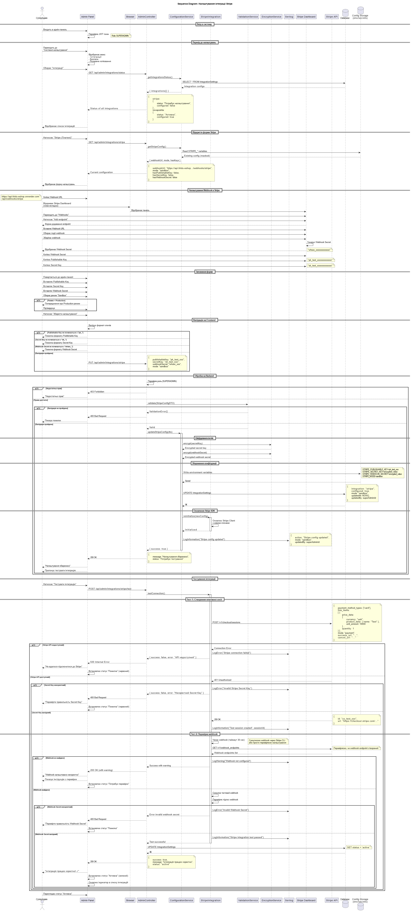
Учасники:
  - СуперАдмін
  - Admin Panel
  - Browser
  - AdminController
  - ConfigurationService
  - StripeIntegration
  - ValidationService
  - EncryptionService
  - Serilog
  - Stripe Dashboard
  - Stripe API
  - Database
  - Config Storage (env/secrets)
Основний сценарій:
1. Вхід в систему:
    1) СуперАдмін входить в адмін-панель
    2) AdminPanel перевіряє JWT токен (роль: SUPERADMIN)
2. Перехід до налаштувань:
    3) СуперАдмін переходить до "Системні налаштування"
    4) AdminPanel відображає меню: Інтеграції, Безпека, Резервне копіювання
    5) СуперАдмін обирає "Інтеграції"
    6) AdminPanel → AdminController: GET /api/admin/integrations/status
    7) AdminController → ConfigurationService: getIntegrationsStatus()
    8) ConfigurationService → Database: SELECT \* FROM IntegrationSettings
    9) Database повертає Integration configs
    10) ConfigurationService → AdminController: {integrations[]}
    11) AdminController → AdminPanel: {stripe: {status: "Потребує налаштування", configured: false}, novaposhta: {status: "Активна", configured: true}}
    12) AdminPanel відображає список інтеграцій
3. Відкриття форми Stripe:
    13) СуперАдмін натискає "Stripe (Платежі)"
    14) AdminPanel → AdminController: GET /api/admin/integrations/stripe
    15) AdminController → ConfigurationService: getStripeConfig()
    16) ConfigurationService → Config Storage: Read STRIPE\_\* variables
    17) Config Storage → ConfigurationService: Existing config (masked)
    18) ConfigurationService → AdminController: {webhookUrl, mode, hasKeys}
    19) AdminController → AdminPanel: {webhookUrl: "https://api.khdu-eshop.../webhooks/stripe", mode: "sandbox", hasPublishableKey: false, hasSecretKey: false, hasWebhookSecret: false}
    20) AdminPanel відображає форму налаштувань
4. Налаштування Webhook в Stripe:
    21) СуперАдмін копіює Webhook URL: "https://api.khdu-eshop.onrender.com/api/webhooks/stripe"
    22) СуперАдмін → Browser: Відкриває Stripe Dashboard (нова вкладка)
    23) Browser → Stripe Dashboard: Відображає панель
    24) СуперАдмін переходить до "Webhooks"
    25) СуперАдмін натискає "Add endpoint"
    26) Stripe Dashboard → СуперАдмін: Форма додавання endpoint
    27) СуперАдмін вставляє Webhook URL
    28) СуперАдмін обирає події webhook
    29) СуперАдмін зберігає webhook
    30) Stripe Dashboard генерує Webhook Secret
    31) Stripe Dashboard → СуперАдмін: Відображає Webhook Secret "whsec\_xxxxxxxxxxxxx"
    32) СуперАдмін копіює: Webhook Secret, Publishable Key "pk\_test\_xxxxxxxxxxxxx", Secret Key "sk\_test\_xxxxxxxxxxxxx"
5. Заповнення форми:
    33) СуперАдмін повертається до адмін-панелі
    34) СуперАдмін вставляє: Publishable Key, Secret Key, Webhook Secret
    35) СуперАдмін обирає режим "Sandbox"
    36) Якщо режим = Production:
        A. AdminPanel → СуперАдмін: Попередження про Production режим  
        B. СуперАдмін підтверджує
    37) СуперАдмін натискає "Зберегти налаштування"
6. Валідація на Frontend:
    38) AdminPanel валідує формат ключів:
        A. Якщо Publishable Key не починається з "pk\_": → Помилка формату Publishable Key  
        B. Якщо Secret Key не починається з "sk\_": → Помилка формату Secret Key  
        C. Якщо Webhook Secret не починається з "whsec\_": → Помилка формату Webhook Secret  
        D. Якщо валідація пройдена:  
            a. AdminPanel → AdminController: PUT /api/admin/integrations/stripe з {publishableKey: "pk\_test\_xxx", secretKey: "sk\_test\_xxx", webhookSecret: "whsec\_xxx", mode: "sandbox"}
7. Обробка на Backend:
    39) AdminController перевіряє роль (SUPERADMIN)
    40) Якщо недостатньо прав: → 403 Forbidden → "Недостатньо прав"
    41) AdminController → ValidationService: validate(StripeConfigDTO)
    42) Якщо валідація не пройдена: → ValidationError[] → 400 Bad Request → AdminPanel показує помилки
    43) Якщо валідація пройдена:
        A. AdminController → ConfigurationService: updateStripeConfig(dto)  
        B. Шифрування ключів:  
            a. ConfigurationService → EncryptionService: encrypt(secretKey)  
            b. EncryptionService → ConfigurationService: Encrypted secret key  
            c. ConfigurationService → EncryptionService: encrypt(webhookSecret)  
            d. EncryptionService → ConfigurationService: Encrypted webhook secret  
        C. Збереження конфігурації:  
            a. ConfigurationService → Config Storage: Write environment variables (STRIPE\_PUBLISHABLE\_KEY=pk\_test\_xxx, STRIPE\_SECRET\_KEY=encrypted\_value, STRIPE\_WEBHOOK\_SECRET=encrypted\_value, STRIPE\_MODE=sandbox)  
            b. Config Storage → ConfigurationService: Saved  
            c. ConfigurationService → Database: UPDATE IntegrationSettings з {integration: "stripe", configured: true, mode: "sandbox", updatedAt: NOW(), updatedBy: superAdminId}  
            d. Database → ConfigurationService: OK  
        D. Оновлення Stripe SDK:  
            a. ConfigurationService → StripeIntegration: reinitialize(newConfig)  
            b. StripeIntegration оновлює Stripe Client з новими ключами  
            c. StripeIntegration → ConfigurationService: Initialized  
        E. Serilog: LogInformation("Stripe config updated") з деталями {action: "Stripe config updated", mode: "sandbox", updatedBy: superAdminId}  
        F. ConfigurationService → AdminController: {success: true}  
        G. AdminController → AdminPanel: 200 OK з {message: "Налаштування збережено", status: "Потребує тестування"}  
        H. AdminPanel → СуперАдмін: "Налаштування збережено"  
        I. AdminPanel → СуперАдмін: Пропонує тестувати інтеграцію
8. Тестування інтеграції:
    44) СуперАдмін натискає "Тестувати інтеграцію"
    45) AdminPanel → AdminController: POST /api/admin/integrations/stripe/test
    46) AdminController → StripeIntegration: testConnection()
    47) Тест 1: Створення платіжної сесії:
        A. StripeIntegration → Stripe API: POST /v1/checkout/sessions з {payment\_method\_types: ["card"], line\_items: [{price\_data: {currency: "uah", product\_data: {name: "Test"}, unit\_amount: 10000}, quantity: 1}], mode: "payment", success\_url: "...", cancel\_url: "..."}  
        B. Якщо Stripe API недоступний:  
            a. Stripe API → StripeIntegration: Connection Error  
            b. Serilog: LogError("Stripe connection failed")  
            c. StripeIntegration → AdminController: {success: false, error: "API недоступний"}  
            d. AdminController → AdminPanel: 500 Internal Error  
            e. AdminPanel → СуперАдмін: "Не вдалося підключитися до Stripe"  
            f. AdminPanel встановлює статус "Помилка" (червоний)  
        C. Якщо Stripe API доступний, але Secret Key некоректний:  
            a. Stripe API → StripeIntegration: 401 Unauthorized  
            b. Serilog: LogError("Invalid Stripe Secret Key")  
            c. StripeIntegration → AdminController: {success: false, error: "Некоректний Secret Key"}  
            d. AdminController → AdminPanel: 400 Bad Request  
            e. AdminPanel → СуперАдмін: "Перевірте правильність Secret Key"  
            f. AdminPanel встановлює статус "Помилка" (червоний)  
        D. Якщо Secret Key валідний:  
            a. Stripe API → StripeIntegration: 200 OK з {id: "cs\_test\_xxx", url: "https://checkout.stripe.com/..."}  
            b. Serilog: LogInformation("Test session created", sessionId)
    48) Тест 2: Перевірка webhook:
        A. StripeIntegration чекає webhook (таймаут 30 сек) або просто перевіряє налаштування  
        B. StripeIntegration → Stripe API: GET /v1/webhook\_endpoints (перевірка чи webhook endpoint створений)  
        C. Stripe API → StripeIntegration: Webhook endpoints list  
        D. Якщо Webhook не знайдено:  
            a. Serilog: LogWarning("Webhook not configured")  
            b. StripeIntegration → AdminController: Success with warning  
            c. AdminController → AdminPanel: 200 OK (with warning)  
            d. AdminPanel → СуперАдмін: "Webhook налаштовано некоректно"  
            e. AdminPanel → СуперАдмін: Показує інструкцію з перевірки  
            f. AdminPanel встановлює статус "Потребує перевірки"  
        E. Якщо Webhook знайдено:  
            a. StripeIntegration симулює тестовий webhook  
            b. StripeIntegration перевіряє підпис webhook  
            c. Якщо Webhook Secret некоректний:  
                a) Serilog: LogError("Invalid Webhook Secret")  
                b) StripeIntegration → AdminController: Error invalid webhook secret  
                c) AdminController → AdminPanel: 400 Bad Request  
                d) AdminPanel → СуперАдмін: "Перевірте правильність Webhook Secret"  
                e) AdminPanel встановлює статус "Помилка"  
            d. Якщо Webhook Secret валідний:  
                a) Serilog: LogInformation("Stripe integration test passed")  
                b) StripeIntegration → AdminController: Test successful  
                c) AdminController → Database: UPDATE IntegrationSettings SET status = 'active'  
                d) Database → AdminController: OK  
                e) AdminController → AdminPanel: 200 OK з {success: true, message: "Інтеграція працює коректно", status: "active"}  
                f) AdminPanel → СуперАдмін: "Інтеграція працює коректно!"  
                g) AdminPanel встановлює статус "Активна" (зелений)  
                h) AdminPanel оновлює індикатор в списку інтеграцій
9. Завершення:
    49) СуперАдмін переглядає статус "Активна"
Альтернативні сценарії:
  - Некоректний формат ключів: СуперАдмін отримує помилку на фронтенді, налаштування не зберігаються
  - Stripe API недоступний: Налаштування зберігаються, але тест не проходить, статус "Помилка"
  - Некоректний Secret Key: Налаштування зберігаються, але Stripe повертає 401, статус "Помилка"
  - Webhook не налаштовано: Тест проходить з попередженням, СуперАдмін отримує інструкцію, статус "Потребує перевірки"
  - Некоректний Webhook Secret: Тест не проходить, статус "Помилка"
  - Всі тести пройдені: Інтеграція активується, статус "Активна"
### 9.8. Sequence Diagram: Перегляд аналітики
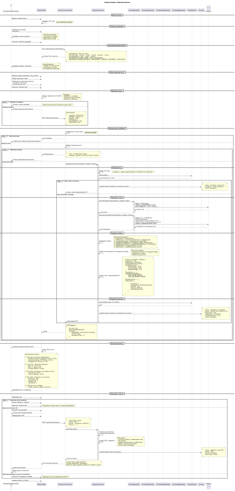
Учасники:
  - Менеджер/Адміністратор
  - Admin Panel
  - AnalyticsController
  - AnalyticsService
  - OrderRepository
  - ProductRepository
  - PromotionRepository
  - IncomingRepository
  - CacheService
  - Serilog
  - Database
Основні сценарії:
1. Вхід в систему:
    1) Менеджер/Адміністратор входить в адмін-панель
    2) AdminPanel перевіряє JWT токен (роль: MANAGER або ADMIN)
2. Перехід до аналітики:
    3) Користувач переходить до розділу "Аналітика"
    4) AdminPanel відображає меню аналітики: Аналітика продажів, Популярність товарів, Аналітика категорій, Ефективність акцій
    5) Користувач натискає "Аналітика продажів"
3. Завантаження форми фільтрів:
    6) AdminPanel → AnalyticsController: GET /api/analytics/sales/filters
    7) AnalyticsController → AdminPanel: Default filter options з {defaultPeriod: "last\_30\_days", periodPresets: ["today", "week", "month", "quarter", "year"], groupByOptions: ["day", "week", "month"], paymentMethods: ["CARD\_ONLINE", "CASH\_ON\_DELIVERY"], orderStatuses: ["PENDING\_PAYMENT", "PROCESSING", "SHIPPED", "DELIVERED", "CANCELLED"]}
    8) AdminPanel відображає форму з фільтрами (за замовчуванням: останні 30 днів, групування по днях, без додаткових фільтрів)
4. Вибір параметрів звіту:
    9) Користувач вибирає період (наприклад, "last\_month")
    10) Користувач обирає групування "week"
    11) Користувач (опціонально) застосовує фільтри: Категорія: "Футболки", Спосіб оплати: всі
    12) Користувач натискає "Показати звіт"
5. Валідація параметрів на Frontend:
    13) AdminPanel валідує параметри:
        A. startDate <= endDate?  
        B. Період не більше 2 років?  
        C. Валідність фільтрів?
    14) Якщо валідація не пройдена:
        A. AdminPanel → Користувач: Показує помилку валідації (наприклад, "Дата початку має бути меншою за дату кінця")
    15) Якщо валідація пройдена:
        A. AdminPanel → Користувач: Показує індикатор завантаження  
        B. AdminPanel → AnalyticsController: GET /api/analytics/sales з Query params: {startDate: "2025-01-01", endDate: "2025-01-31", groupBy: "week", categoryId: 3, paymentMethod: null, orderStatus: null}
6. Обробка запиту на Backend:
    16) AnalyticsController перевіряє роль користувача (MANAGER або ADMIN)
    17) Якщо недостатньо прав:
        A. AnalyticsController → AdminPanel: 403 Forbidden  
        B. AdminPanel → Користувач: "Недостатньо прав для перегляду аналітики"  
    18) Якщо права достатні:  
        A. AnalyticsController валідує параметри запиту  
        B. Якщо параметри невалідні:  
            a. AnalyticsController → AdminPanel: 400 Bad Request з {error: "Invalid date range", message: "Період не може бути більше 2 років"}
            b. AdminPanel → Користувач: Показує повідомлення про помилку
        C. Якщо параметри валідні:
            a. AnalyticsController → AnalyticsService: getSalesAnalytics(startDate, endDate, filters)
7. Перевірка кешу:
    19) AnalyticsService формує ключ кешу: "sales\_analytics:2025-01-01:2025-01-31:week:cat3"
    20) AnalyticsService → CacheService: get(cacheKey)
    21) CacheService → AnalyticsService: cached data (or null)
    22) Якщо дані в кеші і актуальні:
        A. Serilog: LogInformation("Analytics served from cache") з деталями {action: "analytics\_cache\_hit", cacheKey: "sales\_analytics:...", userId: managerId}  
        B. AnalyticsService → AnalyticsController: Return cached SalesAnalyticsDTO  
        C. Перехід до кроку 9
    23) Якщо кеш порожній або застарілий:
        A. Продовжити до збору даних
8. Збір даних з бази та розрахунок метрик:
    24) Збір даних з репозиторіїв:
        A. AnalyticsService → OrderRepository: getOrdersByPeriod(startDate, endDate, filters)  
        B. OrderRepository → Database: SELECT \* FROM Orders WHERE createdAt BETWEEN ? AND ? AND (categoryId = ? OR ? IS NULL)  
        C. Database → OrderRepository: Orders list  
        D. OrderRepository → AnalyticsService: List<Order>  
        E. AnalyticsService → OrderRepository: getOrderItemsByPeriod(startDate, endDate, filters)  
        F. OrderRepository → Database: SELECT oi.\*, p.categoryId FROM OrderItems oi JOIN Orders o ON oi.orderId = o.id JOIN Products p ON oi.productId = p.id WHERE o.createdAt BETWEEN ? AND ?  
        G. Database → OrderRepository: OrderItems with category info  
        H. OrderRepository → AnalyticsService: List<OrderItem>
    25) Розрахунок метрик (паралельно):
        A. AnalyticsService виконує паралельні розрахунки:  
            - totalOrders = Count(Orders)  
            - totalRevenue = Sum(Order.totalAmount + shippingCost)  
            - averageOrderValue = totalRevenue / totalOrders  
            - salesByDay/Week/Month = GroupBy(groupBy) + Sum(revenue)  
            - salesByPaymentMethod = GroupBy(paymentMethod) + Sum(revenue)  
            - salesByStatus = GroupBy(status) + Count  
            - topProducts = OrderBy(revenue).Take(10)  
        B. AnalyticsService обчислює зміни відносно попереднього періоду: для кожної метрики отримує значення за попередній період, розраховує % зміни, додає до результату  
        C. AnalyticsService формує об'єкт SalesAnalyticsDTO з {period: {startDate, endDate}, totalOrders: 245, totalRevenue: 123500.00, averageOrderValue: 504.08, changeVsPrevious: {ordersChange: +12.5%, revenueChange: +8.3%, avgOrderChange: -3.7%}, salesByDay: [...], salesByPaymentMethod: {CARD\_ONLINE: 98400.00, CASH\_ON\_DELIVERY: 25100.00}, salesByStatus: {...}, topProducts: [{productId: 5, productName: "Футболка ХДУ біла", quantity: 145, revenue: 34800.00, shareOfTotal: 28.2%}, ...]}  
    26) Кешування результату:
        A. AnalyticsService → CacheService: set(cacheKey, data, TTL=15min)  
        B. CacheService → AnalyticsService: OK  
        C. Serilog: LogInformation("Analytics calculated and cached") з деталями {action: "analytics\_calculated", period: "2025-01-01 to 2025-01-31", totalOrders: 245, totalRevenue: 123500.00, calculationTime: "1.2s", userId: managerId}  
        D. AnalyticsService → AnalyticsController: SalesAnalyticsDTO
9. Повернення результату:
    27) AnalyticsController → AdminPanel: 200 OK з {success: true, data: SalesAnalyticsDTO, metadata: {generatedAt: "2025-02-02T10:30:00Z", cached: false, calculationTime: 1.2}}
10. Візуалізація даних:
    28) AdminPanel → Користувач: Приховує індикатор завантаження
    29) AdminPanel будує візуалізації:
        - KPI картки (загальна інформація): Загальна кількість замовлень: 245 (↑12.5%), Загальний дохід: 123,500 грн (↑8.3%), Середній чек: 504 грн (↓3.7%)
        - Line Chart - Динаміка продажів: Вісь X: тижні січня, Вісь Y: дохід у грн, Інтерактивний з tooltip
        - Pie Chart - Розподіл за способами оплати: Card Online: 79.7%, Cash on Delivery: 20.3%
        - Bar Chart - Розподіл за статусами: Delivered: 180, Processing: 40, Shipped: 20, Cancelled: 5
        - Таблиця топ-10 товарів: Назва, Кількість, Дохід, Частка %
    30) AdminPanel → Користувач: Відображає звіт з графіками
11. Взаємодія зі звітом:
    31) Сценарій 1: Користувач змінює параметри:
        A. Користувач змінює період на "quarter"  
        B. Користувач натискає "Оновити звіт"  
        C. Повторюється процес запиту з новими параметрами (починаючи з кроку 5)
    32) Сценарій 2: Користувач експортує звіт:
        A. Користувач натискає "Експортувати"  
        B. AdminPanel → Користувач: Показує діалог вибору формату  
        C. Користувач обирає формат "PDF"  
        D. AdminPanel → AnalyticsController: POST /api/analytics/export з {reportType: "sales", format: "PDF", period: {startDate, endDate}, filters: {...}}  
        E. AnalyticsController → AnalyticsService: exportReport(dto)  
        F. AnalyticsService отримує дані аналітики (з кешу або розраховує)  
        G. AnalyticsService генерує PDF з графіками (PDF включає: титульна сторінка з параметрами звіту, KPI метрики, графіки (експортовані як зображення), таблиці з детальними даними, футер з датою генерації)  
        H. Serilog: LogInformation("Report exported") з деталями {action: "analytics\_exported", format: "PDF", userId: managerId, reportType: "sales"}  
        I. AnalyticsService → AnalyticsController: PDF file stream  
        J. AnalyticsController → AdminPanel: File download response (Content-Type: application/pdf, Content-Disposition: attachment; filename="sales\_analytics\_2025-01-01\_2025-01-31.pdf")  
        K. AdminPanel → Користувач: Завантажує PDF файл  
        L. Користувач зберігає файл на пристрій
    33) Сценарій 3: Користувач переходить до іншого типу аналітики:
        A. Користувач натискає "Популярність товарів"  
        B. Переходить до іншої діаграми аналітики
12. Завершення:
    34) Користувач завершує роботу зі звітом
Алтернативні сценарії:
  - Недостатньо прав: Користувач отримує 403 Forbidden, аналітика не відображається
  - Невалідні параметри: Користувач отримує повідомлення про помилку з поясненням
  - Кеш актуальний: Дані повертаються з кешу миттєво без розрахунків
  - Кеш застарілий: Виконуються розрахунки, результат кешується для наступних запитів
  - Зміна параметрів: Процес повторюється з новими параметрами, можливе використання нового кешу
  - Експорт звіту: Генерується файл у обраному форматі (PDF/CSV/Excel), користувач завантажує його
Примітки:
  - Кешування метрик забезпечує швидкість генерації звітів
  - TTL кешу = 15 хвилин для операційних звітів
  - Паралельний розрахунок метрик оптимізує продуктивність
  - Експорт звітів підтримує формати PDF, CSV, Excel
  - Для складних звітів (>5000 записів) використовується асинхронна генерація
## 10. Діаграми станів
### 10.1. State Machine Diagram: Order (Замовлення)
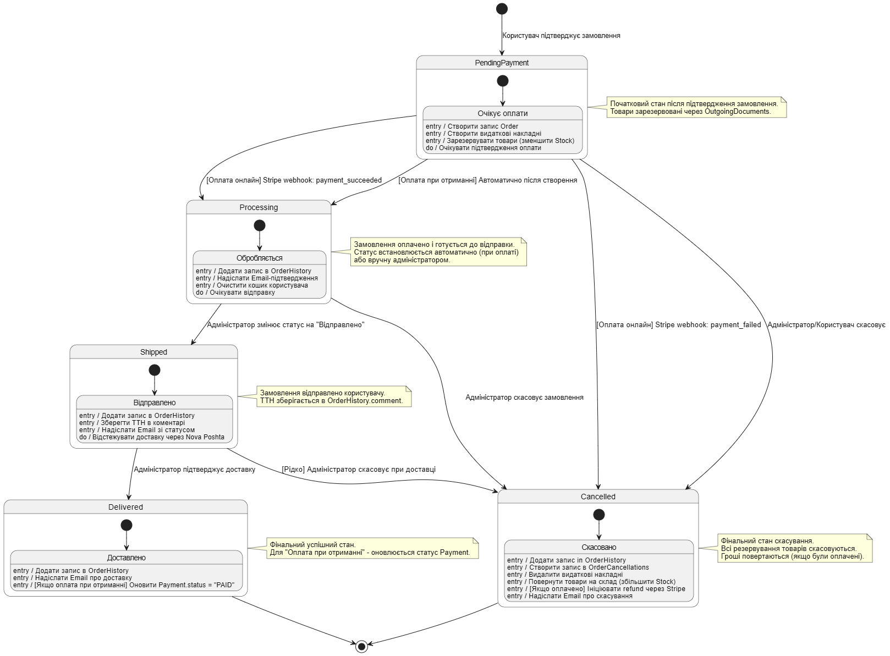
Стани:
1. PENDING\_PAYMENT (Очікує оплати)
    - Початковий стан після підтвердження замовлення
    - Товари зарезервовані через OutgoingDocuments
    - Stock вже зменшено
2. PROCESSING (Обробляється)
    - Замовлення оплачено і готується до відправки
    - Статус встановлюється автоматично після оплати або вручну
3. SHIPPED (Відправлено)
    - Замовлення відправлено користувачу
    - ТТН зберігається в OrderHistory.comment
4. DELIVERED (Доставлено)
    - Фінальний успішний стан
    - Для "Оплата при отриманні" оновлюється Payment.status="PAID"
5. CANCELLED (Скасовано)
    - Фінальний стан скасування
    - Всі резервування товарів скасовуються
    - Гроші повертаються (якщо були оплачені)
Переходи:
  - PENDING\_PAYMENT → PROCESSING (після оплати через Stripe або автоматично для CashOnDelivery)
  - PENDING\_PAYMENT → CANCELLED (скасування до оплати або відхилення платежу)
  - PROCESSING → SHIPPED (адміністратор відправляє)
  - PROCESSING → CANCELLED (адміністратор скасовує)
  - SHIPPED → DELIVERED (адміністратор підтверджує доставку)
  - SHIPPED → CANCELLED (рідко - скасування при доставці)
Дії при переходах:
    - При переході до PROCESSING: додається OrderHistory, надсилається Email, очищається Cart
    - При переході до CANCELLED: видаляються OutgoingDocuments, повертається Stock, ініціюється refund (якщо оплачено)
    - При переході до SHIPPED: зберігається ТТН, надсилається Email
    - При переході до DELIVERED: надсилається Email, оновлюється Payment для CashOnDelivery
### 10.2. State Machine Diagram: Payment (Платіж)
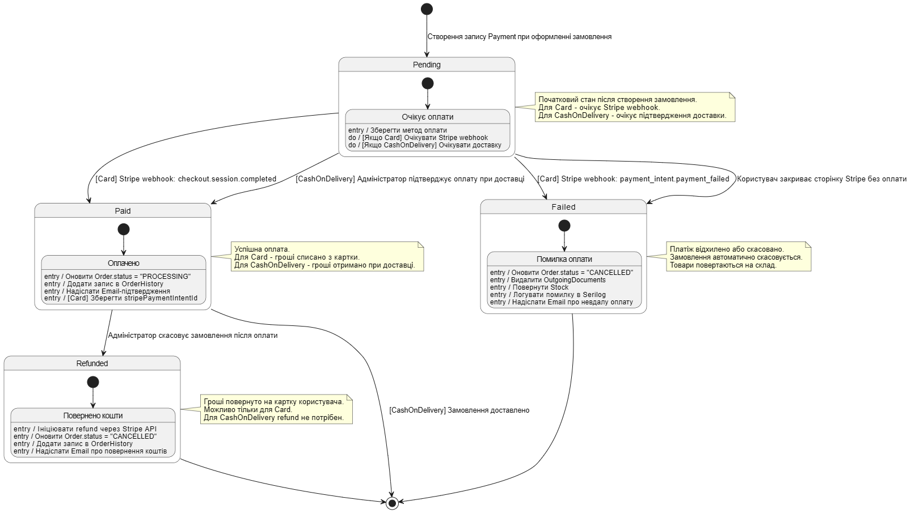
Стани:
1. PENDING (Очікує оплати)
    - Початковий стан після створення Payment
    - Для Card: очікує Stripe webhook
    - Для CashOnDelivery: очікує підтвердження доставки
2. PAID (Оплачено)
    - Успішна оплата
    - Для Card: гроші списано з картки (Stripe webhook: checkout.session.completed)
    - Для CashOnDelivery: гроші отримано при доставці (адміністратор підтверджує)
3. FAILED (Помилка оплати)
    - Платіж відхилено або скасовано (Stripe webhook: payment\_intent.payment\_failed)
    - Замовлення автоматично скасовується
    - Товари повертаються на склад
4. REFUNDED (Повернено кошти)
    - Гроші повернуто на картку користувача
    - Можливо тільки для Card
    - Для CashOnDelivery refund не потрібен
Переходи:
  - PENDING → PAID (Stripe webhook: checkout.session.completed для Card, або підтвердження адміністратора для CashOnDelivery)
  - PENDING → FAILED (Stripe webhook: payment\_intent.payment\_failed або закриття сторінки Stripe)
  - PAID → REFUNDED (адміністратор скасовує замовлення після оплати, ініціює refund через Stripe API)
  - PAID → (фінальний стан) для CashOnDelivery після доставки
  - FAILED → (фінальний стан)
  - REFUNDED → (фінальний стан)
Дії при переходах:
  - При PAID: оновлюється Order.status="PROCESSING", додається OrderHistory, надсилається Email
  - При FAILED: оновлюється Order.status="CANCELLED", видаляються OutgoingDocuments, повертається Stock, логується помилка, надсилається Email
  - При REFUNDED: ініціюється refund через Stripe, оновлюється Order.status="CANCELLED", додається OrderHistory, надсилається Email
### 10.3. State Machine Diagram: IncomingDocument (Прибуткова накладна)
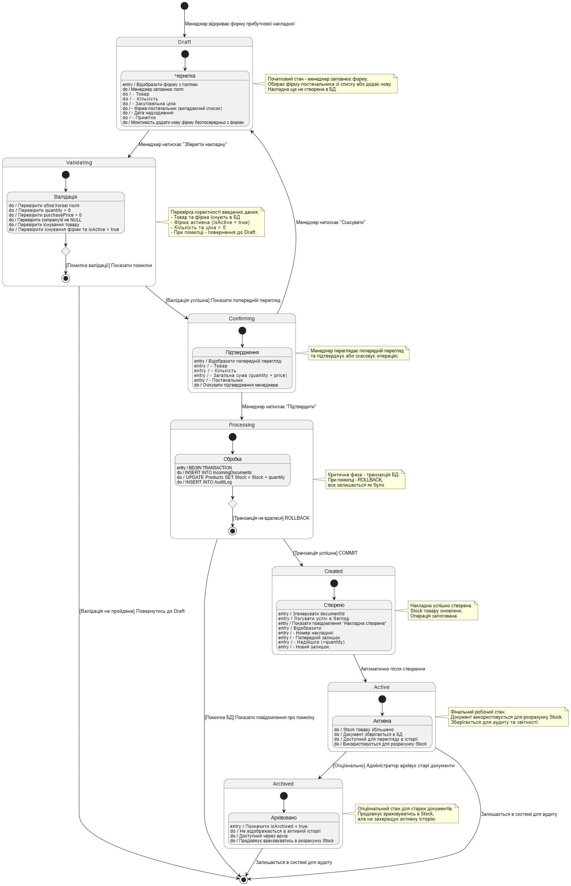
Стани:
1. Draft (Чернетка)
    - Початковий стан - менеджер відкриває форму
    - Накладна ще не створена в БД
    - Менеджер заповнює поля
2. Validating (Валідація)
    - Перевірка обов'язкових полів
    - Перевірка quantity > 0, purchasePrice > 0
    - Перевірка існування товару
3. Confirming (Підтвердження)
    - Менеджер переглядає попередній перегляд
    - Очікування підтвердження або скасування
4. Processing (Обробка)
    - Критична фаза - транзакція БД
    - BEGIN TRANSACTION
    - INSERT INTO IncomingDocuments
    - UPDATE Products SET Stock = Stock + quantity
    - INSERT INTO AuditLog
5. Created (Створено)
    - Накладна успішно створена
    - Stock товару оновлено
    - Операція залогована
6. Active (Активна)
    - Фінальний робочий стан
    - Документ використовується для розрахунку Stock
    - Зберігається для аудиту та звітності
7. Archived (Архівовано) - опціональний
    - Опціональний стан для старих документів
    - Продовжує враховуватись в Stock
    - Не відображається в активній історії
Переходи:
  - Draft → Validating (менеджер натискає "Зберегти накладну")
  - Validating → Draft (валідація не пройдена)
  - Validating → Confirming (валідація успішна)
  - Confirming → Draft (менеджер натискає "Скасувати")
  - Confirming → Processing (менеджер натискає "Підтвердити")
  - Processing → Draft (помилка БД, ROLLBACK)
  - Processing → Created (транзакція успішна, COMMIT)
  - Created → Active (автоматично)
  - Active → Archived (адміністратор архівує старі документи)
  - Active/Archived → (залишається в системі для аудиту)
Дії:
  - Draft: відображення форми з полями
  - Validating: перевірка даних
  - Confirming: попередній перегляд
  - Processing: BEGIN TRANSACTION, створення записів
  - Created: генерація documentId, логування успіху
  - Active: Stock збільшено, документ доступний для перегляду
  - Archived: позначається isArchived=true
### 10.4. State Machine Diagram: OutgoingDocument (Видаткова накладна)
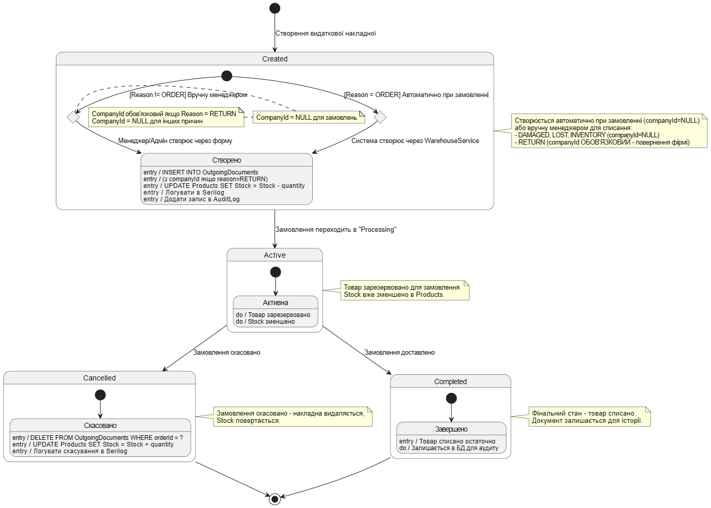
Стани:
1. Created (Створено)
    - Створюється автоматично при замовленні (Reason="ORDER") через WarehouseService
    - Або створюється вручну менеджером/адміном (Reason="DAMAGED", "LOST", "RETURN", "INVENTORY")
    - INSERT INTO OutgoingDocuments
    - UPDATE Products SET Stock = Stock - quantity
    - Логування в Serilog та AuditLog
2. Active (Активна)
    - Товар зарезервовано
    - Stock зменшено
    - Замовлення переходить в "Processing"
3. Cancelled (Скасовано)
    - Замовлення скасовано
    - DELETE FROM OutgoingDocuments WHERE orderId = ?
    - UPDATE Products SET Stock = Stock + quantity
    - Логування скасування
4. Completed (Завершено)
    - Товар списано остаточно
    - Замовлення доставлено
    - Залишається в БД для історії
Переходи:
  - (початок) → Created (створення через OrderModule або вручну)
  - Created → Active (замовлення переходить в "Processing")
  - Active → Cancelled (замовлення скасовано)
  - Active → Completed (замовлення доставлено)
  - Cancelled → (фінальний стан)
  - Completed → (фінальний стан)
Дії при переходах:
  - Created: товар зарезервовано, Stock зменшено
  - Cancelled: накладна видаляється, Stock повертається
  - Completed: товар списано остаточно, документ залишається для аудиту
Примітка: Видаткові накладні з Reason="ORDER" створюються автоматично і пов'язані з життєвим циклом замовлення. Накладні з іншими причинами створюються вручну і одразу переходять в стан Completed.
## 11. Структура даних
### 11.1. Domain Models (Entities)
Детальний опис всіх сутностей предметної області наведено в розділі 6.3. Основні сутності включають:
- Користувачі:
    + User - користувачі системи з різними ролями, підтримка студентського статусу
- Каталог:
    + Product - товари магазину
    + Category - категорії товарів (з підтримкою ієрархії)
    + ProductImage - зображення товарів
    + Promotion - акції та знижки
    + UserPromotion - персональні акції та знижки користувача
- Кошик:
    + Cart - кошики користувачів
    + CartItem - товари в кошику
- Замовлення:
    + Order - замовлення клієнтів
    + OrderItem - товари в замовленні з повною інформацією про ціни та знижки
    + OrderHistory - історія змін статусів
- Доставка та платежі:
    + Shipping - інформація про доставку
    + Payment - платежі
- Складський облік:
    + IncomingDocument - прибуткові накладні
    + OutgoingDocument - видаткові накладні для списання товарів з інформацією про знижки
    + Company - компанії, з якими встановлені товарні відносини
### 11.2. Data Transfer Objects (DTOs)
**Аутентифікація:**
- RegisterDTO:
```
{
    firstName: string (2-50 символів)
    lastName: string (2-50 символів)
    email: string (валідний email)
    password: string (мін. 8 символів, букви + цифри)
    confirmPassword: string (має співпадати)
    phone: string (формат: +380XXXXXXXXX, опц.)
    acceptTerms: bool (має бути true)
}
```
- LoginDTO:
```
{
    email: string (валідний email)
    password: string (не порожній)
}
```
**Товари:**
- ProductDTO:
```
{
    name: string (3-200 символів)
    description: string (10-5000 символів)
    price: decimal (> 0)
    weight: decimal (> 0, макс. 3 знаки після коми)
    categoryId: int (існуюча категорія)
    images: List<File> (JPEG/PNG/WebP, макс. 5MB)
}
```
- CategoryDTO:
```
{
    name: string (3-100 символів)
    parentId: int (існуюча категорія, опц.)
    order: int (>= 0, опц.)
}
```
**Кошик:**
- AddToCartDTO:
```
{
    productId: int (існуючий товар)
    quantity: int (> 0)
}
```
- UpdateCartDTO:
```
{
    productId: int (існуючий товар в кошику)
    quantity: int (> 0)
}
```
**Замовлення:**
- CreateOrderDTO:
```
{
    items: List<OrderItemDTO> (не порожній)
    shippingAddress: AddressDTO (валідна адреса)
    paymentMethod: PaymentMethod (Card/CashOnDelivery)
}
```
- OrderItemDTO:
```
{
    productId: int
    quantity: int
}
```
- AddressDTO:
```
{
    city: string (не порожній)
    cityRef: string (Ref з Nova Poshta API)
    warehouse: string (номер відділення)
    warehouseRef: string (Ref з Nova Poshta API)
    phone: string (формат: +380XXXXXXXXX)
    isDefault: bool (default: false, опц.)
}
```
**Складський облік:**
- IncomingDTO:
```
{
    productId: int (існуючий товар)
    quantity: int (> 0)
    purchasePrice: decimal (> 0)
    companyId: int (існуюча активна фірма)
    documentDate: Date (<= поточна дата)
    notes: string (макс. 1000 символів, опц.)
}
```
- OutgoingDTO:
```
{
    productId: int (існуючий товар)
    quantity: int (> 0, <= Stock)
    companyId: int (обов'язковий якщо reason=RETURN, інакше null)
    reason: OutgoingReason (Damaged/Lost/Return/Inventory)
    notes: string (макс. 1000 символів, опц.)
}
```
- CompanyDTO:
```
{
    name: string (3-200 символів, унікальна назва)
    contactPerson: string (3-100 символів)
    phone: string (формат: +380XXXXXXXXX)
    email: string (валідний email, унікальний)
    address: string (макс. 500 символів)
    notes: string (макс. 1000 символів, опц.)
}
```
- CreateCompanyDTO:
```
{
    name: string (3-200 символів, унікальна)
    contactPerson: string (3-100 символів)
    phone: string (формат: +380XXXXXXXXX)
    email: string (валідний email, унікальний)
    address: string (макс. 500 символів)
    notes: string (макс. 1000 символів, опц.)
}
```
- UpdateCompanyDTO:
```
{
    name: string (3-200 символів, унікальна)
    contactPerson: string (3-100 символів)
    phone: string (формат: +380XXXXXXXXX)
    email: string (валідний email, унікальний)
    address: string (макс. 500 символів)
    notes: string (макс. 1000 символів, опц.)
}
```
**Акції та знижки:**
- PromotionDTO:
```
{
    id: int
    name: string (3-200 символів)
    description: string (макс. 1000 символів, опц.)
    type: PromotionType (Percentage/FixedAmount/SpecialPrice)
    value: decimal (> 0)
    targetType: PromotionTarget (Product/Category/Cart/Shipping)
    targetId: int (якщо Product/Category, інакше null)
    audienceType: PromotionAudience (All/Students/Staff/Alumni/Custom)
    startDate: Date (опц.)
    endDate: Date (опц., >= startDate)
    promoCode: string (макс. 50 символів, унікальний, опц.)
    minOrderAmount: decimal (>= 0, опц.)
    minQuantity: int (> 0, опц.)
    priority: int (0-100, default: 0)
    usageLimit: int (> 0, опц.)
    currentUsage: int (read-only)
    isActive: bool
    createdBy: int (read-only)
    createdAt: DateTime (read-only)
    updatedAt: DateTime (read-only)
}
```
- CreatePromotionDTO:
```
{
    name: string (3-200 символів)
    description: string (макс. 1000 символів, опц.)
    type: PromotionType
    value: decimal (> 0)
    targetType: PromotionTarget
    targetId: int (обов'язковий якщо Product/Category)
    audienceType: PromotionAudience
    startDate: Date (опц.)
    endDate: Date (опц., >= startDate)
    promoCode: string (макс. 50 символів, унікальний, опц.)
    minOrderAmount: decimal (>= 0, опц.)
    minQuantity: int (> 0, опц.)
    priority: int (0-100, default: 0)
    usageLimit: int (> 0, опц.)
}
```
- UpdatePromotionDTO:
```
{
    name: string (3-200 символів)
    description: string (макс. 1000 символів, опц.)
    type: PromotionType
    value: decimal (> 0)
    targetType: PromotionTarget
    targetId: int (обов'язковий якщо Product/Category)
    audienceType: PromotionAudience
    startDate: Date (опц.)
    endDate: Date (опц., >= startDate)
    promoCode: string (макс. 50 символів, унікальний, опц.)
    minOrderAmount: decimal (>= 0, опц.)
    minQuantity: int (> 0, опц.)
    priority: int (0-100)
    usageLimit: int (> 0, опц.)
    isActive: bool
}
```
- ApplyPromoCodeDTO:
```
{
    promoCode: string (не порожній)
    userId: int
    cartItems: List<CartItemDTO>
}
```
- AssignPromotionDTO:
```
{
    userId: int (існуючий користувач)
    promotionId: int (існуюча акція)
}
```
- StudentVerificationDTO:
```
{
    found: bool
    studentId: string (опц.)
    email: string
    gpa: decimal(3,2) (опц.)
    scholarshipStatus: string (опц.)
    studentStatus: StudentStatus (опц.)
    enrollmentYear: int (опц.)
    faculty: string (опц.)
    specialty: string (опц.)
}
```
- PromotionFilters:
```
{
    page: int (default: 1)
    limit: int (default: 20)
    isActive: bool (опц.)
    type: PromotionType (опц.)
    targetType: PromotionTarget (опц.)
    audienceType: PromotionAudience (опц.)
    startDate: Date (опц.)
    endDate: Date (опц.)
    search: string (пошук за назвою, опц.)
    sort: string (name/value/priority/currentUsage, опц.)
    order: string (asc/desc, опц.)
}
```
**Аналітика:**
- AnalyticsFilters:
```
{
    startDate: DateTime (обов'язковий)
    endDate: DateTime (обов'язковий, >= startDate, період <= 2 роки)
    productId: int (опціонально)
    categoryId: int (опціонально)
    groupBy: string (day/week/month, default: day)
}
```
- DateRange:
```
{
    startDate: DateTime
    endDate: DateTime
}
```
- SalesAnalyticsDTO:
```
{
    period: DateRange
    totalOrders: int
    totalRevenue: decimal
    averageOrderValue: decimal
    salesByDay: List<DailyMetric>
    salesByPaymentMethod: Dictionary<PaymentMethod, decimal>
    salesByStatus: Dictionary<OrderStatus, int>
    topProducts: List<ProductMetric>
    changeVsPrevious: ChangeMetrics (опціонально)
}
```
- ProductAnalyticsDTO:
```
{
    period: DateRange
    topByQuantity: List<ProductMetric>
    topByRevenue: List<ProductMetric>
    topByProfit: List<ProductMetric>
    lowStock: List<ProductStock>
}
```
- CategoryAnalyticsDTO:
```
{
    period: DateRange
    revenueByCategory: List<CategoryMetric>
    quantityByCategory: List<CategoryMetric>
    categoryShare: List<CategoryShare>
}
```
- ConversionMetricsDTO:
```
{
    period: DateRange
    visitorToUserRate: decimal
    userToBuyerRate: decimal
    cancelledOrdersRate: decimal
    averageOrderValue: decimal
    repeatPurchaseRate: decimal
    averageOrderItems: decimal
    cartAbandonmentRate: decimal
}
```
- FinancialReportDTO:
```
{
    period: DateRange
    totalRevenue: decimal
    shippingRevenue: decimal
    purchaseCosts: decimal
    discountAmount: decimal
    netProfit: decimal
    roiByProduct: List<ProductROI>
    roiByCategory: List<CategoryROI>
    profitMargin: decimal
}
```
- PromotionEffectivenessDTO:
```
{
    promotionId: int
    promotionName: string
    period: DateRange
    totalUsages: int
    totalDiscount: decimal
    averageOrderValueWithPromo: decimal
    averageOrderValueWithoutPromo: decimal
    conversionRateWithPromo: decimal
    conversionRateWithoutPromo: decimal
    roi: decimal
}
```
- UserBehaviorDTO:
```
{
    period: DateRange
    topCustomers: List<CustomerMetric>
    averageTimeToFirstPurchase: decimal
    cohortAnalysis: List<CohortData>
    categoryHeatmap: Dictionary<string, Dictionary<int, int>>
}
```
- ProductMetric:
```
{
    productId: int
    productName: string
    quantity: int
    revenue: decimal
    profit: decimal (опціонально)
}
```
- CategoryMetric:
```
{
    categoryId: int
    categoryName: string
    quantity: int
    revenue: decimal
    averageOrderValue: decimal
}
```
- ExportReportDTO:
```
{
    format: string (PDF/CSV/Excel)
    reportType: string (sales/products/categories/financial/conversion/behavior/promotion)
    period: DateRange
    filters: Dictionary<string, object> (опціонально)
}
```
- PopularityFilters:
```
{
    period: DateRange
    metric: string (quantity/revenue/profit)
    categoryId: int (опціонально)
    limit: int (1-100, default: 10)
}
```
**Адміністрування:**
- UpdateStatusDTO:
```
{
    newStatus: OrderStatus (Processing/Shipped/Delivered/Cancelled)
    comment: string (макс. 500 символів, опц.)
    reason: string (обов'язковий якщо Cancelled)
}
```
- UpdateProfileDTO:
```
{
    firstName: string (2-50 символів)
    lastName: string (2-50 символів)
    phone: string (формат: +380XXXXXXXXX, опц.)
}
```
- ChangePasswordDTO:
```
{
    currentPassword: string (не порожній)
    newPassword: string (мін. 8 символів, букви + цифри)
    confirmPassword: string (має співпадати)
}
```
**Платежі та доставка:**
- CreateSessionDTO:
```
{
    orderId: int (існуюче замовлення)
    amount: decimal (> 0)
    currency: string (UAH)
}
```
- CalculateCostDTO:
```
{
    cityRef: string (Ref з Nova Poshta API)
    warehouseRef: string (Ref з Nova Poshta API)
    weight: decimal (> 0, сумарна вага товарів)
}
```
**Query параметри для фільтрації:**
- ProductFilters:
```
{
    page: int (default: 1)
    limit: int (default: 20)
    categoryId: int (опц.)
    minPrice: decimal (опц.)
    maxPrice: decimal (опц.)
    search: string (опц.)
    sort: string (price/name/createdAt, опц.)
    order: string (asc/desc, опц.)
}
```
- OrderFilters:
```
{
    page: int (default: 1)
    limit: int (default: 10)
    status: OrderStatus (опц.)
    startDate: Date (опц.)
    endDate: Date (опц.)
}
```
- AdminOrderFilters:
```
{
    page: int (default: 1)
    limit: int (default: 20)
    status: OrderStatus (опц.)
    userId: int (опц.)
    startDate: Date (опц.)
    endDate: Date (опц.)
    orderNumber: string (опц.)
}
```
- UserFilters:
```
{
    page: int (default: 1)
    limit: int (default: 20)
    role: Role (опц.)
    status: UserStatus (опц.)
    search: string (пошук за ім'ям/email, опц.)
}
```
- DocFilters:
```
{
    page: int (default: 1)
    limit: int (default: 20)
    productId: int (опц.)
    startDate: Date (опц.)
    endDate: Date (опц.)
    createdBy: int (для IncomingDocuments, опц.)
    reason: OutgoingReason (для OutgoingDocuments, опц.)
}
```
- StockFilters:
```
{
    page: int (default: 1)
    limit: int (default: 50)
    categoryId: int (опц.)
    lowStock: bool (тільки товари з Stock < 10, опц.)
    outOfStock: bool (тільки товари з Stock = 0, опц.)
}
```
### 11.3. Правила валідації
На рівні Entity:
  - User: email унікальний, passwordHash через bcrypt (salt rounds: 12), role default: CUSTOMER
  - Product: price > 0, weight > 0
  - Order: orderNumber автоматично (format: "ORD-YYYYMMDD-XXXXX"), totalAmount >= 100 (мінімальна сума)
  - CartItem: унікальний (cartId, productId), quantity <= Product.Stock
На рівні DTO:
  - RegisterDTO: email валідний та унікальний, пароль мін. 8 символів з буквами та цифрами, phone формат +380XXXXXXXXX
  - ProductDTO: name 3-200 символів, price > 0.01, weight > 0.001, images: JPEG/PNG/WebP, макс. 5MB, макс. 10 файлів
  - IncomingDTO: quantity >= 1, purchasePrice > 0.01, documentDate <= today
Бізнес-правила:
  - Створення замовлення: CartItem.quantity <= Product.Stock, Order.totalAmount >= 100 грн, валідація адреси через Nova Poshta API
  - Зміна статусу замовлення: перевірка дозволених переходів, при скасуванні - повернення товарів
  - Складський облік:
      + При прибутковій накладній: companyId має відповідати активній фірмі (isActive=true)
      + При видатковій накладній:
          * quantity <= Product.Stock
          * якщо reason=RETURN, то companyId обов'язковий та відповідає активній фірмі
          * для інших причин companyId=NULL
      + Заборонити від'ємний Stock (крім коригування інвентаризації)
      + Попереджати про низький запас (Stock < 10)
  - Керування фірмами-постачальниками:
      + При створенні фірми: name та email унікальні в системі
      + При деактивації фірми: перевірити чи не використовується в активних накладних
      + Фізичне видалення фірми можливе тільки якщо немає жодних пов'язаних накладних
      + При оновленні фірми: якщо змінюється email, перевірити унікальність
Промокоди:
  - promoCode унікальний в системі
  - promoCode має термін дії: startDate ≤ now ≤ endDate
  - currentUsage < usageLimit (якщо ліміт встановлено)
  - умови застосування: orderAmount ≥ minOrderAmount, quantity ≥ minQuantity
Стакування знижок:
  - Пріоритет застосування: Персональні → Студентські → Товарні/Категорійні → Знижки на кошик → Промокоди
  - Для кожного товару зберігається тільки найвигідніша знижка (appliedPromotionId)
  - discountAmount = сума ВСІХ застосованих знижок (автоматичні + промокод)
  - finalPrice = originalPrice - discountAmount
Студентський статус:
  - studentExpiresAt має бути > now для активних знижок
  - при закінченні терміну студентські знижки автоматично деактивуються
  - GPA має бути в межах 0.00-5.00
  - studentStatus = HIGH\_ACHIEVER тільки якщо GPA ≥ 4.5
## 12. Інтерфейси системи
### 12.1. Таблиця інтерфейсів модулів
Детальна таблиця інтерфейсів для всіх модулів системи наведена в документі "Таблиця інтерфейсів.docx". Основні категорії інтерфейсів:
1. Публічні інтерфейси (Frontend → Backend):
    - REST API endpoints для кожного модуля
    - HTTP методи: GET, POST, PUT, DELETE
    - Формат даних: JSON
    - Аутентифікація: JWT токен в заголовку Authorization: Bearer {token}
2. Адміністративні інтерфейси (Admin Panel → Backend):
    - Endpoints з префіксом /api/admin/\*
    - Додаткові перевірки прав доступу
    - Розширений функціонал для управління
3. Внутрішні інтерфейси (між модулями Backend):
    - Service-to-Service calls
    - Синхронні виклики методів
    - Передача даних через параметри та return values
4. Зовнішні інтерфейси (Backend → External Services):
    - Stripe API - платежі
    - Nova Poshta API - доставка
    - Email Service - SMTP
    - MinIO Storage - S3 API
    - University API - академічні дані
### 12.2. Формат відповідей API
Всі відповіді мають стандартну структуру:
```json
{
    "success": true/false,
    "data": {...},
    "message": "Опис операції",
    "errors": [] // якщо є помилки валідації
}
```
HTTP коди статусів:
  - 200 OK - успішна операція
  - 201 Created - ресурс створено
  - 400 Bad Request - помилка валідації
  - 401 Unauthorized - не авторизований
  - 403 Forbidden - недостатньо прав
  - 404 Not Found - ресурс не знайдено
  - 409 Conflict - конфлікт (наприклад, email вже існує)
  - 500 Internal Server Error - серверна помилка
Пагінація:
  Всі endpoints, що повертають списки, підтримують пагінацію:  
Query: `?page=1&limit=20`  
Response:
```json
{
    "data": [...],
    "pagination": 
    {
        "currentPage": 1,
        "totalPages": 5,
        "totalItems": 95,
        "itemsPerPage": 20
    }
}
```
### 12.3. Приклади основних endpoints
CatalogModule:
  - GET `/api/products` - отримати список товарів
  - GET `/api/products/{id}` - отримати товар за ID
  - GET `/api/products/search` - пошук товарів
  - GET `/api/categories` - отримати категорії
  - POST `/api/admin/products` - створити товар (Manager/Admin)
  - PUT `/api/admin/products/{id}` - оновити товар (Manager/Admin)
  - DELETE `/api/admin/products/{id}` - видалити товар (Manager/Admin)
CartModule:
  - GET `/api/cart` - отримати кошик
  - POST `/api/cart/add` - додати товар
  - PUT `/api/cart/update` - оновити кількість
  - DELETE `/api/cart/remove` - видалити товар
  - DELETE `/api/cart/clear` - очистити кошик
OrderModule:
  - POST `/api/orders` - створити замовлення
  - GET `/api/orders/history` - історія замовлень
  - GET `/api/orders/{id}` - деталі замовлення
  - GET `/api/orders/{id}/track` - відстеження замовлення
  - GET `/api/admin/orders` - всі замовлення (Admin)
  - PUT `/api/admin/orders/{id}/status` - змінити статус (Admin)
PaymentModule:
  - POST `/api/payments/create-session` - створити Stripe сесію
  - GET `/api/payments/{id}/status` - статус платежу
  - POST `/api/webhooks/stripe` - webhook від Stripe
ShippingModule:
  - GET `/api/shipping/cities` - список міст (Nova Poshta)
  - GET `/api/shipping/warehouses` - список відділень
  - POST `/api/shipping/calculate` - розрахунок доставки
UserModule:
  - POST `/api/auth/register` - реєстрація
  - POST `/api/auth/login` - авторизація
  - POST `/api/auth/logout` - вихід
  - POST `/api/auth/refresh` - оновлення токену
  - GET `/api/users/profile` - профіль користувача
  - PUT `/api/users/profile` - оновлення профілю
  - POST `/api/users/change-password` - зміна паролю
  - GET `/api/users/addresses` - адреси доставки
  - POST `/api/users/addresses` - додати адресу
WarehouseModule:
  - POST `/api/warehouse/incoming` - створити прибуткову накладну (Manager)
  - POST `/api/warehouse/outgoing` - створити видаткову накладну (Manager/Admin)
  - GET `/api/warehouse/incoming/history` - історія надходжень
  - GET `/api/warehouse/outgoing/history` - історія списань
  - GET `/api/warehouse/stock` - поточні залишки
  - GET `/api/warehouse/stock/export` - експорт звіту
  - GET `/api/warehouse/companies` - отримати список фірм-постачальників (Manager/Admin)
  - GET `/api/warehouse/companies/{id}` - отримати фірму за ID (Manager/Admin)
  - POST `/api/warehouse/companies` - створити нову фірму (Manager/Admin)
  - PUT `/api/warehouse/companies/{id}` - оновити фірму (Manager/Admin)
  - DELETE `/api/warehouse/companies/{id}` - деактивувати фірму (Admin)
  - GET `/api/warehouse/companies/search` - пошук фірм за назвою (Manager/Admin)
PromotionModule:
  - GET `/api/promotions` - список активних акцій (публічний)
  - GET `/api/promotions/{id}` - деталі акції
  - GET `/api/promotions/applicable` - знижки доступні користувачу
  - POST `/api/promotions/validate-code` - валідація промокоду
  - GET `/api/users/my-promotions` - мої персональні знижки (Customer)
  - POST `/api/admin/promotions` - створити акцію (Manager/Admin)
  - PUT `/api/admin/promotions/{id}` - оновити акцію (Manager/Admin)
  - DELETE `/api/admin/promotions/{id}` - видалити акцію (Manager/Admin)
  - PATCH `/api/admin/promotions/{id}/deactivate` - деактивувати акцію (Manager/Admin)
  - POST `/api/admin/promotions/assign` - призначити персональну знижку (Manager/Admin)
  - GET `/api/admin/promotions/stats` - статистика використання (Manager/Admin)
  - GET `/api/admin/promotions/export` - експорт звіту (Manager/Admin)
UniversityModule:
  - POST `/api/auth/verify-student` - верифікація студента (викликається автоматично при реєстрації)
  - GET `/api/users/student-status` - статус студента (Customer)
  - POST `/api/admin/students/verify-manual` - вручну верифікувати (Admin)
  - GET `/api/admin/students/queue` - queue невдалих верифікацій (Admin)
  - POST `/api/admin/students/{userId}/retry` - повторити верифікацію (Admin)
  - PATCH `/api/admin/students/{userId}/extend` - продовжити термін студентського статусу (Admin)
AdminPanelModule:
  - GET `/api/admin/reports/sales` - звіт про продажі (Admin)
  - GET `/api/admin/reports/revenue` - звіт про доходи
  - GET `/api/admin/reports/products/popular` - популярні товари
  - POST `/api/admin/reports/export` - експорт звіту
  - GET `/api/admin/settings` - налаштування системи
  - PUT `/api/admin/settings` - оновлення налаштувань
AnalyticsModule:
  - GET `/api/analytics/sales` - отримати аналітику продажів (Manager/Admin)
  - GET `/api/analytics/products/popular` - топ товарів (Manager/Admin)
  - GET `/api/analytics/categories` - аналітика категорій (Manager/Admin)
  - GET `/api/analytics/promotions/effectiveness` - ефективність акцій (Manager/Admin)
  - GET `/api/analytics/conversion` - метрики конверсії (Admin)
  - GET `/api/analytics/financial` - фінансовий звіт (Admin)
  - GET `/api/analytics/user-behavior` - поведінка користувачів (Admin)
  - POST `/api/analytics/export` - експорт звіту (Manager/Admin)
## 13. Матриця трасування вимог
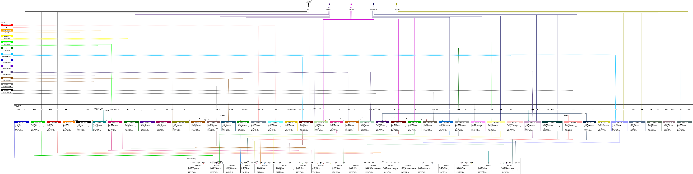
Повна матриця трасування вимог наведена в документі [Requirements Traceability Matrix](requirements-traceability-matrix.md).
**Підсумкова статистика покриття:**
  - Функціональні вимоги:
      + Гість: 4/4 (100%)
      + Користувач: 11/11 (100%)
      + Менеджер: 12/12 (100%)
      + Адміністратор: 10/10 (100%)
      + СуперАдмін: 5/5 (100%)
      + Загалом FR: 42/42 (100%)
  - Нефункціональні вимоги:
      + Продуктивність: 3/3 (100%)
      + Надійність: 4/4 (100%)
      + Безпека: 4/4 (100%)
      + Зручність використання: 3/3 (100%)
      + Масштабованість та Сумісність: 4/4 (100%)
      + Супроводжуваність: 1/1 (100%)
      + Загалом NFR: 19/19 (100%)
  - Use Cases:
      + Гість: 5 Use Cases
      + Користувач: 19 Use Cases
      + Менеджер: 56 Use Cases
      + Адміністратор: 35 Use Cases
      + СуперАдмін: 38 Use Cases
      + Загалом Use Cases: 153 Use Cases
  - Діаграми:
      + Activity Diagrams: 8/8
      + Sequence Diagrams: 8/8
      + State Machine Diagrams: 4/4
      + Architecture Diagrams: 9/9
      + Use Case Diagrams: 5/5
      + Загалом: 34 діаграми
Матриця демонструє повне покриття всіх функціональних та нефункціональних вимог відповідними компонентами системи, діаграмами та тестовими сценаріями.
## 14. Розгортання системи
### 14.1. Deployment Diagram
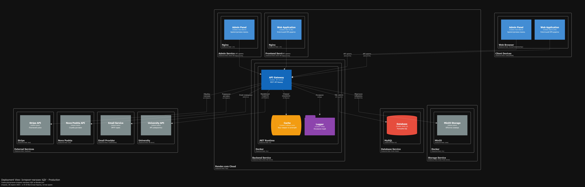
### 14.2. Інфраструктура на Render.com
Сервіси:
1. Frontend Web Service (Static Site)
    - Build Command: `npm run build`
    - Publish Directory: `dist`
    - Auto-deploy: GitHub main branch
    - Web Server: Nginx 1.25
2. Admin Panel Web Service (Static Site)
    - Build Command: `npm run build`
    - Publish Directory: `dist`
    - Auto-deploy: GitHub main branch
    - Web Server: Nginx 1.25
2. Backend Web Service (Docker)
    - Dockerfile: `Dockerfile`
    - Health Check: `/api/health`
    - Auto-deploy: GitHub main branch
    - Runtime: .NET 8.0
3. MySQL Database (Managed)
    - Version: MySQL 8.0
    - Automatic backups: Daily
    - Connection: через DATABASE\_URL
4. MinIO Private Service (Docker)
    - Type: Private Service
    - Internal URL only
    - S3-compatible API
### 14.3. Environment Variables
Backend:
- `DATABASE\_URL=mysql://...`
- `JWT\_SECRET=...`
- `STRIPE\_SECRET\_KEY=...`
- `STRIPE\_PUBLISHABLE\_KEY=...`
- `STRIPE\_WEBHOOK\_SECRET=...`
- `NOVAPOSHTA\_API\_KEY=...`
- `SMTP\_HOST=...`
- `SMTP\_PORT=...`
- `SMTP\_USERNAME=...`
- `SMTP\_PASSWORD=...`
- `MINIO\_ENDPOINT=...`
- `MINIO\_ACCESS\_KEY=...`
- `MINIO\_SECRET\_KEY=...`
Frontend:
- `VITE\_API\_URL=https://api.khdu-eshop.onrender.com`
- `VITE\_STRIPE\_PUBLISHABLE\_KEY=...`
### 14.4. CI/CD Pipeline
GitHub Actions Workflow:
1. Push до гілки main на GitHub
2. Запуск тестів (xUnit, Jest)
3. Збірка Docker образу
4. Відправка на Render.com
5. Автоматичне розгортання
6. Запуск smoke-тестів
7. Надсилання сповіщення (успіх/невдача)
Розгортання:
  - Frontend: автоматично при push до main
  - Backend: автоматично при push до main
  - Database: managed, автоматичні backup
  - MinIO: розгортається через Docker Compose
### 14.5. Безпека та моніторинг
Безпека:
  - HTTPS/TLS 1.3 для всього трафіку
  - JWT токени з терміном дії 1 година
  - Шифрування чутливих даних
  - Rate Limiting: 100 запитів/хвилину на IP
  - CORS політика: дозволені лише специфічні домени
Моніторинг:
  - Render.com Dashboard (CPU, RAM, Network)
  - Serilog logs
  - Custom health check endpoint (`/api/health`)
  - Метрики: response time, error rate, active users
Метрики для моніторингу:
  - Response time API endpoints (цільове: < 200ms)
  - Database query duration (цільове: < 100ms)
  - Cache hit ratio (цільове: > 80%)
  - Error rate (цільове: < 1%)
  - Active users онлайн
## 15. Висновки
### 15.1. Досягнення цілей проєкту
Даний документ System Requirements Specification містить повний та детальний опис вимог до інформаційної системи інтернет-магазину сувенірної продукції Херсонського державного університету.  
Основні досягнення:
1. Повнота вимог: Визначено 42 функціональних та 18 нефункціональних вимог, що покривають всі аспекти роботи системи, включаючи комплексну систему аналітики для управління бізнес-процесами
2. Формалізація через UML: Створено 32 діаграми різних типів, що забезпечують візуальне представлення системи на всіх рівнях абстракції
3. Трасування вимог: Матриця трасування демонструє 100% покриття всіх вимог відповідними компонентами та діаграмами
4. Архітектурна основа: Детально описана три рівнева архітектура з чітким розділенням відповідальностей та модульною структурою
5. Технологічна база: Визначено сучасний технологічний стек, що забезпечує баланс між продуктивністю, безпекою та простотою розробки
6. Комплексна система аналітики: Розроблено повнофункціональний модуль аналітики з підтримкою:
    - Аналізу продажів з детальною розбивкою по періодах та метриках
    - Аналізу популярності товарів та категорій
    - Фінансової аналітики з розрахунком ROI та прибутковості
    - Метрик конверсії та ефективності магазину
    - Аналізу поведінки користувачів та когортного аналізу
    - Оцінки ефективності акцій та знижок
    - Експорту звітів у форматах PDF/Excel/CSV
    - Кешування метрик для оптимізації продуктивності
### 15.2. Переваги обраних рішень
Архітектурні переваги:
  - Монолітна архітектура з модульною структурою забезпечує простоту розробки з можливістю майбутнього масштабування
  - REST API забезпечує стандартизовану комунікацію між рівнями
  - Repository Pattern та Dependency Injection спрощують тестування та підтримку
  - MySQL забезпечує надійність та потужні можливості запитів
Функціональні переваги:
  - Автоматичний складський облік через накладні забезпечує точність даних
  - Інтеграція з Nova Poshta та Stripe спрощує процес оформлення замовлення
  - RBAC система забезпечує гнучке управління доступом
  - Email-сповіщення підтримують користувачів інформованими
Технічні переваги:
  - Docker контейнеризація забезпечує портативність
  - JWT автентифікація забезпечує безпеку без збереження стану на сервері
  - In-Memory кешування підвищує продуктивність
  - Serilog забезпечує структуроване логування для моніторингу
### 15.3. Потенціал для розвитку
Система спроектована з урахуванням можливого майбутнього розширення:
  - Короткострокові покращення:
      + Додавання відгуків та рейтингів товарів
      + Програма лояльності з бонусними балами
      + Розширена аналітика та статистика
      + Мобільні додатки (iOS, Android)
  - Довгострокові покращення:
      + Перехід на Redis для розподіленого кешу (включаючи кеш аналітичних метрик)
      + Впровадження Message Queue (RabbitMQ) для асинхронної обробки (включаючи фонові розрахунки складних звітів)
      + Виділення Payment, Notification та Analytics у окремі мікросервіси
      + WebSocket для real-time оновлень статусів (включаючи live-оновлення дашбордів аналітики)
      + Впровадження окремої аналітичної бази даних (OLAP) для складних звітів (наприклад, ClickHouse або TimescaleDB)
      + Додавання BI інструментів (Power BI, Tableau) для глибшого аналізу даних
      + Впровадження Data Warehouse для історичної аналітики та прогнозування
      + Додавання ML моделей для прогнозування попиту та оптимізації складських запасів
      + Predictive analytics для прогнозування продажів на основі історичних даних
      + Anomaly detection для виявлення аномальних паттернів продажів
### 15.4. Відповідність вимогам
Система повністю відповідає всім визначеним вимогам:
  - Функціональні вимоги: 100% покриття (29/29)
  - Нефункціональні вимоги: 100% покриття (18/18)
  - Продуктивність: Підтримка 500+ одночасних користувачів
  - Надійність: 99.5% uptime
  - Безпека: HTTPS, JWT, RBAC, токенізація платежів
  - Зручність: Інтуїтивний інтерфейс, адаптивний дизайн
  - Масштабованість: Модульна архітектура, горизонтальне масштабування
### 15.5. Готовність до реалізації
Даний SRS документ забезпечує міцну основу для початку фази реалізації проєкту:
  - Всі вимоги чітко визначені та задокументовані
  - Архітектура системи детально описана
  - Структура даних повністю специфікована
  - Інтерфейси між компонентами визначені
  - Бізнес-процеси формалізовані через діаграми
  - Технологічний стек обраний та обґрунтований
  - План розгортання підготовлений
## 16. Додатки
### 16.1. Глосарій термінів
- API Gateway - центральна точка входу для всіх клієнтських запитів до Backend
- RBAC (Role-Based Access Control) - управління доступом на основі ролей
- JWT (JSON Web Token) - компактний токен для передачі інформації між сторонами
- Artifact - компонент системи, що може бути розгорнутий
- DTO (Data Transfer Object) - об'єкт для передачі даних між шарами
- Entity - об'єкт предметної області, що відображає таблицю в БД
- Repository Pattern - патерн для абстракції доступу до даних
- Dependency Injection - патерн для впровадження залежностей
- ORM (Object-Relational Mapping) - технологія для роботи з БД через об'єкти
- Webhook - механізм для отримання повідомлень від зовнішніх сервісів
- Токенізація - заміна чутливих даних безпечними токенами
- KPI (Key Performance Indicators) - ключові показники ефективності
- ROI (Return on Investment) - показник окупності інвестицій
- Conversion Rate - коефіцієнт конверсії (відсоток користувачів що виконали цільову дію)
- Repeat Purchase Rate - відсоток користувачів що здійснили повторну покупку
- Cart Abandonment Rate - відсоток кошиків що не перетворились на замовлення
- Cohort Analysis - когортний аналіз, метод аналізу поведінки груп користувачів
- TTL (Time To Live) - час життя кешованих даних
- Aggregate Metrics - агреговані метрики (підсумкові показники)
- Time Series - часовий ряд, послідовність даних у хронологічному порядку
- OLAP (Online Analytical Processing) - технологія обробки даних для аналітики
- Data Warehouse - сховище даних для довгострокового зберігання та аналізу
-Predictive Analytics - передбачувальна аналітика на основі історичних даних
### 16.2. Скорочення
- API - Application Programming Interface
- REST - Representational State Transfer
- JWT - JSON Web Token
- RBAC - Role-Based Access Control
- CRUD - Create, Read, Update, Delete
- DTO - Data Transfer Object
- ORM - Object-Relational Mapping
- TLS - Transport Layer Security
- UUID - Universally Unique Identifier
- ХДУ - Херсонський державний університет
### 16.3. Список посилань
Документація проєкту:
1. Вимоги до інтернет-магазину сувенірної продукції ХДУ
2. Опис архітектурних рішень та технологічного стеку
3. Опис структур даних (DTO, entities)
4. План переходу від опису системи до моделі
5. Таблиця інтерфейсів
6. Requirements Traceability Matrix
Технічна документація:
1. PlantUML діаграми (Use Cases, Activity, Sequence, State Machine)
2. C4 діаграми (C1, C2, C3)
3. ER-діаграма бази даних
4. Component Diagram
5. Package Diagram
6. Class Diagram
7. Deployment Diagram
Зовнішні ресурси:
1. Stripe API Documentation: <https://stripe.com/docs>
2. Nova Poshta API Documentation: <https://developers.novaposhta.ua/>
3. ASP.NET Core Documentation: <https://docs.microsoft.com/aspnet/core>
4. React Documentation: <https://react.dev>
5. MySQL Documentation: <https://dev.mysql.com/doc/>
6. Render.com Documentation: <https://render.com/docs>
### 16.4. Історія змін документа
| Версія | Дата | Автор | Опис змін |
|--------|------|-------|-----------|
| 1.0 | 31.12.2025 | Самородський Д. | Початкова версія SRS |
| 1.1 | 16.01.2025 | Самородський Д. | Стоврення нової сутності Компанія (для товарних відносин) |
| 1.2 | 30.01.2025 | Самородський Д. | Додавання механік акцій та знижок |
| 1.3 | 05.02.2025 | Самородський Д. | Додавання функціоналу аналітики для ролей Менеджера та Адміністратора |