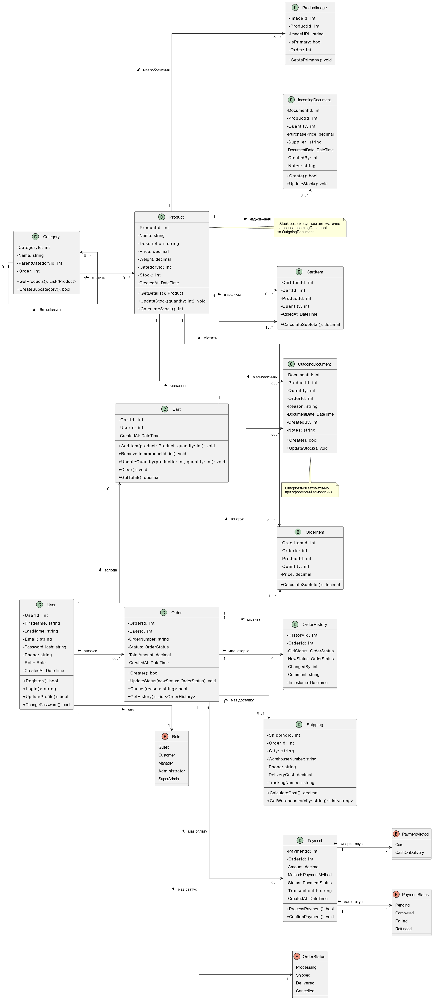
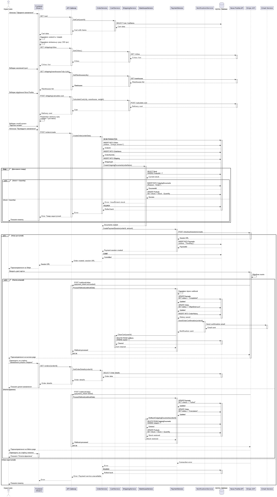
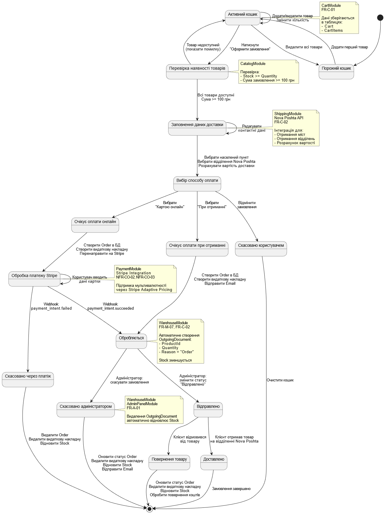

# Вимоги до інтернет-магазину сувенірної продукції ХДУ

## 1. Вступ

### 1.1. Назва проекту
**Інтернет-магазин сувенірної продукції Херсонського державного університету**

### 1.2. Цільова аудиторія
- **Студенти ХДУ** — основні покупці університетських сувенірів
- **Викладачі та працівники університету** — для придбання продукції та корпоративних товарів
- **Випускники університету** — для підтримки зв'язку з alma mater через придбання символічної атрибутики
- **Гості університету, відвідувачі заходів** — потенційні покупці сувенірної продукції
- **Партнери та представники інших навчальних закладів** — для корпоративних замовлень
- **Адміністрація університету** — для керування асортиментом, обліком замовлень і фінансами

### 1.3. Проблема, яку вирішує проект

**Поточні проблеми:**
- **Обмежена доступність:** Сувенірна продукція університету доступна лише в окремих локаціях та під час спеціальних заходів (наприклад, День університету), що значно обмежує можливість придбання товарів протягом року
- **Відсутність інформації:** Потенційні покупці не мають можливості заздалегідь ознайомитися з асортиментом, побачити фото товарів, дізнатися про ціни та наявність
- **Проблеми з розмірами та асортиментом:** Обмежений вибір розмірів та варіантів товарів у фізичних точках продажу призводить до незадоволення покупців
- **Незручний процес покупки:** Великі черги під час заходів, обмежений графік роботи точок продажу створюють бар'єри для здійснення покупки
- **Відсутність можливості доставки:** Необхідність особистого відвідування точок продажу незручна для випускників, віддалених студентів та інших зацікавлених осіб

**Рішення:**
Створення повнофункціонального інтернет-магазину з інтуїтивним інтерфейсом, інтеграцією з платіжними системами (Stripe) та службою доставки (Nova Poshta), що забезпечить:
- Цілодобовий доступ до каталогу товарів
- Можливість детального ознайомлення з продукцією (фото, опис, характеристики)
- Зручне оформлення замовлення та доставку в будь-яку точку України
- Відстеження статусу замовлення в реальному часі
- Автоматизований облік товарів та фінансів для адміністрації

---

## 2. Діаграма класів

### 2.1. Визначення
Діаграма класів відображає статичну структуру системи інтернет-магазину, показуючи основні класи (сутності), їх атрибути, методи та взаємозв’язки між ними. Діаграма ілюструє ключові модулі системи: управління користувачами, каталог товарів, кошик, замовлення, доставка, платежі та складський облік.

### 2.2. Класи та їх атрибути/методи

| Клас                | Атрибути                                                                 | Методи                                      |
|---------------------|--------------------------------------------------------------------------|---------------------------------------------|
| **User**            | UserId, FirstName, LastName, Email, PasswordHash, Phone, Role, CreatedAt | Register(), Login(), UpdateProfile(), ChangePassword() |
| **Role** (enum)     | Guest, Customer, Manager, Administrator, SuperAdmin                     | —                                           |
| **Product**         | ProductId, Name, Description, Price, Weight, CategoryId, Stock, CreatedAt | GetDetails(), UpdateStock(), CalculateStock() |
| **Category**        | CategoryId, Name, ParentCategoryId, Order                                | GetProducts(), CreateSubcategory()          |
| **ProductImage**    | ImageId, ProductId, ImageURL, IsPrimary, Order                           | SetAsPrimary()                              |
| **Cart**            | CartId, UserId, CreatedAt                                                | AddItem(), RemoveItem(), UpdateQuantity(), Clear(), GetTotal() |
| **CartItem**        | CartItemId, CartId, ProductId, Quantity, AddedAt                         | CalculateSubtotal()                         |
| **Order**           | OrderId, UserId, OrderNumber, Status, TotalAmount, CreatedAt            | Create(), UpdateStatus(), Cancel(), GetHistory() |
| **OrderStatus** (enum) | Processing, Shipped, Delivered, Cancelled                             | —                                           |
| **OrderItem**       | OrderItemId, OrderId, ProductId, Quantity, Price                         | CalculateSubtotal()                         |
| **OrderHistory**    | HistoryId, OrderId, OldStatus, NewStatus, ChangedBy, Comment, Timestamp | —                                           |
| **Shipping**        | ShippingId, OrderId, City, WarehouseNumber, Phone, DeliveryCost, TrackingNumber | CalculateCost(), GetWarehouses()          |
| **Payment**         | PaymentId, OrderId, Amount, Method, Status, TransactionId, CreatedAt     | ProcessPayment(), ConfirmPayment()          |
| **PaymentMethod** (enum) | Card, CashOnDelivery                                                | —                                           |
| **PaymentStatus** (enum) | Pending, Completed, Failed, Refunded                                | —                                           |
| **IncomingDocument**| DocumentId, ProductId, Quantity, PurchasePrice, Supplier, DocumentDate, CreatedBy, Notes | Create(), UpdateStock() |
| **OutgoingDocument**| DocumentId, ProductId, Quantity, OrderId, Reason, DocumentDate, CreatedBy, Notes | Create(), UpdateStock() |

### 2.3. Зв'язки

- **User → Role** (асоціація "1 до 1") – користувач має роль
- **User → Cart** (асоціація "1 до 0..1") – користувач володіє кошиком
- **User → Order** (асоціація "1 до 0..*") – користувач створює замовлення
- **User → Shipping** (асоціація "1 до 0..*") – користувач має адреси доставки
- **Category → Product** (асоціація "1 до 0..*") – категорія містить товари
- **Category → Category** (рекурсивна асоціація "0..1 до 0..*") – категорія може бути батьківською для інших категорій
- **Product → ProductImage** (асоціація "1 до 0..*") – товар має зображення
- **Product → CartItem** (асоціація "1 до 0..*") – товар може бути в кошиках
- **Product → OrderItem** (асоціація "1 до 0..*") – товар може бути в замовленнях
- **Product → IncomingDocument** (асоціація "1 до 0..*") – товар має надходження на склад
- **Product → OutgoingDocument** (асоціація "1 до 0..*") – товар має списання зі складу
- **Cart → CartItem** (композиція "1 до 1..*") – кошик містить товари
- **Order → OrderItem** (композиція "1 до 1..*") – замовлення містить товари
- **Order → Shipping** (асоціація "1 до 0..1") – замовлення має доставку
- **Order → Payment** (асоціація "1 до 0..1") – замовлення має оплату
- **Order → OrderHistory** (асоціація "1 до 0..*") – замовлення має історію змін
- **Order → OutgoingDocument** (асоціація "1 до 0..*") – замовлення генерує видаткові накладні
- **Order → OrderStatus** (асоціація "1 до 1") – замовлення має статус
- **Payment → PaymentMethod** (асоціація "1 до 1") – платіж використовує метод оплати
- **Payment → PaymentStatus** (асоціація "1 до 1") – платіж має статус

## 3. Діаграма послідовностей

### 3.1. Визначення
Діаграма послідовностей ілюструє процес «Оформлення замовлення з онлайн-оплатою» — від натискання кнопки у кошику до підтвердження платежу через Stripe, включаючи успішний та невдалий сценарії.

### 3.2. Учасники
- Користувач (User) – клієнт магазину, який оформлює замовлення
- Frontend (React) – клієнтська частина додатку
- API Gateway – точка входу для всіх HTTP-запитів
- OrderService – сервіс управління замовленнями
- CartService – сервіс управління кошиком
- ShippingService – сервіс доставки
- WarehouseService – сервіс складського обліку
- PaymentService – сервіс платежів
- NotificationService – сервіс сповіщень
- MySQL Database – база даних
- Nova Poshta API – зовнішній API служби доставки
- Stripe API – зовнішній API платіжної системи
- Email Service – зовнішній сервіс відправки email

### 3.3. Послідовність
**Початок процесу:**
1.	Користувач натискає кнопку "Оформити замовлення" на сторінці кошика
2.	Frontend надсилає запит до API для отримання даних кошика
3.	API звертається до CartService, який отримує дані з бази даних
4.	Frontend перевіряє наявність товарів та мінімальну суму замовлення (100 грн)
**Вибір доставки:**
5.	Frontend запитує список населених пунктів через API
6.	ShippingService отримує список міст з Nova Poshta API
7.	Користувач вибирає населений пункт
8.	Frontend запитує список відділень Nova Poshta для обраного міста
9.	ShippingService отримує список відділень з Nova Poshta API
10.	Користувач вибирає відділення доставки
11.	Frontend надсилає запит на розрахунок вартості доставки
12.	ShippingService розраховує вартість через Nova Poshta API
13.	Frontend розраховує та відображає загальну суму (товари + доставка)
**Створення замовлення:**
14.	Користувач вибирає спосіб оплати "Карткою онлайн" та підтверджує замовлення
15.	Frontend надсилає запит на створення замовлення до API
16.	OrderService розпочинає транзакцію в базі даних
17.	OrderService створює запис Order зі статусом "Очікує оплати"
18.	OrderService створює записи OrderItems (товари в замовленні)
19.	OrderService створює запис Shipping (інформація про доставку)
**Резервування товарів:**
20.	OrderService викликає WarehouseService для створення видаткових накладних
21.	Для кожного товару WarehouseService перевіряє наявність на складі (Stock)
22.	Якщо товару достатньо: створюється OutgoingDocument та зменшується Stock
23.	Якщо товару недостатньо: відбувається ROLLBACK транзакції, повертається помилка користувачу
**Ініціація оплати:**
24.	OrderService викликає PaymentService для створення сесії оплати
25.	PaymentService звертається до Stripe API для створення checkout-сесії
26.	Якщо Stripe доступний: створюється запис Payment зі статусом "Pending"
27.	Транзакція БД фіксується (COMMIT)
28.	Frontend отримує URL сесії Stripe та перенаправляє користувача
29.	Якщо Stripe недоступний: відбувається ROLLBACK, повертається помилка
**Обробка оплати (успішний сценарій):**
30.	Користувач вводить дані картки на сторінці Stripe
31.	Stripe обробляє платіж та відправляє webhook "payment_intent.succeeded"
32.	PaymentService перевіряє підпис webhook для безпеки
33.	Статус платежу оновлюється на "Completed" у базі даних
34.	Статус замовлення оновлюється на "Обробляється"
35.	Створюється запис в OrderHistory
36.	NotificationService відправляє email-підтвердження користувачу через Email Service
37.	CartService очищає кошик користувача
38.	Stripe перенаправляє користувача на сторінку успіху
39.	Frontend показує деталі успішно створеного замовлення
**Обробка оплати (невдалий сценарій):**
40.	Якщо платіж відхилено: Stripe відправляє webhook "payment_intent.failed"
41.	Статус платежу оновлюється на "Failed"
42.	Статус замовлення оновлюється на "Скасовано"
43.	WarehouseService видаляє видаткові накладні
44.	Stock товарів відновлюється (товари повертаються на склад)
45.	Stripe перенаправляє користувача на сторінку помилки
46.	Frontend показує повідомлення "Оплата відхилена"

## 4. Діаграма станів

### 4.1. Визначення
Діаграма станів відображає повний життєвий цикл замовлення — від порожнього кошика до успішної доставки або скасування.

### 4.2. Стани
- Порожній кошик - початковий стан, кошик користувача не містить товарів
- Активний кошик - користувач додав товари і може їх редагувати
- Перевірка наявності товарів - система перевіряє доступність товарів на складі
- Заповнення даних доставки - користувач заповнює адресу доставки через Nova Poshta
- Вибір способу оплати - користувач обирає між онлайн-оплатою та оплатою при отриманні
- Очікує оплати онлайн - система готує платіжну сесію для Stripe
- Обробка платежу Stripe - користувач вводить дані картки на стороні Stripe
- Очікує оплати при отриманні - замовлення створене з відкладеною оплатою
- Обробляється - замовлення підтверджене та готове до відправки
- Відправлено - товар відправлено через Nova Poshta
- Доставлено - клієнт успішно отримав замовлення (фінальний стан)
- Скасовано користувачем - користувач відмінив замовлення на етапі оформлення
- Скасовано адміністратором - адміністратор скасував замовлення
- Скасовано через платіж - платіж не пройшов через Stripe
- Повернення товару - клієнт повертає товар

### 4.3. Переходи
1.	[*] → Порожній кошик  
Умова: Користувач заходить на сайт
2.	Порожній кошик → Активний кошик  
Умова: Користувач додає перший товар до кошика
3.	Активний кошик → Активний кошик  
Умова: Користувач додає/видаляє товари або змінює їх кількість
4.	Активний кошик → Порожній кошик  
Умова: Користувач видаляє всі товари з кошика
5.	Активний кошик → Перевірка наявності  
Умова: Користувач натискає кнопку "Оформити замовлення"
6.	Перевірка наявності → Активний кошик  
Умова: Товар недоступний на складі (Stock < Quantity), система показує помилку
7.	Перевірка наявності → Заповнення даних  
Умова: Всі товари доступні (Stock >= Quantity) та сума замовлення >= 100 грн
8.	Заповнення даних → Заповнення даних  
Умова: Користувач редагує контактні дані
9.	Заповнення даних → Вибір оплати  
Умова: Користувач вибрав населений пункт та відділення Nova Poshta, система розрахувала вартість доставки
10.	Вибір оплати → Очікує оплати онлайн  
Умова: Користувач обрав спосіб оплати "Картою онлайн"
11.	Вибір оплати → Очікує при отриманні  
Умова: Користувач обрав спосіб оплати "При отриманні"
12.	Вибір оплати → Скасовано користувачем  
Умова: Користувач натиснув "Відмінити замовлення"
13.	Очікує оплати онлайн → Обробка Stripe  
Умова: Система створила Order в БД, створила видаткову накладну (зменшила Stock), перенаправила користувача на Stripe
14.	Обробка Stripe → Обробка Stripe  
Умова: Користувач вводить дані банківської картки
15.	Обробка Stripe → Обробляється  
Умова: Отримано webhook від Stripe: payment_intent.succeeded
16.	Обробка Stripe → Скасовано через платіж  
Умова: Отримано webhook від Stripe: payment_intent.failed
17.	Скасовано через платіж → [*]  
Умова: Система видаляє Order, видаляє видаткову накладну, відновлює Stock
18.	Очікує при отриманні → Обробляється  
19.	Умова: Система створила Order в БД, створила видаткову накладну (зменшила Stock), відправила Email-підтвердження
20.	Обробляється → Відправлено  
Умова: Адміністратор змінює статус замовлення на "Відправлено"
21.	Обробляється → Скасовано адміністратором  
Умова: Адміністратор скасовує замовлення (наприклад, товар пошкоджений)
22.	Скасовано адміністратором → [*]  
Умова: Система оновлює статус Order на "Скасовано", видаляє видаткову накладну, відновлює Stock, відправляє Email користувачу
23.	Відправлено → Доставлено  
Умова: Клієнт отримав товар на відділенні Nova Poshta
24.	Відправлено → Повернення  
Умова: Клієнт відмовився від товару або повертає його
25.	Повернення → [*]  
Умова: Система оновлює статус Order, видаляє видаткову накладну, відновлює Stock, обробляє повернення коштів (якщо оплачено онлайн)
26.	Доставлено → [*]  
Умова: Замовлення успішно завершено
27.	Скасовано користувачем → [*]  
Умова: Система очищає кошик користувача

## 5. Висновки

UML-діаграми суттєво впливають на весь процес подальшої розробки проєкту.  
Вони виступають єдиним «мовним стандартом» між аналітиками, архітекторами, розробниками та замовником, зменшуючи непорозуміння.  
Діаграми класів заздалегідь фіксують структуру об’єктів, ієрархію спадкування, асоціації та залежності, що безпосередньо перетворюється на каркас коду.  
Діаграми послідовності детально показують взаємодію об’єктів у критичних сценаріях, допомагаючи розробникам одразу писати правильні методи та сигнатури.  
Діаграми станів дозволяють точно реалізувати кінцеві автомати й бізнес-логіку, зменшуючи баги у складних переходах.  
Наявність актуальних UML-діаграм спрощує код-рев’ю, онбординг нових розробників і підтримку проєкту через роки.  
Добре продумані діаграми зменшують технічний борг, бо змушують думати про дизайн до написання коду.  
У підсумку, проєкти з чіткими та актуальними UML-діаграмами виходять швидше, дешевше й з вищою якістю.