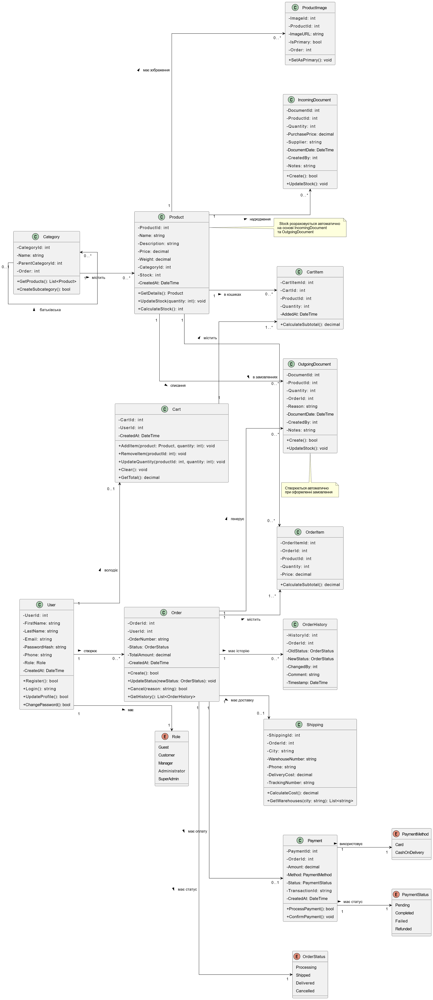
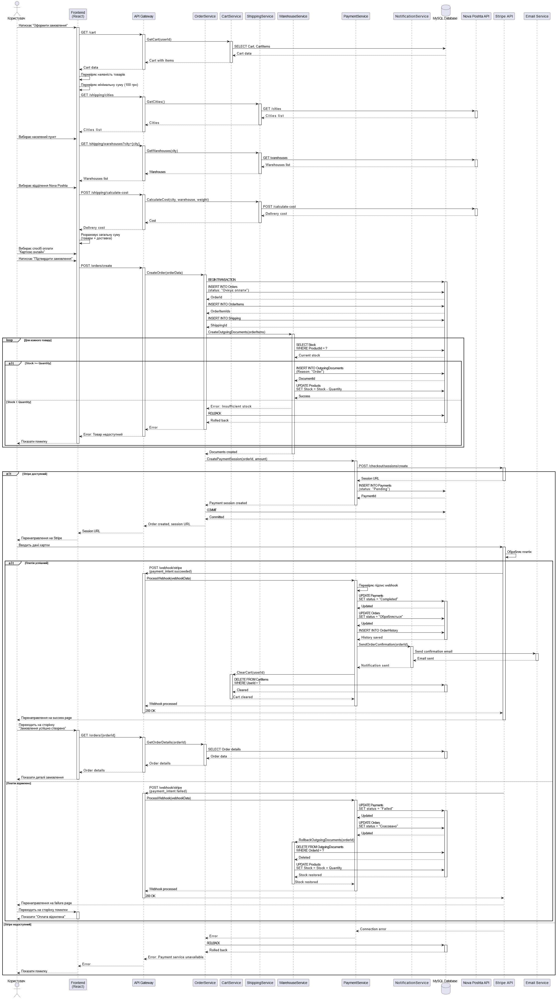
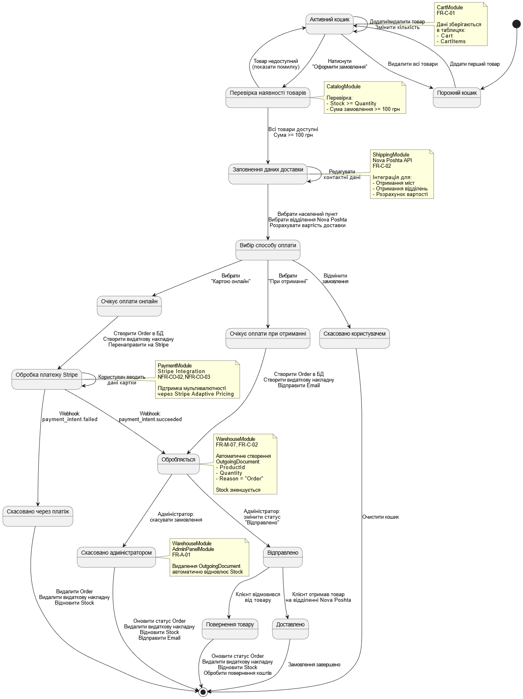

# Вимоги до інтернет-магазину сувенірної продукції ХДУ

## 1. Вступ

### 1.1. Назва проекту
**Інтернет-магазин сувенірної продукції Херсонського державного університету**

### 1.2. Цільова аудиторія
- **Студенти ХДУ** — основні покупці університетських сувенірів
- **Викладачі та працівники університету** — для придбання продукції та корпоративних товарів
- **Випускники університету** — для підтримки зв'язку з alma mater через придбання символічної атрибутики
- **Гості університету, відвідувачі заходів** — потенційні покупці сувенірної продукції
- **Партнери та представники інших навчальних закладів** — для корпоративних замовлень
- **Адміністрація університету** — для керування асортиментом, обліком замовлень і фінансами

### 1.3. Проблема, яку вирішує проект

**Поточні проблеми:**
- **Обмежена доступність:** Сувенірна продукція університету доступна лише в окремих локаціях та під час спеціальних заходів (наприклад, День університету), що значно обмежує можливість придбання товарів протягом року
- **Відсутність інформації:** Потенційні покупці не мають можливості заздалегідь ознайомитися з асортиментом, побачити фото товарів, дізнатися про ціни та наявність
- **Проблеми з розмірами та асортиментом:** Обмежений вибір розмірів та варіантів товарів у фізичних точках продажу призводить до незадоволення покупців
- **Незручний процес покупки:** Великі черги під час заходів, обмежений графік роботи точок продажу створюють бар'єри для здійснення покупки
- **Відсутність можливості доставки:** Необхідність особистого відвідування точок продажу незручна для випускників, віддалених студентів та інших зацікавлених осіб

**Рішення:**
Створення повнофункціонального інтернет-магазину з інтуїтивним інтерфейсом, інтеграцією з платіжними системами (Stripe) та службою доставки (Nova Poshta), що забезпечить:
- Цілодобовий доступ до каталогу товарів
- Можливість детального ознайомлення з продукцією (фото, опис, характеристики)
- Зручне оформлення замовлення та доставку в будь-яку точку України
- Відстеження статусу замовлення в реальному часі
- Автоматизований облік товарів та фінансів для адміністрації

**Мета діаграм:** Візуалізація структури та поведінки.

---

## 2. Діаграма класів

### 2.1. Визначення
Діаграма класів відображає статичну структуру системи інтернет-магазину, показуючи основні класи (сутності), їх атрибути, методи та взаємозв’язки між ними. Діаграма ілюструє ключові модулі системи: управління користувачами, каталог товарів, кошик, замовлення, доставка, платежі та складський облік.

### 2.2. Основні класи та їх атрибути/методи

| Клас                | Атрибути                                                                 | Методи                                      |
|---------------------|--------------------------------------------------------------------------|---------------------------------------------|
| **User**            | UserId, FirstName, LastName, Email, PasswordHash, Phone, Role, CreatedAt | Register(), Login(), UpdateProfile(), ChangePassword() |
| **Role** (enum)     | Guest, Customer, Manager, Administrator, SuperAdmin                     | —                                           |
| **Product**         | ProductId, Name, Description, Price, Weight, CategoryId, Stock, CreatedAt | GetDetails(), UpdateStock(), CalculateStock() |
| **Category**        | CategoryId, Name, ParentCategoryId, Order                                | GetProducts(), CreateSubcategory()          |
| **ProductImage**    | ImageId, ProductId, ImageURL, IsPrimary, Order                           | SetAsPrimary()                              |
| **Cart**            | CartId, UserId, CreatedAt                                                | AddItem(), RemoveItem(), UpdateQuantity(), Clear(), GetTotal() |
| **CartItem**        | CartItemId, CartId, ProductId, Quantity, AddedAt                         | CalculateSubtotal()                         |
| **Order**           | OrderId, UserId, OrderNumber, Status, TotalAmount, CreatedAt            | Create(), UpdateStatus(), Cancel(), GetHistory() |
| **OrderStatus** (enum) | Processing, Shipped, Delivered, Cancelled                             | —                                           |
| **OrderItem**       | OrderItemId, OrderId, ProductId, Quantity, Price                         | CalculateSubtotal()                         |
| **OrderHistory**    | HistoryId, OrderId, OldStatus, NewStatus, ChangedBy, Comment, Timestamp | —                                           |
| **Shipping**        | ShippingId, OrderId, City, WarehouseNumber, Phone, DeliveryCost, TrackingNumber | CalculateCost(), GetWarehouses()          |
| **Payment**         | PaymentId, OrderId, Amount, Method, Status, TransactionId, CreatedAt     | ProcessPayment(), ConfirmPayment()          |
| **PaymentMethod** (enum) | Card, CashOnDelivery                                                | —                                           |
| **PaymentStatus** (enum) | Pending, Completed, Failed, Refunded                                | —                                           |
| **IncomingDocument**| DocumentId, ProductId, Quantity, PurchasePrice, Supplier, DocumentDate, CreatedBy, Notes | Create(), UpdateStock() |
| **OutgoingDocument**| DocumentId, ProductId, Quantity, OrderId, Reason, DocumentDate, CreatedBy, Notes | Create(), UpdateStock() |

### 2.3. Основні зв’язки

- **User 1 → 1 Role** — користувач має одну роль  
- **User 1 → 0..1 Cart** — користувач володіє кошиком  
- **User 1 → 0..* Order** — користувач створює замовлення  
- **Category 1 → 0..* Product** — категорія містить товари  
- **Category 0..1 ↔ 0..* Category** (рекурсія) — ієрархія категорій  
- **Product 1 → 0..* ProductImage** — товар має зображення  
- **Cart 1 → 1..* CartItem** (композиція)  
- **Order 1 → 1..* OrderItem** (композиція)  
- **Order 1 → 0..1 Shipping**, **Order 1 → 0..1 Payment**, **Order 1 → 0..* OrderHistory**

## 3. Діаграма послідовностей

### 3.1. Визначення
Діаграма послідовностей ілюструє процес «Оформлення замовлення з онлайн-оплатою» — від натискання кнопки у кошику до підтвердження платежу через Stripe, включаючи успішний та невдалий сценарії.

### 3.2. Учасники
- Користувач  
- Frontend (React)  
- API Gateway  
- CartService, OrderService, ShippingService, WarehouseService, PaymentService, NotificationService  
- MySQL Database  
- Nova Poshta API  
- Stripe API  
- Email Service

### 3.3. Ключові етапи
1. Отримання даних кошика  
2. Вибір міста → відділення Nova Poshta → розрахунок вартості доставки  
3. Створення замовлення в транзакції  
4. Резервування товарів (OutgoingDocument, зменшення Stock)  
5. Створення платіжної сесії в Stripe  
6. Обробка webhook від Stripe (успіх / невдача)  
7. Оновлення статусів, очищення кошика, надсилання email

## 4. Діаграма станів

### 4.1. Визначення
Діаграма станів відображає повний життєвий цикл замовлення — від порожнього кошика до успішної доставки або скасування.

### 4.2. Основні стани
- Порожній кошик  
- Активний кошик  
- Перевірка наявності товарів  
- Заповнення даних доставки  
- Вибір способу оплати  
- Очікує оплати онлайн → Обробка платежу Stripe  
- Очікує оплати при отриманні  
- Обробляється → Відправлено → Доставлено  
- Скасовано (користувачем, адміністратором, через платіж)  
- Повернення товару

### 4.3. Ключові переходи
- Додавання першого товару → Активний кошик  
- Натиснення «Оформити» → Перевірка наявності (з можливим поверненням при нестачі)  
- Успішна оплата Stripe → Обробляється  
- Невдалий платіж → Скасовано через платіж + відновлення Stock  
- Адміністратор змінює статус → Відправлено → Доставлено

## 5. Висновки

UML-діаграми суттєво впливають на весь процес подальшої розробки проєкту.  
Вони виступають єдиним «мовним стандартом» між аналітиками, архітекторами, розробниками та замовником, зменшуючи непорозуміння.  
Діаграми класів заздалегідь фіксують структуру об’єктів, ієрархію спадкування, асоціації та залежності, що безпосередньо перетворюється на каркас коду.  
Діаграми послідовності детально показують взаємодію об’єктів у критичних сценаріях, допомагаючи розробникам одразу писати правильні методи та сигнатури.  
Діаграми станів дозволяють точно реалізувати кінцеві автомати й бізнес-логіку, зменшуючи баги у складних переходах.  
Наявність актуальних UML-діаграм спрощує код-рев’ю, онбординг нових розробників і підтримку проєкту через роки.  
Добре продумані діаграми зменшують технічний борг, бо змушують думати про дизайн до написання коду.  
У підсумку, проєкти з чіткими та актуальними UML-діаграмами виходять швидше, дешевше й з вищою якістю.